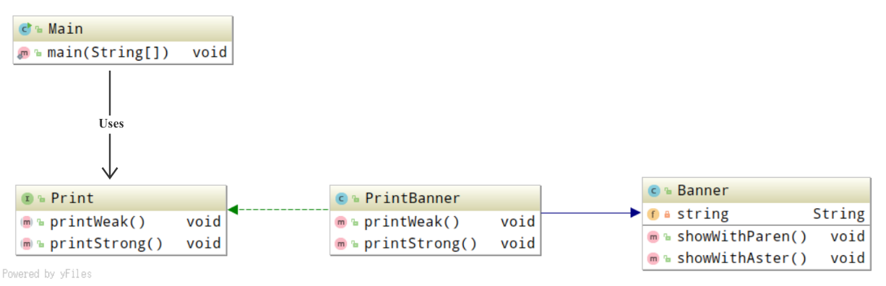
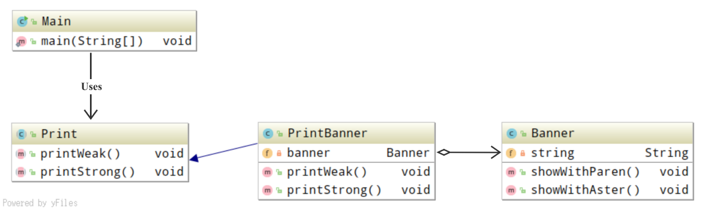

## Adapter 模式

*加个适配器以便于复用*

### 目录

1. 知识概述
2. 示例程序(1)
3. 示例程序(2)
4. Q&A


### 一、知识概述

Adapter 设计模式用于填补“现有程序”和”所需程序“之间的差异，即现有的程序无法直接使用，需要经过适当的变换之后才能满足需求。Adapter模式包含四种主要的角色。

* Target: 为对象，负责声明所需的方法
* Client: 为请求者，负责使用Target角色所声明的方法进行具体处理
* Adaptee: 为被适配者，持有既定的方法
* Adapter: 为适配者，包装Adaptee角色的方法来满足Target角色的需求

Adapter模式分为两种模型。在类适配器模式中，Adapter角色通过继承来使用Adaptee角色，而在对象适配器模式中，Adapter角色通过委托来使用Adaptee角色。


### 二、示例程序(1)

以下示例程序实现了类适配器模式，这里示例程序的主要作用是，将原有的字符串显示程序进行包装，使其能够按照需求进行工作。

**示例类图**



**代码清单**

适配

```java
/**
 * 表示实际情况的类
 */
public class Banner {
    private String string;

    public Banner(String string) {
        this.string = string;
    }

    public void showWithParen() {
        System.out.println("(" + string + ")");
    }

    public void showWithAster() {
        System.out.println("*" + string + "*");
    }
}

/**
 * 表示变换装置的类
 */
public class PrintBanner extends Banner implements Print {

    public PrintBanner(String string) {
        super(string);
    }

    public void printWeak() {
        showWithParen();
    }

    public void printStrong() {
        showWithAster();
    }
}
```

需求

```java
/**
 * 表示需求的接口
 */
public interface Print {
    // 方法声明：弱化显示字符串
    public abstract void printWeak();

    // 方法声明：强调显示字符串
    public abstract void printStrong();
}

/**
 * 对输入的字符串，进行不同的显示
 */
public class Main {
    public static void main(String[] args) {
        Print p = new PrintBanner("Hello");
        p.printWeak();
        p.printStrong();
    }
}
```


### 三、示例程序(2)

设想一种场景，假设Print不是接口而是类，即PrintBanner被作为Print的子类。此时在java单继承的限制条件下，Banner无法被继承，要如何才能实现Adapter模式呢？

可以将方法中的实际处理委托给Banner类的实例进行处理，对原有的字符串显示程序进行包装，使其能够按照需求进行工作。以下示例程序实现了对象适配器模式。

**示例类图**



**代码清单**

```java
/**
 * 表示需求的抽象类
 */
public abstract class Print {
    // 方法声明：弱化显示字符串
    public abstract void printWeak();

    // 方法声明：强调显示字符串
    public abstract void printStrong();
}

/**
 * 表示变换装置的类
 */
public class PrintBanner extends Print {
    private Banner banner;

    public PrintBanner(String string) {
        banner = new Banner(string);
    }

    public void printWeak() {
        banner.showWithParen();
    }

    public void printStrong() {
        banner.showWithAster();
    }
}


```


### 四、Q&A

Q1：

在示例程序中采用了Print类型的变量来保存PrintBanner实例。

`Print p = new PrintBanner("Hello");`

请问为什么不采用PrintBanner类型的变量来保存PrintBanner实例？

`PrintBanner p = new PrintBanner("Hello");`

A1：

```
使用Print类型是为了将需求层与适配器的实现层解耦。
PrintBanner类型的变量只能接收PrintBanner类，那么此处的请求者只能打印广告。
Print类型的变量可以接收任何Print接口的实现类，即不论是PrintBanner、PrintNews、PrintReport，请求者可以打印广告、新闻、报告等等。
```

Q2：

```
编写一个将属性集合保存至文件中的FileProperties类。
要求：包装Properties的方法，以实现FileIO所声明的接口api
```

A2：

```java
/**
 * 声明需要的接口api
 */
public interface FileIO {
    public void readFromFile(String filename) throws IOException;
    public void writeToFile(String filename) throws IOException;
    public void setValue(String key, String value);
    public String getValue(String key);
}

/**
 * 包装Properties的方法，以实现FileIO声明的接口api,
 */
public class FileProperties extends Properties implements FileIO  {
    @Override
    public void readFromFile(String filename) throws IOException {
        InputStream in = new FileInputStream(filename);
        load(in);
    }

    @Override
    public void writeToFile(String filename) throws IOException {
        OutputStream out = new FileOutputStream(filename);
        store(out, "header");
    }

    @Override
    public void setValue(String key, String value) {
        setProperty(key, value);
    }

    @Override
    public String getValue(String key) {
        return getProperty(key, "");
    }
}

/**
 * 请求者 负责使用FileIO所声明的方法进行具体处理
 */
public class Main {
    public static void main(String[] args) {
        FileIO f = new FileProperties();
        try {
            f.readFromFile("file.txt");
            f.setValue("year", "2004");
            f.setValue("month", "4");
            f.setValue("day", "21");
            f.writeToFile("newfile.txt");

        } catch (IOException e) {
            e.printStackTrace();
        }
    }
}
```