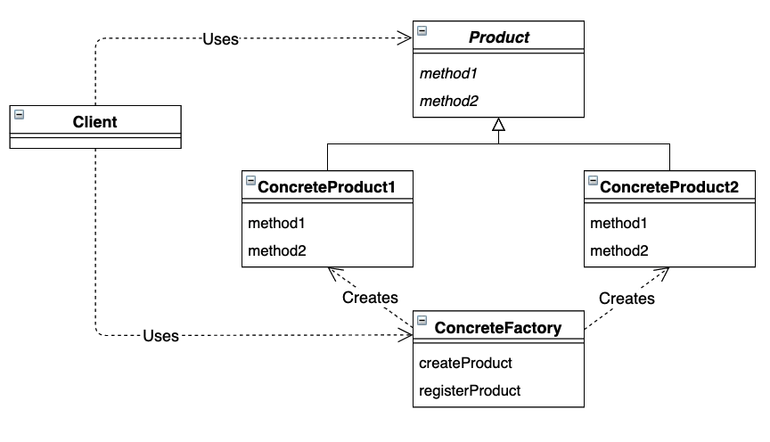

# Simple Factory 模式

## 目录

1. 类图
2. 需求
3. 实现


## 一、类图




## 二、需求

已知具体工厂类和产品抽象类，要求设计汽车产品，以及单车产品

```java
/**
 * 工厂类，根据需求生产不同类型的产品
 */
public class Factory {

    public static final int PRODUCT_BIKE = 0;
    public static final int PRODUCT_CAR = 1;

    public static Product createProduct(int type) {
        switch (type) {
            case PRODUCT_BIKE:
                return new Bike();
            case PRODUCT_CAR:
                return new Car();
        }
        return null;
    }
}

/**
 * 产品接口，声明通用的产品方法
 */
public interface Product {
    public abstract void check();
}
```


测试类调用工厂生产不同类型的产品，并进行产品检测

```java
public class Main {
    public static void main(String[] args) {
        test(Factory.PRODUCT_CAR);
        test(Factory.PRODUCT_BIKE);
    }

    public static void test(int type) {
        Product product = Factory.createProduct(type);
        product.check();
    }
}
```


## 三、实现

1. 项目结构

framework包搭建了简单工厂的框架，并对外提供了工厂的生产接口，以及产品的通用接口。com包提供了各种产品的具体实现。在简单工厂模式中framework包在一定程度上依赖于com包，无法完全解耦。

```
factory
|__	Main.java
|__	framework
|	|__	Factory.java
|	|__	Product.java
|__	com
	|__	Car.java
	|__	Bike.java
```


2. 具体产品

```java
/**
 * 汽车产品，提供汽车的检测方法
 */
public class Car implements Product {
    @Override
    public void check() {
        System.out.println("这是汽车");
    }
}

/**
 * 单车产品，提供单车的检测方法
 */
public class Bike implements Product {
    @Override
    public void check() {
        System.out.println("这是单车");
    }
}

```
