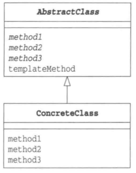

# Template Method 模式

*将具体处理交给子类*

## 目录
1. 需求
2. 思路
3. 总结


## 一、需求

已知工厂抽象类，要求设计生产汽车的汽车工厂，以及生产单车的单车工厂

```java
public abstract class Factory {

    protected abstract String createProduct(long code);
    protected abstract void registerProduct(String product);

    public final String create(long code) {
        String product = createProduct(code);
        registerProduct(product);
        return product;
    }
}

```


## 二、思路

1. 项目结构

CarFactory为Factory的具体子类，用于生产汽车。BikeFactory为Factory的具体子类，用于生产单车。Main为外部测试类，用于测试不同种类的工厂。

```
template
|__	Main.java
|__	framework
|	|__	Factory.java
|__	com
	|__	CarFactory.java
	|__	BikeFactory.java
```


2. 汽车工厂类

汽车工厂实现了抽象工厂里的所有抽象方法，抽象工厂对汽车生产进行统一管理。

```java
public class CarFactory extends Factory {

    private List<String> list;

    public CarFactory () {
        this.list = new ArrayList<>();
    }

    @Override
    protected String createProduct(long code) {
        return "汽车" + code;
    }

    @Override
    protected void registerProduct(String product) {
        list.add(product);
    }
}
```


3. 单车工厂类

单车工厂实现了抽象工厂里的所有抽象方法，抽象工厂对单车生产进行统一管理。

```java
public class BikeFactory extends Factory {

    private List<String> list;

    public BikeFactory () {
        this.list = new ArrayList<>();
    }

    @Override
    protected String createProduct(long code) {
        return "单车" + code;
    }

    @Override
    protected void registerProduct(String product) {
        list.add(product);
    }
}
```


4. 外部测试类

测试方法可以接收不同的工厂，并进行生产。

```java
public class Main {
    public static void main(String[] args) {
        test(new CarFactory());
        test(new BikeFactory());
    }

    public static void test(Factory factory) {
        long code = System.currentTimeMillis();
        String product = factory.create(code);
        System.out.println(product);
    }
}
```


## 三、总结

模板方法模式的类图：




