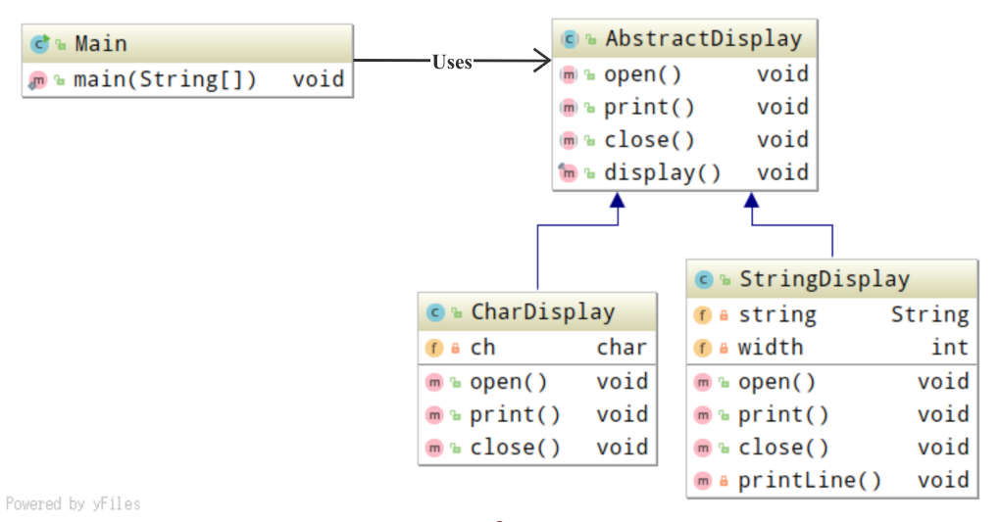

# Template Method 模式

*将具体处理交给子类*

## 目录
1. 知识概述
2. 示例程序
3. Q&A


## 需求

已知出行抽象类，要求设计汽车出行类，以及单车出行类。


## 一、知识概述

Template Method 设计模式是指在父类中定义处理流程的框架，在子类中实现具体处理。其主要包含两种主要的角色。

* AbstractClass: 为抽象类，不仅负责实现模板方法，还负责声明在模板方法中所使用到的抽象方法。
* ConcreteClass: 为具体类，负责具体实现AbstractClass角色中声明的抽象方法。


## 二、示例程序

以下为实现了Template Method模式的示例程序，这段示例程序的主要作用是，将字符和字符串循环显示5次，二者分别采用不同的显示格式。

**类图示例**



**程序清单**

流程

```java
/**
 * 声明需求方法的抽象类，并使用所声明的方法进行具体处理
 */
public abstract class AbstractDisplay {
    // 方法声明
    protected abstract void open();
    protected abstract void print();
    protected abstract void close();

    // 方法实现
    public final void display() {
        open();
        for (int i = 0; i < 5; i++) {
            print();
        }
        close();
    }
}

/**
 * 测试程序行为的类 将字符和字符串循环显示5次
 */
public class Main {
    public static void main(String[] args) {
        AbstractDisplay d1 = new CharDisplay('H');
        AbstractDisplay d2 = new StringDisplay("Hello, world");
        AbstractDisplay d3 = new StringDisplay("你好，世界");
        d1.display();
        d2.display();
        d3.display();
    }
}

```

实现

```java
/**
 * 实现了open、print、close方法的类
 */
public class CharDisplay extends AbstractDisplay {
    private char ch;

    public CharDisplay(char ch) {
        this.ch = ch;
    }

    public void open() {
        System.out.print("<<");
    }

    public void print() {
        System.out.print(ch);
    }

    // 这里是方法区的继承，那么实例化之后会是怎么样呢
    public void close() {
        System.out.println(">>");
    }
}

/**
 * 实现了open、print、close方法的类
 */
public class StringDisplay extends AbstractDisplay {
    private String string;
    private int width;

    public StringDisplay(String string) {
        this.string = string;
        this.width = string.getBytes().length;
    }


    public void open() {
        printLine();
    }

    public void print() {
        System.out.println("|" + string + "|");
    }

    public void close() {
        printLine();
    }

    private void printLine() {
        System.out.print("+");
        for (int i = 0; i < width; i++) {
            System.out.print("-");
        }
        System.out.println("+");
    }
}
```


## 三、Q&A

Q1：

java.io.InputStream类使用了Template Method 模式，请参考JDK找出其子类需要实现的方法。

A1：

```
在子类中需要实现的方法：public abstract in read() throws IOException
该方法会被java.io.InputStream中的模板方法read(byte[] b, int off, int len)循环调用。
```

Q2：

示例程序中AbstractDisplay的模板方法，使用了修饰符final，why?

A2：

```
public是必要的，为了对外提供接口；final虽然非必要，但是其能够限制方法被子类重写(Override)，使程序更加的规范化。
```

Q3：

如果相让抽象类中的open、print、close方法，可以被父子类和同包下的类调用，而不能被其他类调用，需要怎么做？

A3：

```
将方法的访问权限由public改成protected
```

Q4：

Java 当中的接口和抽象类很相似，接口同样也是声明抽象方法的集合。为什么在Template Method模式中，无法使用接口来扮演AbstractClass角色？

A4：

```
因为接口只能负责声明抽象方法，而抽象类不仅负责声明抽象方法，还负责具体实现模板方法对抽象方法进行调用，即使用抽象类可以在抽象方法的声明阶段确定调用的流程。
```