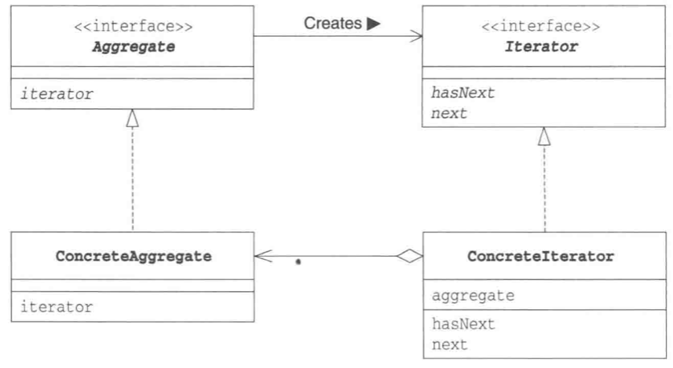

# Iterator 模式

*一个一个遍历*

## 目录

1. 需求
2. 思路
3. 总结


## 一、需求

已知集合接口和迭代器接口，要求实现书架和书架迭代器，使得书架只能通过迭代器遍历。

```java
public interface Aggregate {
    /**
     * Create an iterator to traverse the aggregate
     * @return the iterator for aggregate
     */
    public abstract Iterator iterator();
}

public interface Iterator {
    /**
     * Return true if this iterator has next element
     * @return true if this iterator has next element
     */
    public abstract boolean hasNext();

    /**
     * Ruturn the next element
     * @return the next element
     */
    public abstract Object next();
}
```


## 二、思路

1. 项目结构

BookShelf 为书架的具体实现，BookShelfIterator 为迭代器的具体实现。Main 为外部测试类，用于测试不同集合的迭代器。

```
iterator
|__	Main.java
|__	framework
|	|__	Aggregate.java
|	|__	Iterator.java
|__	book
	|__	BookShelf.java
	|__	BookShelfIterator.java
```


2. 设计书架

书架拥有一个书籍列表作为私有的成员变量，其他类想访问书籍列表只能通过书架提供的可见方法。在这些可见方法中，public方法是提供给外部类的可见方法，外部类通常需要添加书本，以及获取迭代器。protect方法是提供给迭代器的方法，迭代器通常需要获取书本，以及获取列表大小。

```java
/**
 * 表示书架的类
 */
public class BookShelf implements Aggregate {

    private List<String> books;

    public BookShelf() {
        books = new ArrayList<>();
    }

    public void addBook(String book) {
        books.add(book);
    }

    @Override
    public Iterator iterator() {
        return new BookShelfIterator(this);
    }

    protected String getBook(int index) {
        return books.get(index);
    }

    protected int getSize() {
        return books.size();
    }
}
```


3. 设计迭代器

书架迭代器实现了迭代器中的所有接口，书架迭代器只能由书架构造。

```java
/**
 * 表示书架迭代器的类
 */
public class BookShelfIterator implements Iterator {

    private BookShelf bookShelf;
    private int next;

    protected BookShelfIterator(BookShelf bookShelf) {
        this.bookShelf = bookShelf;
        this.next = 0;
    }

    @Override
    public boolean hasNext() {
        return next < bookShelf.getSize();
    }

    @Override
    public String next() {
        return bookShelf.getBook(next++);
    }
}
```


4. 程序测试

测试函数可以接收不同的集合，并获取对应的迭代器。

```java
/**
 * 用于测试的类
 */
public class Main {
    public static void main(String[] args) {
        BookShelf bookShelf = new BookShelf();
        bookShelf.addBook("alice");
        bookShelf.addBook("bob");
        bookShelf.addBook("mask");
		test(bookshelf);
    }
    
    private static void test(Aggregate aggregate) {
        Iterator it = aggregate.iterator();
        while (it.hasNext()) {
            System.out.println(it.next());
        }
    }
}

```


## 三、总结

迭代器模式的类图如下


