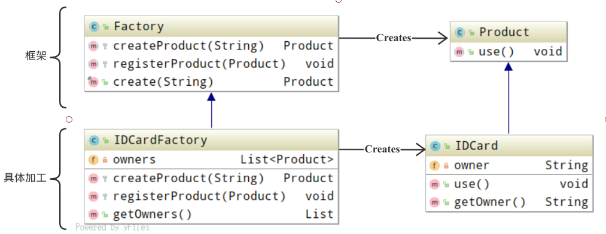

## Factory Method 模式

*将实例的生成交给子类*

### 目录

1. 知识概述
2. 示例程序
3. Q&A


### 一、知识概述

Factory Method 模式是指，在父类中定义生成实例的框架，在子类中实现具体处理。Factory Method 由Template Method 演变而来，其主要包含四种角色。

* Product：为产品，属于框架内部，负责声明产品实例所需的方法
* Creator：为创建者，属于框架内部，不仅负责实现模板方法，还负责声明在模板方法中所使用到的抽象方法
* ConcreteProduct：为具体产品，负责具体实现Product角色中声明的抽象方法
* ConcreteCreator：为具体的创建者，负责具体实现Creator角色中声明的抽象方法


### 二、示例程序

以下为实现Factory Method 模式的示例程序，这段示例程序的作用是，利用工厂流水线制作产品，且根据不同的具体加工可以生产不同的产品。

**类图示例**



```
Tips: 方法区上的类之间可以循环依赖，堆上的实例不可以循环依赖，包之间不可以循环依赖。
```

**程序清单**

需求框架

```java
/**
 * 声明需求方法的抽象类，并调用所声明的方法进行具体处理
 */
public abstract class Factory {
    // 声明方法
    protected abstract Product createProduct(String owner);
    protected abstract void registerProduct(Product product);

    // 模板方法
    public final Product create(String owner) {
        Product p = createProduct(owner);
        registerProduct(p);
        return p;
    }
}

/**
 * 声明需求方法的抽象类
 */
public abstract class Product {
    // 声明方法
    public abstract void use();
}
```

行为测试

```java
/**
 * 测试程序行为的类 生产并使用身份证
 */
public class Main {
    public static void main(String[] args) {
        Factory factory = new IDCardFactory();
        Product card1 = factory.create("小明");
        Product card2 = factory.create("小红");
        Product card3 = factory.create("小刚");
        card1.use();
        card2.use();
        card3.use();
    }
}

```

具体实现

```java
/**
 * 具体实现Factory所声明的抽象方法
 */
public class IDCardFactory extends Factory{

    private List<Product> owners = new ArrayList<Product>();

    protected Product createProduct(String owner) {
        return new IDCard(owner);
    }

    protected void registerProduct(Product product) {
        owners.add(product);
    }

    public List getOwners() {
        return owners;
    }
}

/**
 * 具体实现Product所声明的抽象方法
 */
public class IDCard extends Product {
    private String owner;

    IDCard(String owner) {
        System.out.println("制作" + owner + "的ID卡");
        this.owner = owner;
    }

    public void use() {
        System.out.println("使用" + owner + "的ID卡");
    }

    public String getOwner() {
        return owner;
    }
}
```


### 三、Q&A

Q1：

在示例程序中，IDCard类的构造函数并不是public，why？

A1：

```
如果构造函数的可见性为public，那么外部类可直接使用构造函数来创建实例，而这是设计者所不希望的。
使用构造函数的可见性为package，可以限制外部类只能通过工厂来创建实例。
```

Q2：

修改示例程序，为IDCard类添加卡的编号，并在IDCardFactory类中保存编号与所有者之间的对应表

A2：

```java
/**
 * 具体实现Factory所声明的抽象方法
 */
public class IDCardFactory extends Factory{

    private Map<Integer, Product> database = new HashMap<Integer, Product>();
    private int serial = 100;

    protected synchronized Product createProduct(String owner) {
        return new IDCard(owner, serial++);
    }

    protected void registerProduct(Product product) {
        IDCard card = (IDCard) product;
        database.put(card.getId(), card);
    }
}

/**
 * 具体实现Product所声明的抽象方法
 */
public class IDCard extends Product {
    private String owner;
    private int id;

    public IDCard(String owner, int id) {
        System.out.println("制作" + owner + "的ID卡" + id);
        this.owner = owner;
        this.id = id;
    }

    public void use() {
        System.out.println("使用" + owner + "的ID卡" + id);
    }

    public String getOwner() {
        return owner;
    }

    public int getId() {
        return id;
    }
}
```

Q3：

为了强制往Product类的子类的构造函数中传入"产品名字"作为参数，我们采用了如下的定义方式，却出现了编译错误，why?

```java
public abstract class Product {
    public abstract Product(String name);
    public abstract void use();
}
```

A3：

```
在Java中abstract的构造函数是无法定义的。
在Java中具体的构造函数无法被继承，无法通过父类的构造函数限制子类的构造函数。
```