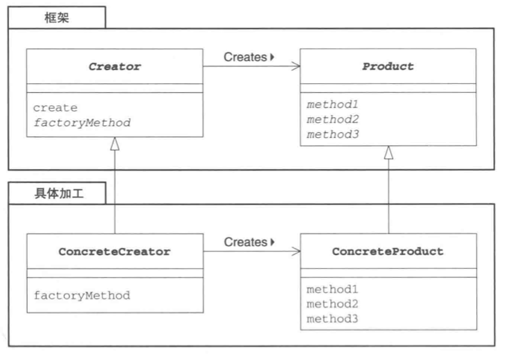

# Factory Method 模式

*将实例的生成交给子类*

## 目录

1. 需求
2. 思路
3. 总结


## 一、需求

已知工厂抽象类和产品抽象类，要求设计生产汽车的汽车工厂，以及生产单车的单车工厂

```java
/**
 * 声明需求方法的抽象类，并调用所声明的方法进行具体处理
 */
public abstract class Factory {
    // 声明方法
    protected abstract Product createProduct(String owner);
    protected abstract void registerProduct(Product product);

    // 模板方法
    public final Product create(String owner) {
        Product p = createProduct(owner);
        registerProduct(p);
        return p;
    }
}

/**
 * 声明需求方法的抽象类
 */
public abstract class Product {
    // 声明方法
    public abstract void use();
}
```


## 二、思路

1. 项目结构

CarFactory 为Factory的具体子类，用于生产汽车。BikeFactory 为Factory的具体子类，用于生产单车。Main为外部测试类，只能调用抽象工厂的public方法进行生产，具体的生产行为由传入的具体工厂决定。

```
factory
|__	Main.java
|__	framework
|	|__	Factory.java
|	|__	Product.java
|__	car
|	|__	CarFactory.java
|	|__	Car.java
|__	bike
	|__	BikeFactory.java
	|__	Bike.java
```


2. 汽车工厂和汽车

汽车工厂实现了抽象工厂里的所有抽象方法，抽象工厂对汽车生产进行统一管理。

```java
public class CarFactory extends Factory {

    private List<Product> list;

    public CarFactory() {
        this.list = new ArrayList<>();
    }

    @Override
    protected Product createProduct(String name) {
        return new Car(name);
    }

    @Override
    protected void registerProduct(Product product) {
        list.add(product);
    }
}

public class Car extends Product {

    private String name;

    Car(String name) {
        this.name = name;
    }

    @Override
    public void use() {
        System.out.println("使用汽车" + name);
    }
}
```


3. 单车工厂和单车

单车工厂实现了抽象工厂里的所有抽象方法，抽象工厂对单车生产进行统一管理。

```java
public class BikeFactory extends Factory {

    private List<Product> list;

    public BikeFactory() {
        this.list = new ArrayList<>();
    }

    @Override
    protected Product createProduct(String name) {
        return new Bike(name);
    }

    @Override
    protected void registerProduct(Product product) {
        list.add(product);
    }
}

public class Bike extends Product {

    private String name;

	Bike(String name) {
        this.name = name;
    }

    @Override
    public void use() {
        System.out.println("使用单车" + name);
    }
}
```


4. 外部测试类

test方法可以接收不同的工厂对象，并进行生产。

```java
public class Main {
    public static void main(String[] args) {
        test(new CarFactory());
        test(new BikeFactory());
    }

    private static void test(Factory factory) {
        for (int i = 0; i < 5; i++) {
            Product product = factory.create(i + "号");
            product.use();
        }
    }
}
```


## 三、总结

抽象工厂模式的类图：



