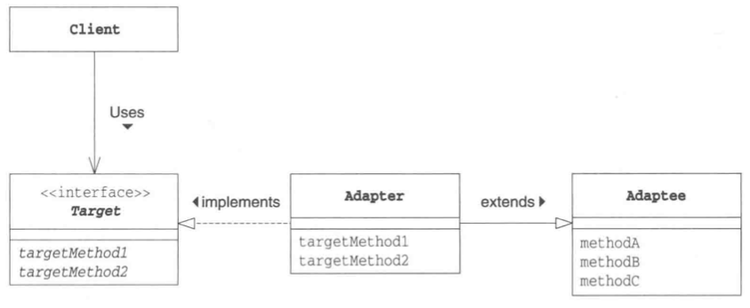

# Adapter 模式

*加个适配器以便于复用*

## 目录

1. 需求
2. 思路
3. 总结


## 一、需求

已知插座类有一个三孔方法，要求设计适配器，使得可以通过适配器的两孔方法接通插座。

```java
public class Socket {
    protect void threeHole() {
        System.out.println("接通电源");
    }
}

public interface Adapter {
    public abstract void twoHead();
}
```


## 二、思路

1. 项目结构

Socket 为插座类，提供三孔方法。SocketAdapter 为适配器的具体实现，提供二孔方法。Main为外部测试类，用于测试不同的适配器。

```
adapter
|__	Main.java
|__	framework
|	|__	Adapter.java
|__	socket
	|__	SocketAdapter.java
	|__	Socket.java
```


2. 使用类继承的适配器

SocketAdapter 继承了三孔插座类，并对外部类提供二孔方法。

```java
/**
 * 表示适配器的类
 */
public class SocketAdapter extends Socket implements Adapter {
    @Override
    public void twoHead() {
        threeHole();
    }
}
```


3. 使用对象委托的适配器

SocketAdapter 的私有成员变量为三孔插座。由于适配器和三孔插座不是父子关系，适配器可以选择继承其他父类。

```java
/**
 * 表示适配器的类
 */
public class SocketAdapter implements Adapter {
    private Socket socket;
    
    public SocketAdapter() {
        this.socket = new Socket();
    }
    
    @Override
    public void twoHead() {
        socket.threeHole();
    }
}
```


4. 外部测试类

测试方法可以接收不同的适配器，并接通电源。

```java
public class Main {
    public static void main(String[] args) {
        test(new SocketAdapter());
    }
    
    private static void test(Adapter adapter) {
        adapter.twoHead();
    }
}
```


## 三、总结

类继承适配器模式的类图




对象委托适配器模式的类图


