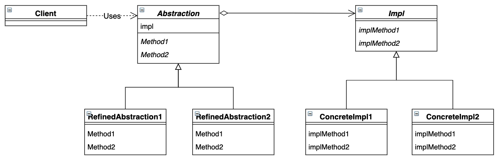

# Bridge 模式

*将类的功能层次结构与实现层次结构分离*

## 目录

1. 类图
2. 需求
3. 实现


## 一、类图




## 二、需求

已知礼物的内容为一本书。要求设计实现男孩的礼物，男孩的礼物内容可以是小说或漫画书。要求设计实现女孩的礼物，女孩的礼物内容可以是小说或漫画书。

```java
/**
 * 书籍抽象类
 */
public abstract class Book {
    public abstract void showImpl();
}


/**
 * 礼物抽象类，这里用书籍作为礼物内容
 */
public abstract class Gift {

    protected Book book;

    protected Gift(Book book) {
        this.book = book;
    }

    public abstract void show();
}
```


测试类可以拆开礼物，从而知晓礼物的具体内容

```java
public class Main {

    public static void main(String[] args) {
        test(new BoyGift(new ComicBook()));
        test(new BoyGift(new NovelBook()));
        test(new GirlGift(new ComicBook()));
        test(new GirlGift(new NovelBook()));
    }

    public static void test(Gift gift) {
        gift.show();
    }
}
```


## 三、实现

1. 项目结构

framework包搭建了礼物与书籍之间的桥接框架，并对外提供了访问礼物的接口。book包提供了书籍的具体实现，gift包提供了礼物的具体实现。Main为程序行为测试类，可以拆开礼物，从而知晓礼物的具体内容。

```
bridge
|__	Main.java
|__	framework
|	|__	Book.java
|	|__	Gift.java
|__	book
|	|__	ComicBook.java
|	|__	NovelBook.java
|__	gift
	|__	BoyGift.java
	|__	GirlGift.java
```


2. 书籍具体类

```java
public class ComicBook extends Book {
    @Override
    public void showImpl() {
        System.out.println("叮当猫");
    }
}

public class NovelBook extends Book {
    @Override
    public void showImpl() {
        System.out.println("西游记");
    }
}
```


3. 礼物具体类

```java
public class BoyGift extends Gift {

    public BoyGift(Book book) {
        super(book);
    }

    @Override
    public void show() {
        System.out.print("给勇敢的男孩");
        book.showImpl();
    }
}

public class GirlGift extends Gift {

    public GirlGift(Book book) {
        super(book);
    }

    @Override
    public void show() {
        System.out.print("给美丽的女孩");
        book.showImpl();
    }
}
```

