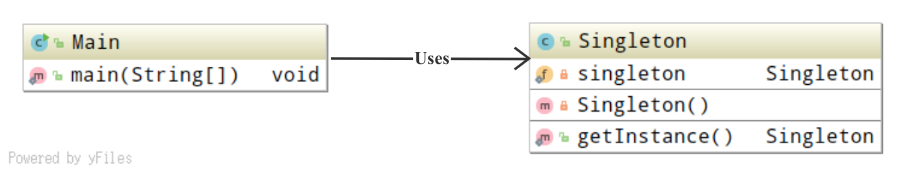

## Singleton 模式

*只有一个实例*

### 目录

1. 知识概述
2. 示例程序
3. Q&A


### 一、知识概述

Singleton 模式是指，在任何情况下只生成一个实例，且该实例能够在程序上表现出来。该模式仅包含一种角色。

* Singleton：负责实现返回唯一实例的方法。


### 二、示例程序

以下为实现了Singleton模式的示例程序，这段示例程序的作用是，从外部获取唯一实例，并进行验证。

**类图示例**



**程序清单**

```java
/**
 * 只存在一个实例的类
 */
public class Singleton {
    private static Singleton singleton = new Singleton();

    private Singleton() {
        System.out.println("生成了一个实例");
    }

    public static Singleton getInstance() {
        return singleton;
    }
}

/**
 * 测试程序行为的类 验证任何情况下只生成一个实例
 */
public class Main {
    public static void main(String[] args) {
        System.out.println("Start.");
        Singleton obj1 = Singleton.getInstance();
        Singleton obj2 = Singleton.getInstance();
        if (obj1 == obj2) {
            System.out.println("obj1与obj2是相同的实例");
        } else {
            System.out.println("obj1与obj2是不同的实例");
        }
        System.out.println("End.");
    }
}

```


### 三、Q&A

Q1：

修改以下代码，确保只能生成一个该类的实例

```java
public class TicketMaker {
    private int ticket = 1000;
    public int getNextTicketNumber() {
        return ticket++;
    }
}
```

A1：

```java
public class TicketMaker {
    
    private static TicketMaker maker = new TicketMaker();
        
    public static getInstance() {
        return maker;
    }
    
    private int ticket = 1000;
    
    private TicketNumber() {
    }
    
    public synchronized int getNextTicketNumber() {
        return ticket++;
    }
}
```

Q2：

编写Triple类，实现最多只能生成3个Triple类的实例，实例编号1,2,3，且可以通过getInstance(int id) 来获取该编号对应的实例

A2：

```java
public class Triple {
    private static Triple[] triples = new Triple[] {
            new Triple(0),
            new Triple(1),
            new Triple(2),
    };
    
    public static Triple getInstance(int id) {
        return triples[id];
    }
    // 限制可见性
    private Triple() {
    }
}
```

Q3：

某研发人员编写了如下的Singleton类，但这并非严格的Singleton模式。why？

```java
public class Singleton {
    // 限制可见性
    private Singeton() {
        System.out.println("生成了一个实例");
    }
    
    private static Singleton singleton = null;
    
    public static Singleton getInstance() {
        if (singleton == null) {
            singleton = new Singleton();
        }
        return singleton;
    } 
}
```

A3：

```
这是因为在多个线程在同时调用getInstance方法时，可能会生成多个实例。
```