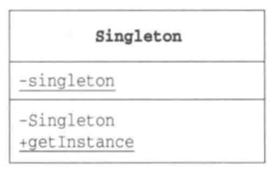

# Singleton 模式

*只有一个实例*

## 目录

1. 需求
2. 思路
3. 总结


## 一、需求

要求设计一个类，该类在任何情况下只存在一个实例


## 二、思路

1. 饿汉式

单例类的唯一实例，在类加载的过程中被初始化。单例类的构造方法是私有的，对外不可见。

缺点：浪费内存

```java
public class Singleton {
    private static Singleton singleton = new Singleton();

    private Singleton() {
        System.out.println("生成了一个实例");
    }

    public static Singleton getInstance() {
        return singleton;
    }
}
```


2. 懒汉式

在多个线程在同时调用getInstance方法时，必须加锁才能保证单例。

缺点：影响效率

```java
public class Singleton {
    private static Singleton singleton;
    
    private Singleton() {
        System.out.println("生成了一个实例");
    }
    
    public static synchronized Singleton getInstance() {
        if (singleton == null)
            singleton = new Singleton();
        return singleton;
    }
}
```


3. 双检锁

```java
public class Singleton {
    private static Singleton singleton;
    
    private Singleton() {
        System.out.println("生成了一个实例");
    }
    
    public static Singleton getInstance() {
        if (singleton == null) {
            Synchronized(Singleton.class) {
                if (singleton == null)
                    singleton = new Singleton();
            }
        }
        return singleton;
    }
}
```


4. 静态内部类

`SingletonHolder.class`为`Singleton.class`的私有成员变量，只有在被调用时才会装载。

```java
//由JVM线程装载至方法区
public class Singleton {
    private static Singleton singleton;
    
    private Singleton() {
        System.out.println("生成了一个实例");
    }
    
    public static Singleton getInstance() {
        return SingletonHolder.singleton;
    }
    
    //由JVM线程装载至方法区
    private static class SingletonHolder {
        private static Singleton singleton = new Singleton();
    }
}
```

补充小知识：

* 静态内部类，是外部类的成员变量
* 内部类，是外部对象的成员变量
* 只要获得了类或实例，就可以调用他们的可见代码


代码可见性：

```
Modifier	|	Class	|	Package	|	SubClass|	World
public		|	Y		|	Y		|	Y		|	Y
protected	|	Y		|	Y		|	Y		|	N
no modifier	|	Y		|	Y		|	N		|	N
private		|	Y		|	N		|	N		|	N
```


## 三、总结

单例模式的类图：

