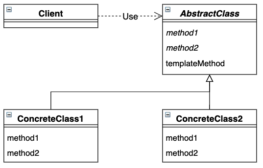

# Template Method 模式

定义一个流程结构，而将流程中的具体步骤延迟到子类中。


## 目录
1. 类图
2. 需求
3. 实现


## 一、类图




## 二、需求

已知食物的处理流程是先清洗后加热，要求实现鸡蛋的处理步骤和大米的处理步骤

```java
/**
 * 模版抽象类
 */
public abstract class Food {
    protected abstract void wash();
    protected abstract void heat();

    public void make() {
        wash();
        heat();
    }
}
```


测试类

```java
public class Main {
    public static void main(String[] args) {
        test(new Rice());
        test(new Egg());
    }

    public static void test(Food food) {
        food.make();
    }
}
```


## 三、实现

1. 项目结构

```
template
|__	Main.java
|__	framework
|	|__	Food.java
|__	food
	|__	Egg.java
	|__	Rice.java
```


2. 具体的食物

```java
/**
 * 大米
 */
public class Rice extends Food {
    @Override
    protected void wash() {
        System.out.println("洗大米");
    }

    @Override
    protected void heat() {
        System.out.println("煮大米");
    }
}


/**
 * 鸡蛋
 */
public class Egg extends Food {
    @Override
    protected void wash() {
        System.out.println("洗鸡蛋");
    }

    @Override
    protected void heat() {
        System.out.println("煮鸡蛋");
    }
}

```


