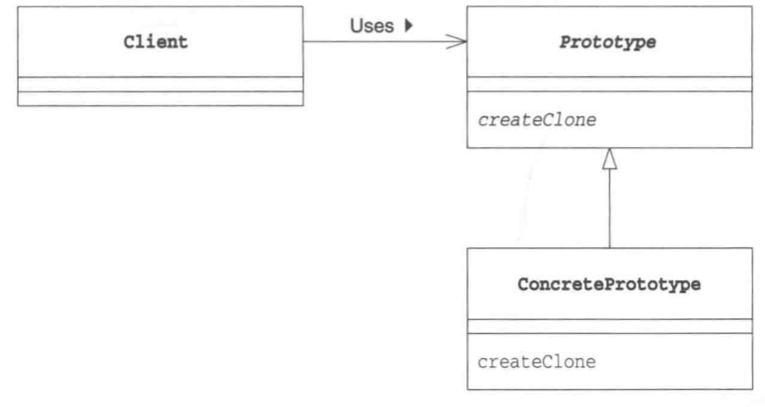

# Prototype 模式

通过复制生成实例

## 目录

1. 需求
2. 思路
3. 总结


## 一、需求

给定复印机类，可以复印通用的纸质资料。要求实现具体的日志类和新闻类，可供复印机进行复印

```java
/**
 * 纸质资料接口，声明了用于显示和复印的抽象方法
 */
public interface Paper extends Cloneable {
    public abstract void show();
    public abstract Paper copy();
}

/**
 * 复印机类，可以复印任何纸质资料
 */
public class Printer {

    private HashMap<String, Paper> map = new HashMap<>();

    public void register(String name, Paper proto) {
        map.put(name, proto);
    }

    public Paper create(String name) {
        Paper product = map.get(name);
        return product.copy();
    }
}


```


## 二、思路

1. 项目结构

fromework包搭建了复印机框架，以及提供了复印机的使用接口。com包对有待复印的纸质资料进行具体实现。Main为测试类，用于测试复印机是否正常工作。

```
prototype
|__	Main.java
|__	framework
|	|__	Printer.java
|	|__	Paper.java
|__	com
	|__	Logs.java
	|__	News.java
```


2. 日志类

假定一个完整的日志需要有标题，显示日志时会输出日志标题，复印日志时会复制标题。

```java
/**
 * 日志类，可以显示日志的具体内容，或进行日志复印
 */
public class Logs implements Paper {

    private String title;

    public Logs(String title) {
        this.title = title;
    }

    @Override
    public void show() {
        System.out.println(title);
    }

    @Override
    public Paper copy() {
        Paper p = null;
        try {
            p = (Paper) clone();
        } catch (CloneNotSupportedException e) {
            e.printStackTrace();
        }
        return p;
    }
}

```


3. 新闻类

假定一个完整的新闻需要有标题，显示新闻时会输出新闻标题，复印新闻时会复制标题。

```java
/**
 * 新闻类，可以显示新闻的具体内容，或进行新闻复印
 */
public class News implements Paper {

    private String title;

    public News(String title) {
        this.title = title;
    }

    @Override
    public void show() {
        System.out.println(title);
    }

    @Override
    public Paper copy() {
        Paper p = null;
        try {
            p = (Paper) clone();
        } catch (CloneNotSupportedException e) {
            e.printStackTrace();
        }
        return p;
    }
}

```


4. 测试类

在进行复印之前，需要将纸质资料的原稿注册进打印机中，之后可以指定原稿进行复印

```java
public class Main {
    public static void main(String[] args) {
        Printer p = new Printer();
        p.register("news", new News("新闻标题"));
        p.register("logs", new Logs("日志标题"));
        p.create("news").show();
        p.create("logs").show();
    }
}
```


## 三、总结

原型模式的类图

