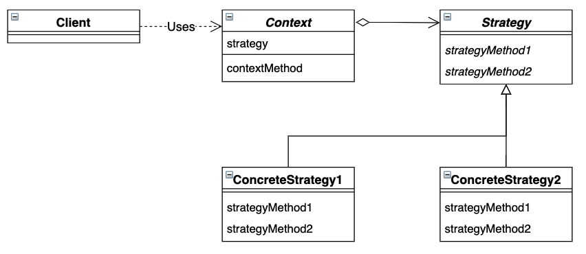

# Strategy 模式

*整体地替换算法*

## 目录

1. 类图
2. 需求
3. 实现


## 一、类图




## 二、需求

已知礼物的内容为一本书，要求设计实现小说和漫画书。

```java
/**
 * 书籍抽象类
 */
public abstract class Book {
    public abstract void showImpl();
}


/**
 * 礼物抽象类，这里用书籍作为礼物内容
 */
public class Gift {

    private Book book;
    
    public void setBook(Book book) {
        this.book = book;
    }

    public void show() {
        book.showImpl();
    }
}
```


测试类可以拆开礼物，从而知晓礼物的具体内容

```java
public class Main {

    public static void main(String[] args) {
        Gift gift = new Gift();
        
        gift.set(new ComicBook());
        test(gift);
        
        gift.set(new NovelBook());
        test(gift)
    }

    public static void test(Gift gift) {
        gift.show();
    }
}
```


## 三、实现

1. 项目结构

framework包搭建了礼物与书籍之间的框架，并对外提供了访问礼物的接口。book包提供了书籍的具体实现。Main为程序行为测试类，可以拆开礼物，从而知晓礼物的具体内容。

```
strategy
|__	Main.java
|__	framework
|	|__	Book.java
|	|__	Gift.java
|__	book
	|__	ComicBook.java
	|__	NovelBook.java

```


2. 书籍具体类

```java
public class ComicBook extends Book {
    @Override
    public void showImpl() {
        System.out.println("叮当猫");
    }
}

public class NovelBook extends Book {
    @Override
    public void showImpl() {
        System.out.println("西游记");
    }
}
```

