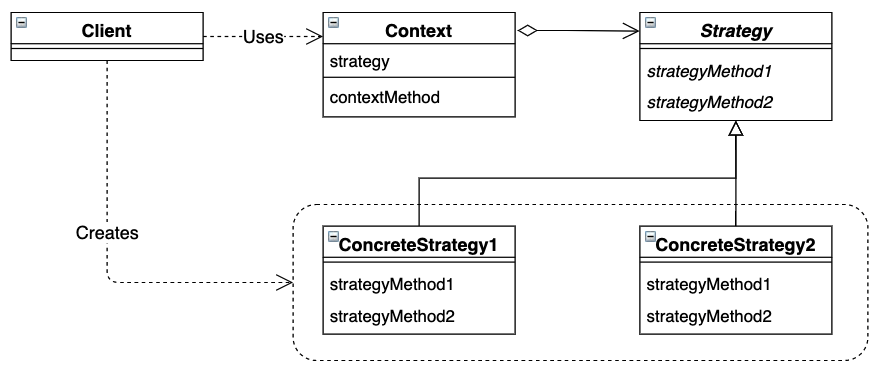

# Strategy 模式

通过对策略进行封装，把使用策略的责任和策略的实现分割开来。


## 目录

1. 类图
2. 需求
3. 实现


## 一、类图




## 二、需求

要求实现不同类型的策略，对上下文进行排序

```java
/**
 * 策略抽象类
 */
public abstract class Strategy {
    public abstract void execute();
}

/**
 * 上下文类
 */
public class Context {

    private Strategy strategy;

    public Context(Strategy strategy) {
        this.strategy = strategy;
    }

    public void call() {
        strategy.execute();
    }
}
```


测试类

```java
public class Main {
    public static void main(String[] args) {
        test(new QuickSort());
        test(new MergeSort());
    }
    
    public static void test(Strategy strategy) {
        Context context = new Context(strategy);
        context.call();
    }
}
```


## 三、实现

1. 项目结构

```
strategy
|__	Main.java
|__	framework
|	|__	Context.java
|	|__	Strategy.java
|__	strategy
	|__	QuickSort.java
	|__	MergeSort.java
```


2. 具体策略

```java
/**
 * 快速排序
 */
public class QuickSort extends Strategy {
    @Override
    public void execute() {
        System.out.println("执行快速排序");
    }
}

/**
 * 归并排序
 */
public class MergeSort extends Strategy {
    @Override
    public void execute() {
        System.out.println("执行归并排序");
    }
}
```

