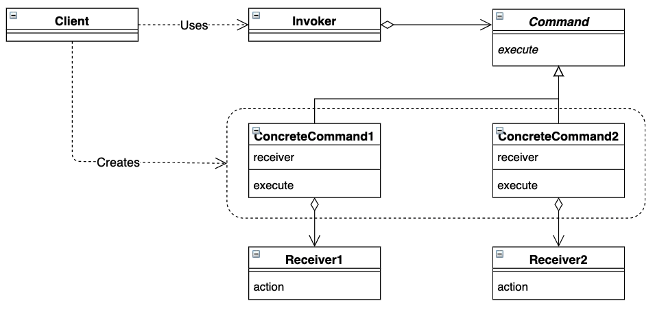

# Command 模式

将一个请求封装为一个对象，使发出请求的责任和执行请求的责任分割开


## 目录

1. 类图
2. 需求
3. 实现


## 一、类图




## 二、需求

已知命令发起者可以发出一系列指令，由命令接收者执行。要求实现不同类型的指令，分别对应开灯操作和关灯操作

```java
/**
 * 命令抽象类
 */
public abstract class Command {
    public abstract void execute();
}


/**
 * 命令发起者
 */
public class Invoker {
    private ArrayDeque<Command> queue;

    public Invoker() {
        this.queue = new ArrayDeque<>();
    }

    public void save(Command command) {
        queue.offer(command);
    }

    public void execute() {
        Command command = queue.poll();
        command.execute();
    }
}


/**
 * 命令接收者
 */
public class Light {

    public void on() {
        System.out.println("Light on");
    }

    public void off() {
        System.out.println("Light off");
    }
}
```


测试类

```java
package command;

import command.framework.Light;
import command.command.OffCommand;
import command.command.OnCommand;
import command.framework.Invoker;

public class Main {
    public static void main(String[] args) {
        Invoker invoker = new Invoker();
        Light light = new Light();
        invoker.save(new OnCommand(light));
        invoker.save(new OffCommand(light));
        invoker.execute();
        invoker.execute();
    }
}
```


## 三、实现

1. 项目结构

```
command
|__	Main.java
|__	framework
|	|__	Commmand.java
|	|__	Invoker.java
|	|__	Light
|__	Command
	|__	OffCommand.java
	|__	OnCommand.java
```


2. 具体指令

```java
/**
 * 开灯指令
 */
public class OnCommand extends Command {
    private Light light;

    public OnCommand(Light light) {
        this.light = light;
    }

    @Override
    public void execute() {
        light.on();
    }
}

/**
 * 关灯指令
 */
public class OffCommand extends Command {
    private Light light;

    public OffCommand(Light light) {
        this.light = light;
    }
    @Override
    public void execute() {
        light.off();
    }
}
```

