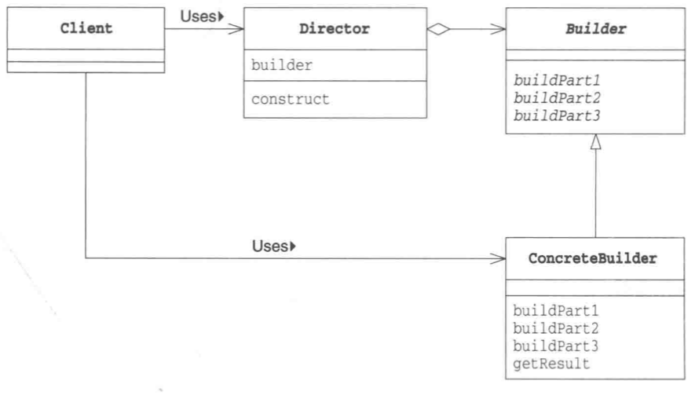

# Builder 模式

*组装复杂的实例*

## 目录

1. 需求
2. 思路
3. 总结


## 一、需求

已知监工类和通用的建造方法，监工可以指挥建造者完成工作。要求实现具体的公园建造者和旅馆建造者，最后，用户可以到公园散步，可以到旅馆住宿

```java
/**
 * 建造者抽象类，声明了内部和外部的建造方法
 */
public abstract class Builder {
    protected abstract void inside();
    protected abstract void outside();
}

/**
 * 监工类，负责指挥建造者完成工作
 */
public class Director {
    private Builder builder;

    public Director(Builder builder) {
        this.builder = builder;
    }

    public void construct() {
        builder.inside();
        builder.outside();
    }
}
```


## 二、思路

1. 项目结构

framework包含监工类和通用的建造方法，com包对具体的建造者进行实现。Main为程序行为测试类，用于测试监工类能否指挥建造者完成工作

```
builder
|__	Main.java
|__	framework
|	|__	Director.java
|	|__	Builder.java
|__	com
	|__	ParkBuilder.java
	|__	HotelBuilder.java
```


2. 公园建造者

公园建造者只能在监工的指挥下进行建造，外部用户可以直接访问建造后的公园

```java
/**
 * 公园建造者，可以建造公园内部和外部
 */
public class ParkBuilder extends Builder {
    private StringBuilder park = new StringBuilder();

    @Override
    protected void inside() {
        park.append("内部花园");
    }

    @Override
    protected void outside() {
        park.append("外部小河");
    }

    public String visit() {
        return park.toString();
    }
}

```


3. 旅馆建造者

旅馆建造者只能在监工的指挥下进行建造，外部用户可以直接访问建造后的旅馆

```java
package builder.com;

import builder.framework.Builder;

/**
 * 旅馆建造者，可以建造旅馆内部和外部
 */
public class HotelBuilder extends Builder {
    private StringBuilder hotel = new StringBuilder();

    @Override
    protected void inside() {
        hotel.append("豪华套间");
    }

    @Override
    protected void outside() {
        hotel.append("宽敞大门");
    }

    public String visit() {
        return hotel.toString();
    }
}
```


4. 测试类

用于测试监工是否能指挥公园/旅馆建造者正常工作

```java
public class Main {
    public static void main(String[] args) {
        ParkBuilder parkBuilder = new ParkBuilder();
        Director director1 = new Director(parkBuilder);
        director1.construct();

        HotelBuilder hotelBuilder = new HotelBuilder();
        Director director2 = new Director(hotelBuilder);
        director2.construct();

        System.out.println(parkBuilder.visit());
        System.out.println(hotelBuilder.visit());
    }
}

```


## 三、总结

Builder模式的类图



Builder模式的时序图


