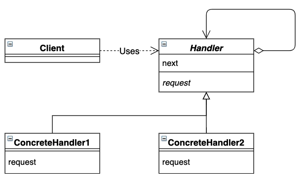

# Chain of Responsibility 模式

将多个责任人对象组成一条职责链，并沿着这条链传递请求，直到有责任人对象处理它为止。责任链模式可以避免请求发送者同时与多个责任人耦合在一起。


## 目录

1. 类图
2. 需求
3. 实现


## 一、类图




## 二、需求

要求实现一条责任链，其中老板负责转交请求，员工负责处理请求。

```java
/**
 * 处理者抽象类
 */
public abstract class Handler {
    protected Handler next;

    protected Handler(Handler next) {
        this.next = next;
    }

    public abstract void request();
}
```


测试类

```java
public class Main {
    public static void main(String[] args) {
        Handler boss = new Boss(new Staff(null));
        boss.request();
    }
}
```


## 三、实现

1. 项目结构

```
command
|__	Main.java
|__	framework
|	|__	Handler.java
|__	handler
	|__	Boss.java
	|__	Staff.java
```


2. 具体责任人

```java
/**
 * 老板
 */
public class Boss extends Handler {

    public Boss(Handler next) {
        super(next);
    }

    @Override
    public void request() {
        System.out.println("老板转交请求");
        next.request();
    }
}

/**
 * 员工
 */
public class Staff extends Handler {

    public Staff(Handler next) {
        super(next);
    }

    @Override
    public void request() {
        System.out.println("员工处理请求");
    }
}
```

