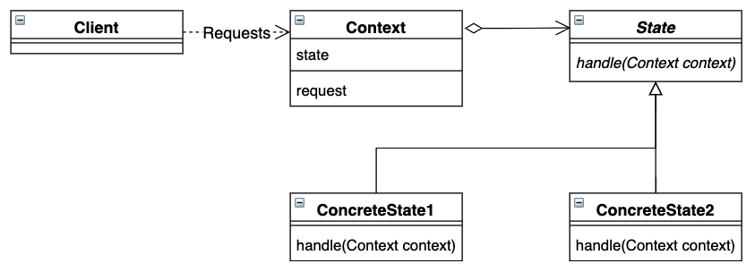

# State 模式

根据上下文的状态，对上下文进行不同处理。状态模式用不同的状态对象来表示不同的“判断逻辑”。


## 目录

1. 类图
2. 需求
3. 实现


## 一、类图




## 二、需求

要求根据水的当前状态，对水进行不同的处理。比如水当前是保温状态，则进行保温处理，如果水当前是加热状态，则进行加热处理。（禁用“判断逻辑”）

```java
/**
 * 状态抽象类
 */
public abstract class State {
    protected abstract void handle(Water water);
}

/**
 * 水
 */
public class Water {

    private State state;

    public Water(State state) {
        this.state = state;
    }

    public void setState(State state) {
        this.state = state;
    }

    public void request() {
        state.handle(this);
    }
}
```


测试类

```java
public class Main {
    public static void main(String[] args) {
        Water water = new Water(new Heat());
        water.request();
        water.request();
    }
}
```


## 三、实现

1. 项目结构

```
state
|__	Main.java
|__	framework
|	|__	State.java
|	|__	Water.java
|__	state
	|__	Heat.java
	|__	Keep.java
```


2. 具体状态类

```java
/**
 * 加热状态
 */
public class Heat extends State {
    @Override
    protected void handle(Water water) {
        System.out.println("加热状态");
        water.setState(new Keep());
    }
}

/**
 * 保温状态
 */
public class Keep extends State {
    @Override
    protected void handle(Water water) {
        System.out.println("保温状态");
        water.setState(new Heat());
    }
}
```

