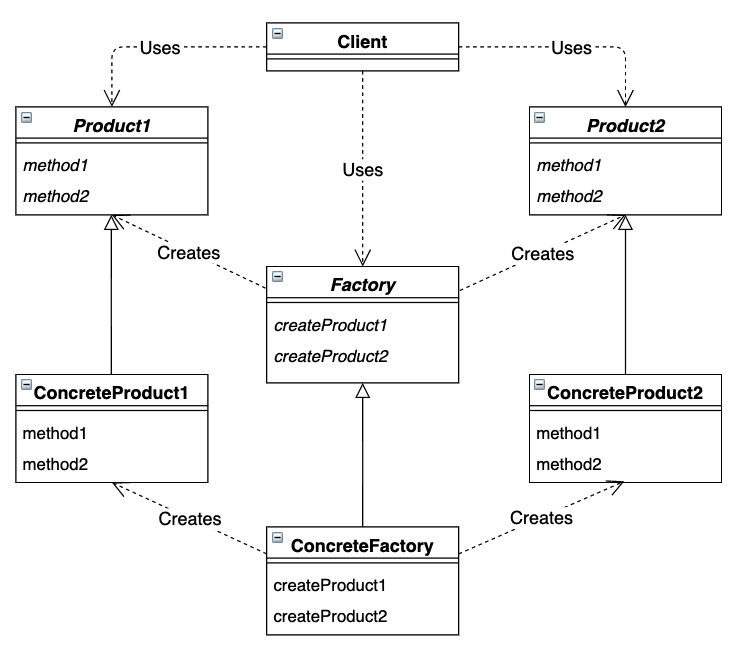

# Abstract Factory

*将关联零件组装成产品*

## 目录

1. 类图
2. 需求
3. 实现


## 一、类图



## 二、需求

已知抽象的工厂和零件，要求实现具体的工厂和零件。比如汽车工厂生产汽车零件，单车工厂生产单车零件。

```java
/**
 * 工厂抽象类，声明了生产内部零件和外部零件的抽象方法
 */
public abstract class Factory {

    public static Factory getFactory(String classname) {
        Factory factory = null;
        try {
            factory = (Factory) Class.forName(classname).newInstance();
        } catch (Exception e) {
            e.printStackTrace();
        }
        return factory;
    }

    public abstract Inpart createInpart();
    public abstract Outpart createOutpart();
}

/**
 * 内部零件抽象类，声明了检查温度的抽象方法
 */
public abstract class Inpart {
    public abstract void checkTemp();
}

/**
 * 外部零件抽象类，声明了检查大小的抽象方法
 */
public abstract class Outpart {
    public abstract void checkSize();
}
```


测试类调用工厂生产不同类型的零件，并对零件进行检查

```java
/**
 * 测试类，调用工厂生产零件，并对零件进行检查
 */
public class Main {
    public static void main(String[] args) {
        test(Factory.getFactory("factoryab.bike.BikeFactory"));
        test(Factory.getFactory("factoryab.car.CarFactory"));
    }

    public static void test(Factory factory) {
        Inpart in = factory.createInpart();
        in.checkTemp();
        Outpart ou = factory.createOutpart();
        ou.checkSize();
    }
}
```


## 三、实现

1. 项目结构

framework包构建了抽象工厂的框架，并对外了提供了工厂的生产接口，以及零件的通用接口。bike包实现了单车工厂和单车零件，car包实现了汽车工厂和汽车零件。Main为程序行为测试类，用于测试指定的工厂能否生产对应的零件。

```
factory
|__	Main.java
|__	framework
|	|__	Factory.java
|	|__	Inpart.java
|	|__	Outpart.java
|__	car
|	|__	CarFactory.java
|	|__	CarInpart.java
|	|__	CarOutpart.java
|__	bike
	|__	BikeFactory.java
	|__	BikeInpart.java
	|__	BikeOutpart.java
```


2. 汽车工厂

CarFactory实现了生产外部零件和内部零件的方法。CarInpart实现了汽车内部零件的检查方法，CarOutpart实现了汽车外部零件的检查方法。

```java
public class CarFactory extends Factory {
    @Override
    public Inpart createInpart() {
        return new CarInpart();
    }

    @Override
    public Outpart createOutpart() {
        return new CarOutpart();
    }
}

public class CarInpart extends Inpart {
    @Override
    public void checkTemp() {
        System.out.println("发动机温度为40度");
    }
}

public class CarOutpart extends Outpart {
    @Override
    public void checkSize() {
        System.out.println("玻璃大小为5英尺");
    }
}
```


3. 单车工厂

BikeFactory实现了生产外部零件和内部零件的方法。BikeInpart实现了单车内部零件的检查方法，BikeOutpart实现了单车外部零件的检查方法。

```java
public class BikeFactory extends Factory {
    @Override
    public Inpart createInpart() {
        return new BikeInpart();
    }

    @Override
    public Outpart createOutpart() {
        return new BikeOutpart();
    }
}

public class BikeInpart extends Inpart {
    @Override
    public void checkTemp() {
        System.out.println("轴承温度为15度");
    }
}

public class BikeOutpart extends Outpart {
    @Override
    public void checkSize() {
        System.out.println("踏板大小为3英寸");
    }
}
```

