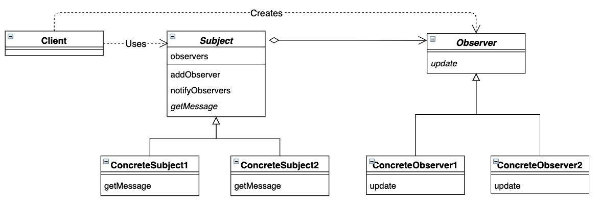

# 观察者模式

指多个对象间存在一对多的依赖关系，当一个对象的状态发生改变时，所有依赖于它的对象都得到通知并被自动更新。


## 目录

1. 类图
2. 需求
3. 实现


## 一、类图




## 二、需求

要求实现具体的观察者和观察目标，当目标发生状态改变时，观察者会得到通知并被自动更新。比如，当米饭熟了之后，男孩和女孩都会得到通知。

```java
/**
 * 抽象目标
 */
public abstract class Subject {
    private List<Observer> observers;

    public Subject() {
        this.observers = new ArrayList<>();
    }

    public void addObserver(Observer observer) {
        observers.add(observer);
    }

    public void notifyObservers() {
        for (Observer observer: observers) {
            observer.update(getMsg());
        }
    }

    protected abstract String getMsg();

}


/**
 * 抽象观察者
 */
public abstract class Observer {

    public Observer(Subject subject) {
        subject.addObserver(this);
    }

    public abstract void update(String msg);
}
```


测试类

```java
public class Main {
    public static void main(String[] args) {
        test(new Rice());
        test(new Egg());
    }

    public static void test(Subject subject) {
        Boy boy = new Boy(subject);
        Girl girl = new Girl(subject);
        subject.notifyObservers();
    }
}
```


## 三、实现

1. 项目结构

```
observe
|__	Main.java
|__	framework
|	|__	Observer.java
|	|__	Subject.java
|__	observer
|	|__	Boy.java
|	|__	Girl.java
|__	subject
	|__	Egg.java
	|__	Rice.java
```


2. 具体目标

```java
/**
 * 米饭
 */
public class Rice extends Subject {
    @Override
    protected String getMsg() {
        return "米饭熟了";
    }
}


/**
 * 鸡蛋
 */
public class Egg extends Subject {
    @Override
    protected String getMsg() {
        return "鸡蛋熟了";
    }
}
```


3. 具体观察者

```java
/**
 * 男孩
 */
public class Boy extends Observer {

    public Boy(Subject subject) {
        super(subject);
    }

    @Override
    public void update(String msg) {
        System.out.println("男孩发现" + msg);
    }
}


/**
 * 女孩
 */
public class Girl extends Observer {

    public Girl(Subject subject) {
        super(subject);
    }

    @Override
    public void update(String msg) {
        System.out.println("女孩发现" + msg);
    }
}
```


Tips：子类在构造实例前，会先构造父类实例。所以适用于父类的设计，对子类也是通用的。
