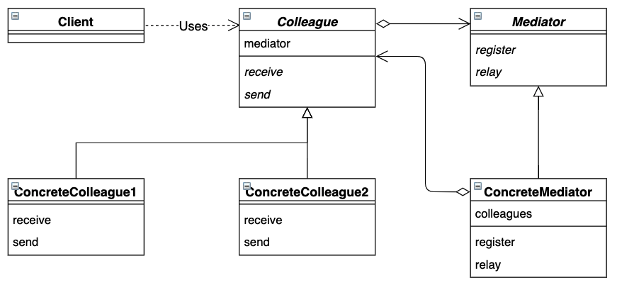

# 中介者模式

组员向中介者报告，中介者向组员下达指示。组员之间不会相互询问和相互指示。


## 目录

1. 类图
2. 需求
3. 实现


## 一、类图




## 二、需求

要求实现具体的中介者和具体的组员。组员向中介者报告，中介者向组员下达指示，组员之间不会相互询问和相互指示。

```java
/**
 * 抽象中介者
 */
public interface Mediator {
    void register(Colleague colleague);
    void relay();
}


/**
 * 抽象组员
 */
public abstract class Colleague {

    protected Mediator mediator;

    public Colleague(Mediator mediator) {
        this.mediator = mediator;
        mediator.register(this);
    }

    public abstract void receive();
    public abstract void send();
}
```


测试类

```java
public class Main {
    public static void main(String[] args) {
        Mediator mediator = new Leader();
        Colleague Tom = new Tom(mediator);
        Colleague Mike = new Mike(mediator);
        Tom.send();
        Mike.send();
    }
}
```


## 三、实现

1. 项目结构

```
mediator
|__	Main.java
|__	framework
|	|__	Colleague.java
|	|__	Mediator.java
|__	mediator
|	|__	Leader.java
|__	colleague
	|__	Mike.java
	|__	Tom.java
```


2. 具体的中介者

```java
/**
 * 领导
 */
public class Leader implements Mediator {

    private List<Colleague> colleagues;

    public Leader() {
        this.colleagues = new ArrayList<>();
    }

    @Override
    public void register(Colleague colleague) {
        colleagues.add(colleague);
    }

    @Override
    public void relay() {
        for (Colleague colleague: colleagues) {
            colleague.receive();
        }
    }
}
```


3. 具体的组员

```java
/**
 * Mike
 */
public class Mike extends Colleague {

    public Mike(Mediator mediator) {
        super(mediator);
    }

    @Override
    public void receive() {
        System.out.println("Mike 接收消息");
    }

    @Override
    public void send() {
        System.out.println("Mike 发送消息");
        mediator.relay();
    }
}


/**
 * Tom
 */
public class Tom extends Colleague {

    public Tom(Mediator mediator) {
        super(mediator);
    }

    @Override
    public void receive() {
        System.out.println("Tom 接收消息");
    }

    @Override
    public void send() {
        System.out.println("Tom 发送消息");
        mediator.relay();
    }
}
```


Tips：对象之间可以相互依赖，类之间可以相互依赖，包之间可以相互依赖，但是模块之间不可以相互依赖。如果模块间出现相互依赖，则无法按照自下而上的顺序进行打包。为了解决这个问题，我们可以将被依赖的部分抽取成新的接口模块，之后可以按序打包。
