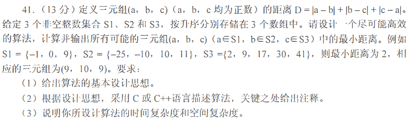
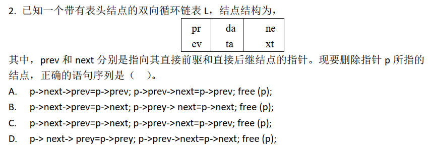
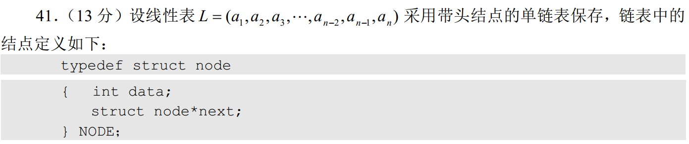
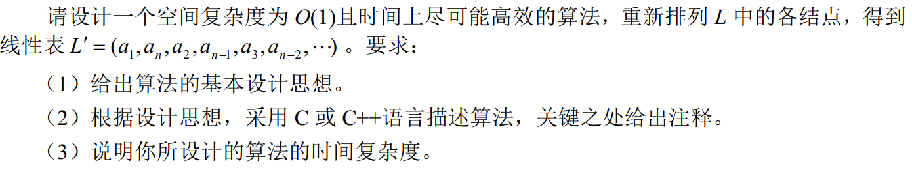
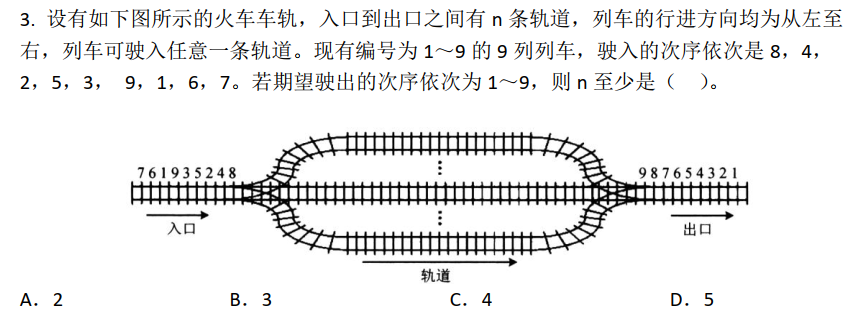
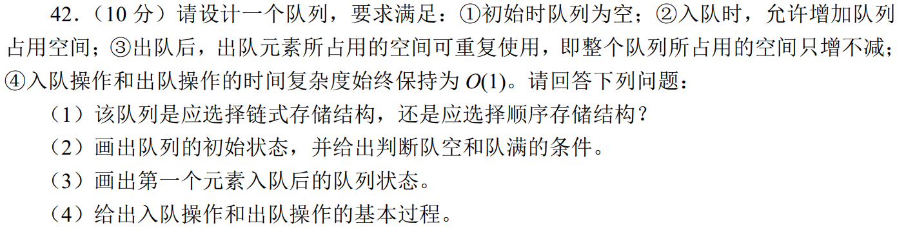
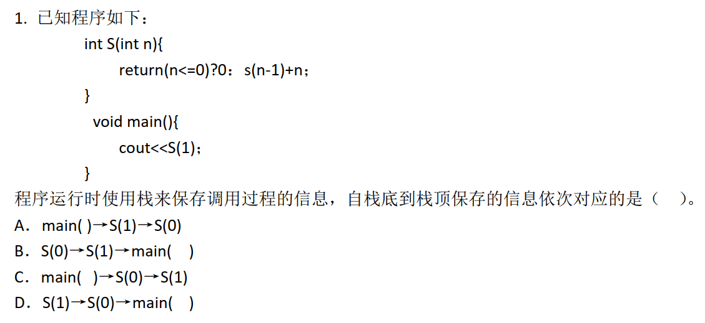
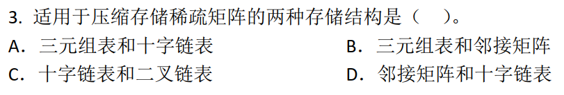

## 数据结构考点

分章节整理2015-2020年的高频考点，以及对应的考研真题

### 目录

1. 绪论
2. 线性表
3. 栈和队列
4. 串
5. 树与二叉树
6. 图
7. 查找
8. 排序

### 一、绪论

#### 时间复杂度与空间复杂度【必考】

2017：

2019：

### 二、线性表

#### 线性表的顺序表示【必考】

2016：

2018：

2020：

#### 线性表的链式表示【常考】

2015：

2016：

2019：

### 三、栈和队列

#### 栈和队列的基本属性【必考】

2016：

2017：

2018：

2020：

#### 栈和队列的存储结构

2019：

#### 双端队列

#### 栈与队列的应用【常考】

2015：

2018：

### 四、串

#### 特殊矩阵的压缩存储

2016：

2017：

2018：

2020：

#### 串的模式匹配算法

2015：

2019：

### 五、树与二叉树

#### 树的基本性质

#### 二叉树的定义与性质【常考】

#### 二叉树的遍历【常考】

#### 二叉搜索树【常考】

#### 平衡二叉树【常考】

#### 树、森林与二叉树的转换【常考】

#### 线索二叉树的基本概念和构造

#### 哈夫曼树和哈夫曼编码【必考】

### 六、图

### 七、查找

### 八、排序

