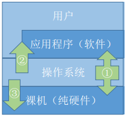
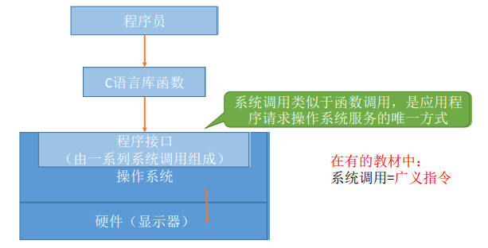
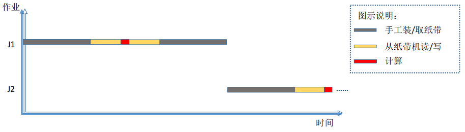
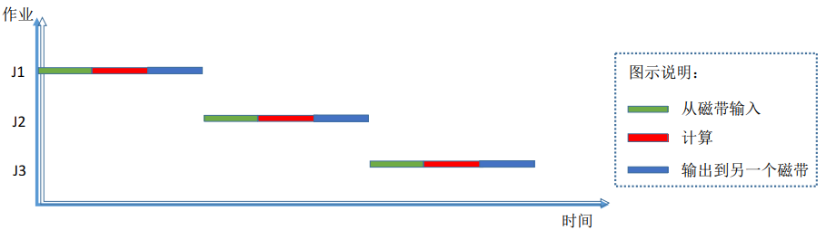
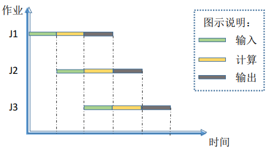

## 1.1 操作系统的基本概念 

### 目录

1. 操作系统的概念
2. 操作系统的特征
3. 操作系统的目标和功能
4. 操作系统的发展与分类

### 操作系统的概念

操作系统是指，控制和管理整个计算机系统的硬件和软件资源，并合理地组织调度计算机的工作和资源的分配，以提供给用户和其他软件方便的接口和环境的**程序集合**。它是计算机系统中最基本的系统软件。

### 操作系统的特征

**并发：**指计算机系统中“同时”运行着多个程序，这些程序宏观上是同时运行的，但微观上是交替运行的。

* 单核CPU同一时刻只能执行一个程序，各个程序只能并发地执行
* 多核CPU同一时刻可以同时执行多个程序，多个程序可以并行地执行

**共享：**指系统中的资源可供内存中多个并发执行的进程共同使用

* 两个并发执行的进程可以共享地访问硬盘资源

**虚拟：**指把一个物理上的实体变成若干个逻辑上的对应物。物理实体是实际存在的，而逻辑上的对应物是用户感受到的。

* 空分复用技术，比如虚拟存储器技术
* 时分复用技术，比如虚拟处理器

**异步：**指在多道程序环境下，允许多个程序并发执行，但由于资源有限，进程的执行不是一贯到底的，而是走走停停，以不可预知的速度向前推进，这就是进程的异步性。

没有并发和共享，就谈不上虚拟和异步，因此并发和共享是操作系统的两个最基本的特征。

### 操作系统的目标和功能

#### a) 作为系统资源的管理者

比如，用 QQ 和朋友视频聊天的过程：
* 在各个文件夹中找到 QQ 安装的位置
* 双击打开 QQ.exe
* QQ 程序正常运行
* 开始和朋友视频聊天

操作系统提供的对应功能有：文件管理、存储器管理、处理机管理、设备管理

#### b) 向上层提供方便易用的服务

硬件只听得懂二进制指令，如：010101111011011011，硬件对外暴露了不友好的交互接口；操作系统在硬件之上进行安装，对外暴露了友好的交互接口。操作系统把不友好的硬件功能封装成简单易用的服务，用户无需关注底层硬件的原理，只需要对操作系统发出命令即可。

* 图形化用户接口：在 Windows 系统中，删除文件只需要把文件“拖拽”到回收站
* 联机命令接口：在命令解释器cmd中，输入命令并执行
* 脱机命令接口：双击执行批处理文件
* 程序接口：由一组系统调用命令（广义指令）组成

### 操作系统的发展与分类

#### a) 手工操作阶段

* 每个程序的执行都需要用户手工装取纸带，造成人机速度矛盾

#### b) 批处理阶段

单道批处理系统：

* 引入脱机输入输出技术，缓解人机速度矛盾
* 系统串行运行各个程序，资源利用率低

多道批处理系统

* 多道程序并发执行，资源利用率高
* 不提供人机交互功能，用户提交作业后只能等待计算机处理完成，无法在程序运行过程中输入一些参数

#### c) 分时操作系统

提供人机交互功能

不能优先处理紧急任务

#### d) 实时操作系统
