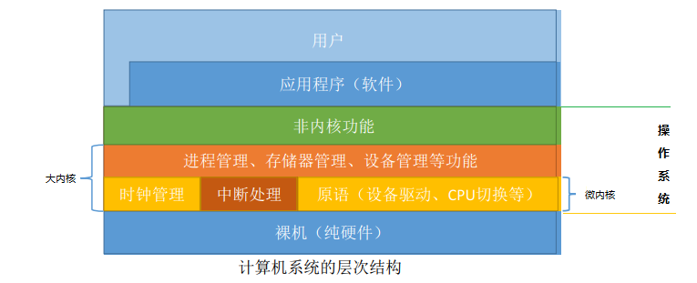

## 1.2 操作系统的运行环境

### 目录

1. 操作系统的运行机制
2. 中断和异常的概念
3. 系统调用

### 操作系统的运行机制

两种指令

* 特权指令：IO指令、置中断指令、存取用于内存保护的寄存器指令
* 非特权指令：加法指令、减法指令、存取寄存器指令

两种处理器状态

* 内核态：运行内核程序，此时可以执行特权指令

* 用户态：运行应用程序，此时只能执行非特权指令

两种处理器状态的转换

* 内核态->用户态：执行一条特权指令，修改PSW的标志位为“用户态”，这个动作意味着操作系统将主动让出CPU使用权
* 用户态->内核态：由“中断”引发，硬件自动完成变态过程，触发中断信号意味着操作系统将强行夺回CPU的使用权

两种内核

### 中断和异常的概念

“中断”是操作系统内核夺回CPU使用权的唯一途经，广义的中断分为内中断和外中断。

内中断：信号来源于CPU内部，与当前执行的指令有关。应用程序主动或被动的将CPU控制权还给内核。

* 指令中断：系统调用时的访管指令
* 硬件故障：缺页
* 软件中断：整数除0

外中断：信号来源于CPU外部，与当前执行的指令无关。每一条指令执行结束时，CPU都会例行检查是否有外部中断信号。

* 时钟中断：时间片中断信号
* 外设请求：I/O中断请求
* 人工干预：用户终止进程

中断向量表：为不同的中断信号类型，提供相应的中断处理程序的地址。显然，中断处理程序一定是内核程序，需要运行在内核态。

### 系统调用

