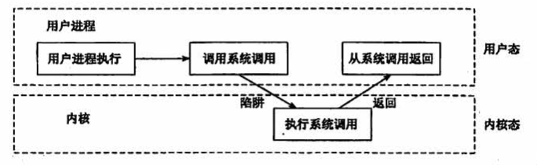

## 1.2 操作系统的运行环境

### 目录

1. 操作系统的运行机制
2. 中断和异常的概念
3. 系统调用

### 操作系统的运行机制

两种指令

* 特权指令：IO指令、置中断指令、存取用于内存保护的寄存器指令
* 非特权指令：加法指令、减法指令、存取寄存器指令

两种处理器状态

* 内核态：运行内核程序，此时可以执行特权指令

* 用户态：运行应用程序，此时只能执行非特权指令

两种处理器状态的转换

* 内核态->用户态：执行一条特权指令，修改PSW的标志位为“用户态”，这个动作意味着操作系统将主动让出CPU使用权
* 用户态->内核态：由“中断”引发，硬件自动完成变态过程，

### 中断和异常的概念

### 系统调用

