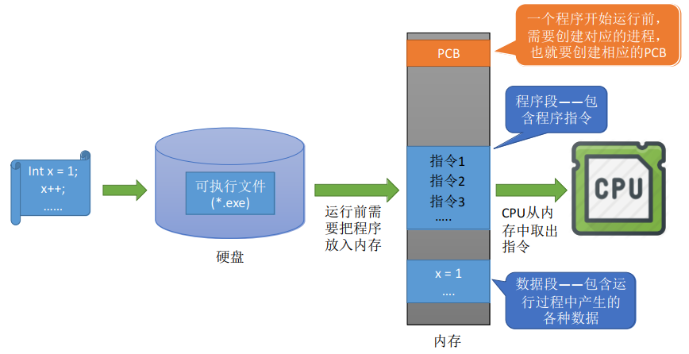
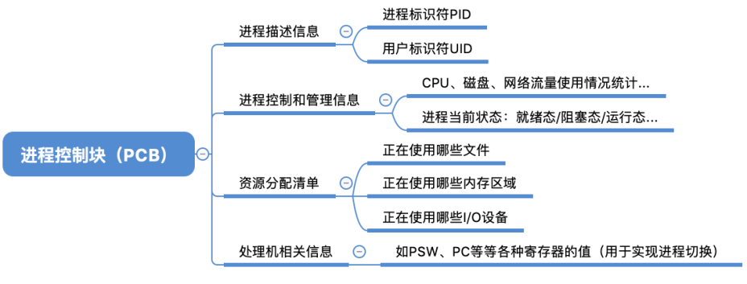
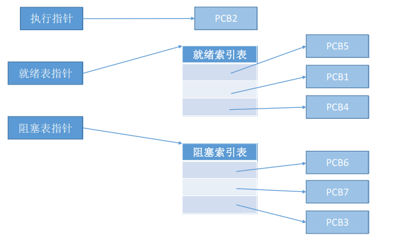
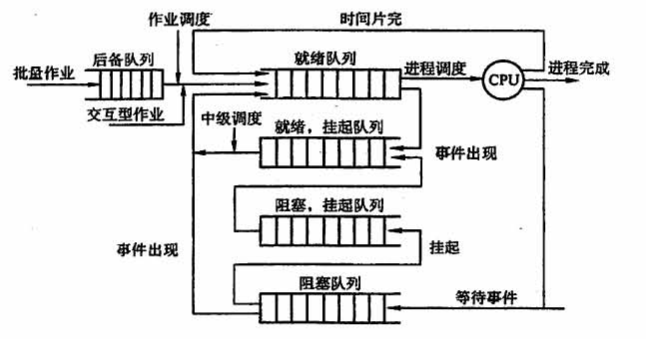
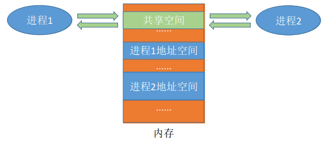
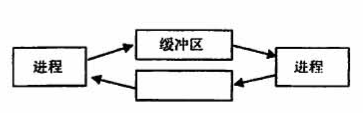

## 2.1 进程与线程

### 目录

1. 进程的概念
2. 进程的组织
3. 进程的状态与转换
4. 进程控制
5. 进程的通信
6. 线程概念和多线程模型


### 进程的概念

一个进程实体（进程映象）由PCB、程序段、数据段组成。进程是动态的，进程实体（进程映象）是静态的。进程实体反应了进程在某一时刻的状态。在引入进程实体的概念后，可以把操作系统中的进程定义为：

> 进程是进程实体的运行过程，是系统进行资源分配和调度的一个独立单位




操作系统需要对各个并发运行的进程进行管理，但凡管理时所需要的信息，都会被放在PCB中。PCB是进程存在的唯一标志，当进程被创建时，操作系统为其创建 PCB，当进程结束时，会回收期PCB。




### 进程的组织

进程的组成讨论的是一个进程实体内部由哪些部分构成的问题，而进程的组织讨论的是多个进程之间的组织方式问题。在一个系统中，通常有很多个PCB。为了能对他们加以有效的管理，应该用适当的方式把这些PCB组织起来。

* 链接方式按照进程状态将PCB分为多个队列，操作系统持有指向各个队列的指针。


* 索引方法根据进程状态的不同，建立相应索引表，操作系统持有指向各个索引表的指针




### 进程的状态与转换

在分时操作系统中，计算机以时间片为单位轮流为各个用户/作业服务，进程的状态不断发生变化。


需要注意的是，在时间片轮转机制中，会进行处理机资源的重新分配（进程控制），这是在时钟中断指向的内核程序中完成的。

另外，一个进程从运行状态变成阻塞状态是一个主动的行为，比如，进程以系统调用的形式请求内核提供打印机服务，而此时打印机被占用了；从阻塞状态变成就绪状态是一个被动的行为，比如，占用打印机的进程释放了打印机，则相应的阻塞进程被唤醒。


各种进程状态及说明如下：

| 进程状态 | 说明                              |
| -------- | --------------------------------- |
| 创建状态 | 操作系统为进程分配资源、初始化PCB |
| 就绪状态 | 进程具备运行条件，但是没有空闲CPU |
| 运行状态 | 进程正在处理机上运行              |
| 阻塞状态 | 进程正在请求某一资源而暂停运行    |
| 终止状态 | 进程执行exit系统调用，撤销PCB     |


### 进程控制

进程控制是由内核程序实现的，在内核程序中，把控制进程状态转换的程序段称为原语。原语用“关中断”和“开中断”这两个特权指令实现原子性，CPU执行了关中断指令之后，就不再例行检查中断信号，直到执行开中断指令之后才会恢复检查。


进程控制的相关原语（创建/终止/阻塞/唤醒/切换）

```
1. 关中断
2. 更新PCB中的信息
3. 将PCB插入合适的队列
4. 分配/回收资源
5. 开中断
```


如果把进程状态比作元素所在队列，那么进程控制就是负责调度这些队列的过程，可见进程控制实现了状态转换。




### 进程通信

为了保证安全，一个进程不能直接访问另一个进程的地址空间，但是进程之间的信息交换又是必须实现的。为了保证进程间的安全通信，操作系统提供了一些方法：

#### a) 共享存储

在通信的进程之间存在一块可以直接访问的共享空间，通过对这片共享空间进行读/写操作实现进程之间的信息交换。操作系统负责提供共享空间和同步互斥工具(如P、V操作)





#### b) 消息传递

进程间的数据交换以格式化的消息为单位。进程通过操作系统内核提供的“发送消息”和“接收消息”两个原语进行数据交换。


#### c) 管道通信

“管道”是指用于连接读写进程的一个共享文件（pipe文件）。其实就是在内存中开辟一个大小固定的缓冲区，如果没写满，就不允许读，如果没读空，就不允许写。




### 线程概念和多线程模型

