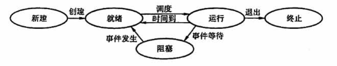

## 2.1 进程与线程

### 目录

1. 进程的概念
2. 进程的组织
3. 进程的状态与转换
4. 进程控制
5. 进程的通信
6. 线程概念和多线程模型

### 进程的概念

程序是存放在磁盘里的可执行文件（静态的指令集合），进程是程序的一次执行过程（动态的作业过程）

一个进程实体（进程映象）由PCB、程序段、数据段组成。进程是动态的，进程实体（进程映象）是静态的。进程实体反应了进程在某一时刻的状态。在引入进程实体的概念后，可以把操作系统中的进程定义为：

> 进程是进程实体的运行过程，是系统进行资源分配和调度的一个独立单位

比如，同时挂3个QQ号，会对应3个QQ进程，他们的PCB、数据段各不相同，但程序段的内容都是相同的

### 进程的组织

在一个系统中，通常有很多个PCB。为了能对他们加以有效的管理，应该用适当的方式把这些PCB组织起来。进程的组成讨论的是一个进程实体内部由哪些部分构成的问题，而进程的组织讨论的是多个进程之间的组织方式问题。

* 链接方式按照进程状态将PCB分为多个队列，操作系统持有指向各个队列的指针。

* 索引方法根据进程状态的不同，建立相应索引表，操作系统持有指向各个索引表的指针

### 进程的状态与转换

进程在其生命周期内，由于系统中各进程之间的相互制约关系以及系统运行环境的变化，使得进程的状态也在不断地发生变化。

* 创建状态：在这个阶段操作系统会为进程分配资源、初始化PCB

* 就绪状态：处于就绪状态的进程已经具备运行条件，但是由于没有空闲CPU，暂时不能运行

* 运行状态：进程正在处理机上运行，即CPU正在执行该进程对应的程序指令

* 阻塞状态：进程正在等待某一事件而暂停运行，此时操作系统会选择另外一个就绪状态进程在CPU上运行

* 终止状态：进程执行exit系统调用，操作系统将进程置为终止状态，再进一步处理资源释放和回收等工作

需要注意的是，一个进程从运行状态变成阻塞状态是一个主动的行为，比如，进程以系统调用的形式请求操作系统内核提供服务；而从阻塞状态变成就绪状态是一个被动的行为，比如，中断处理程序把相应进程的状态由阻塞状态转换为就绪状态

### 进程控制

