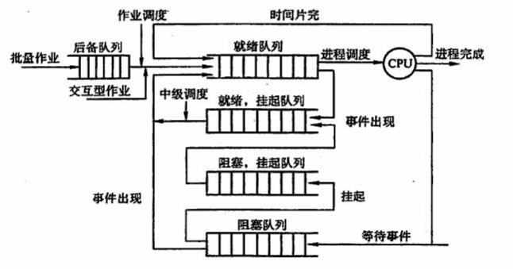

## 2.2 处理机调度

### 目录

1. 调度的概念
2. 进程调度方式
3. 调度的基本准则
4. 典型的调度算法

### 调度的概念

处理机调度是对处理机进行分配，就是从就绪队列中，按照一定的算法（公平、高效）选择一个进程并将处理机分配给它运行，以实现进程并发地运行

处理机的三级调度：

|                      | 功能                                                   | 部件       | 频率 |
| -------------------- | ------------------------------------------------------ | ---------- | ---- |
| 高级调度（作业调度） | 从后备队列中选择合适的作业将其调入内存，并为其创建进程 | 外存->内存 | 最低 |
| 中级调度（内存调度） | 从挂起队列中选择合适的进程将其数据调回内存             | 外存->内存 | 中等 |
| 低级调度（进程调度） | 从就绪队列中选择合适的进程为其分配处理机               | 内存->CPU  | 最高 |

### 进程调度方式

