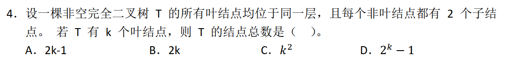
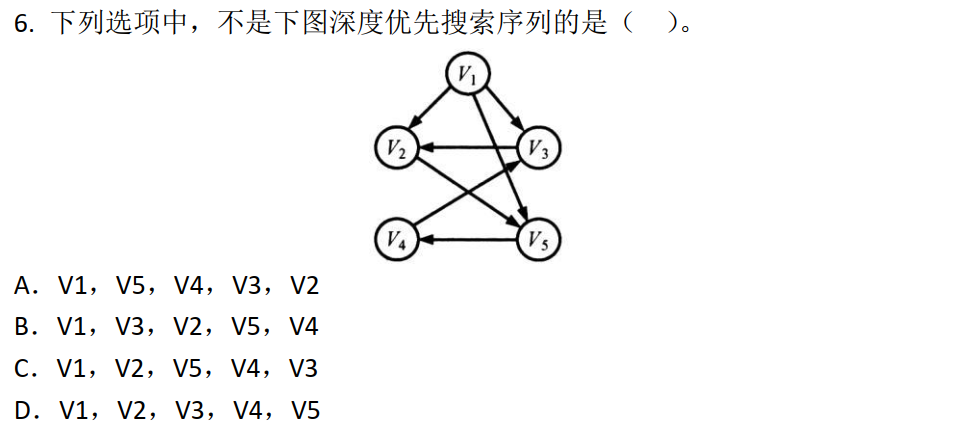

## 408数据结构考点

分章节整理2015-2020年的高频考点，以及对应的考研真题

### 考点框架

| 章节       | 考点                       | 考频 | 小题 | 大题 |
| ---------- | -------------------------- | ---- | ---- | ---- |
| 绪论       | 时间复杂度与空间复杂度     | 必考 | 2    | 5    |
| 线性表     | 线性表的顺序表示           | 必考 | 0    | 3    |
|            | 线性表的链式表示           | 常考 | 2    | 2    |
| 栈和队列   | 栈和队列的基本属性         | 必考 | 4    | 1    |
|            | 栈和队列的存储结构         |      | 0    | 1    |
|            | 双端队列                   |      | 0    | 0    |
|            | 栈与队列的应用             | 常考 | 3    | 1    |
| 串         | 特殊矩阵的压缩存储         |      | 4    | 0    |
|            | 串的模式匹配算法           |      | 2    | 0    |
| 树与二叉树 | 树的基本性质               |      | 1    | 1    |
|            | 二叉树的定义与性质         | 常考 | 3    | 1    |
|            | 二叉树的遍历               | 常考 | 3    | 2    |
|            | 二叉搜素树                 | 常考 | 3    | 0    |
|            | 平衡二叉树                 | 常考 | 2    | 0    |
|            | 树、森林与二叉树的转换     | 常考 | 2    | 0    |
|            | 线索二叉树的基本概念和构造 |      | 0    | 0    |
|            | 哈夫曼树和哈夫曼编码       | 必考 | 4    | 1    |
| 图         | 图的基本概念               | 常考 | 2    | 0    |
|            | 图的存储及基本操作         | 常考 | 1    | 1    |
|            | 图的遍历                   | 常考 | 3    | 0    |
|            | 最小生成树                 |      | 2    | 2    |
|            | 最短路径                   |      | 1    | 0    |
|            | 拓扑排序                   | 必考 | 3    | 0    |
|            | 关键路径                   |      | 2    | 0    |
| 排序       | 插入排序                   |      | 2    | 0    |
|            | 交换排序                   |      | 1    | 0    |
|            | 选择排序                   | 常考 | 3    | 0    |
|            | 二路归并排序               |      | 1    | 0    |
|            | 基数排序                   |      | 0    | 0    |
|            | 各种内部排序方法的比较     | 必考 | 5    | 0    |
|            | 外部排序的思想             |      | 2    | 0    |
| 查找       | 顺序/折半查找法            | 常考 | 3    | 0    |
|            | B树                        | 必考 | 4    | 0    |
|            | 散列表                     |      | 2    | 0    |

### 一、绪论

#### 时间复杂度与空间复杂度【必考】

2017：

2019：

### 二、线性表

#### 线性表的顺序表示【必考】

2016：

2018：

2020：

#### 线性表的链式表示【常考】

2015：

2016：

2019：

### 三、栈和队列

#### 栈和队列的基本属性【必考】

2016：

2017：

2018：

2020：

#### 栈和队列的存储结构

2019：

#### 双端队列

#### 栈与队列的应用【常考】

2015：

2018：

### 四、串

#### 特殊矩阵的压缩存储

2016：

2017：

2018：

2020：

#### 串的模式匹配算法

2015：

2019：

### 五、树与二叉树

#### 树的基本性质

2016：

#### 二叉树的定义与性质【常考】

2018：

2020：

#### 二叉树的遍历【常考】

2015：

2017：

#### 二叉搜索树【常考】

2018：

2020：

#### 平衡二叉树【常考】

2015：

2019：

#### 树、森林与二叉树的转换【常考】

2019：

2020：

#### 线索二叉树的基本概念和构造

#### 哈夫曼树和哈夫曼编码【必考】

2015：

2017：

2018：

2019：

2020：

### 六、图

#### 图的基本概念【常考】

2017：

#### 图的存储及基本操作【常考】

2015：

#### 图的遍历【常考】

2015：

2016：

#### 最小生成树

2015：

2017：

2018：

2020：

#### 最短路径

2016：

#### 拓扑排序【必考】

2016：

2018：

2020：

#### 关键路径

2019：

2020：

### 七、排序

#### 插入排序

2015：

2018：

#### 交换排序

2019：

#### 选择排序【常考】

2015：

2018：

2020：

#### 二路归并排序

2016：

#### 基数排序

#### 各种内部排序方法的比较【必考】

2015：

2017：

2019：

2020：

#### 外部排序的思想

2019：

### 八、查找

#### 顺序/折半查找法【常考】

2015：

2016：

2017：

#### B树【必考】

2016：

2017：

2018：

2020：

#### 散列表

2018：

2019：

