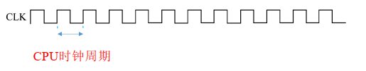

## 1.2 计算机性能指标

### 目录

1. 与速度无关的性能指标
2. 与速度相关的性能指标

### 与速度无关的性能指标

**速度无关指标：**

| 指标名称 | 功能部件 | 定义                                   |
| -------- | -------- | -------------------------------------- |
| 机器字长 | 运算器   | 一次定点整数运算，所能处理的二进制位数 |
| 指令字长 | 控制器   | 一条指令对应的二进制位数               |
| 存储字长 | 存储器   | 一个存储单元对应的二进制位数           |

**容量单位：**

$K = 2^{10}$

$M = 2^{20}$

$G = 2^{30}$

$T = 2^{40}$

### 与速度相关的性能指标

**一切从CPU的时钟周期开始：**

**速度相关指标：**

| 指标名称    | 单位         | 定义                                       | 计算公式                       |
| ----------- | ------------ | ------------------------------------------ | ------------------------------ |
| CPU时钟周期 | [s/拍]       | 通常为节拍脉冲或T周期，为CPU的最小时间单位 |                                |
| CPU主频     | [拍/s]、[HZ] | CPU内部主时钟频率                          | 1/CPU时钟周期                  |
| CPI         | [拍/条]      | 执行一条指令所需的时钟周期数               |                                |
| CPU执行时间 | [s]          | CPU执行程序的时间                          | (指令条数 * CPI) / 主频        |
| MIPS        | [M条/s]      | 每秒执行多少百万条指令                     | 主频/(CPI * 10^6)              |
| MFLOPS      | [M次/s]      | 每秒执行多少百万次浮点运算                 | 浮点运算次数/(执行时间 * 10^6) |

**数量单位：**

千：$K = 10^3$

百万：$M = 10^6$

十亿：$G = 10 ^9$

万亿：$T = 10^{12}$

