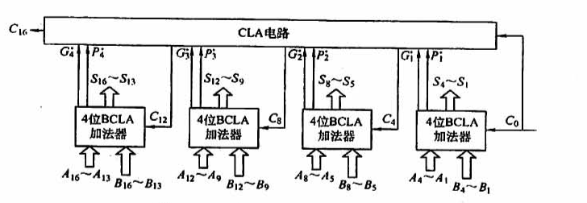
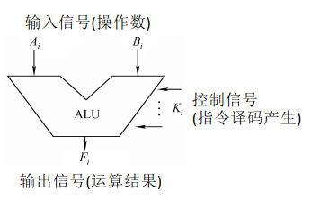
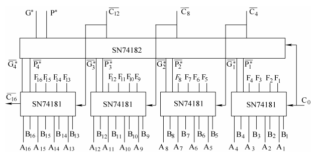

## 2.4 算术逻辑单元 ALU

### 目录

1. 逻辑运算
2. 加法器
3. 算术逻辑单元

### 逻辑运算

|             | 与          | 或    | 非             | 异或         |
| ----------- | ----------- | ----- | -------------- | ------------ |
| C语言表达式 | &&          | \|\|  | !              | ^            |
| 逻辑表达式  | $A \cdot B$ | $A+B$ | $\overline{A}$ | $A \oplus B$ |

### 加法器

**一位全加器：**

* 本位 $S_i = A_i \oplus B_i \oplus C_i$
* 进位 $C_i = A_i \cdot B_i + (A_i \oplus B_i) \cdot C_{i-1}$

**串行加法器：**

* 串行产生进位信号

* 每次产生一位和，串行逐位送回寄存器

**组内并行、组间串行加法器：**

* 令 $G_i = A_i \cdot B_i$， $P_i = A_i \oplus B_i$，则 $C_i = G_i + P_i \cdot C_{i-1}$
* 对 $C_i$ 进行展开可得：
  * $C_1 = G_1 + P_1 \cdot C_0$
  * $C_2 = G_2 + P_2 \cdot C_1 = G_2 + P_2 \cdot G_1 + P_2 \cdot P_1 \cdot C_0$
  * $C_3 = G_3 + P_3 \cdot C_2 = G_3 + P_3 \cdot G_2 + P_3 \cdot P_2 \cdot G_1 + P_3 \cdot P_2 \cdot P_1 \cdot C_0$
  * $C_4 = G_4 + P_4 \cdot C_3 = Fun(G_4, G_3, G_2, G_1, P_4, P_3, P_2, P_1, C_0)$

**组内并行、组间并行加法器：**

* 令 $G_i^* = G_4 + P_4 \cdot G_3 + P_4 \cdot P_3 \cdot G_2 + P_4 \cdot P_3 \cdot P_2 \cdot G_1$
* 令$P_i^* = P_4 \cdot P_3 \cdot P_2 \cdot P_1$

### 算术逻辑单元

**ALU的功能：**

* 算术运算：加、减、乘、除

* 逻辑运算：与、或、非、异或

**ALU的基本结构：**

**ALU的芯片结构：**

**ALU芯片的优化：**

* 16位的组内并行、组间串行ALU

* 16位的组内并行、组间并行ALU

