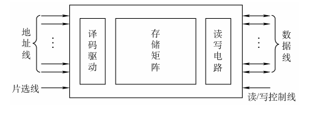
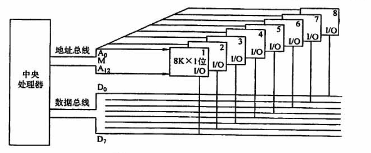
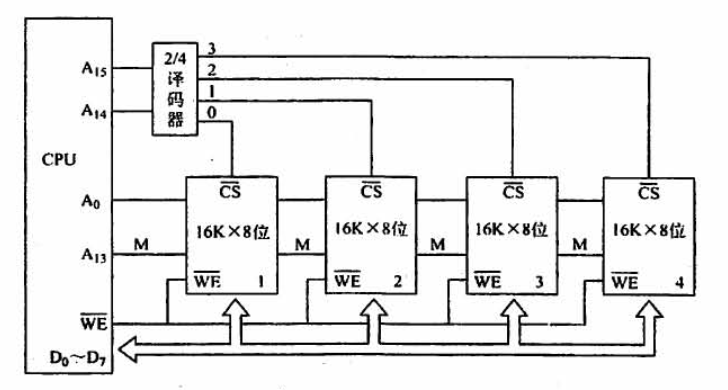
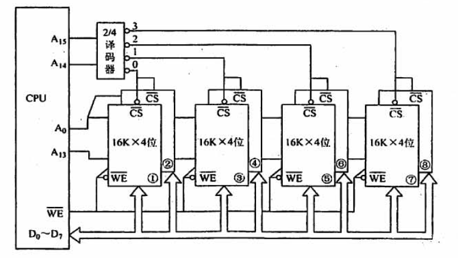
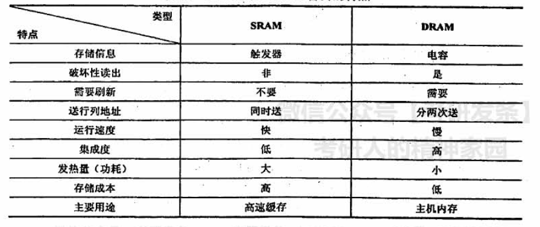

## 3.2 半导体随机存储器

### 目录

1. RAM的基本结构
2. RAM的容量扩展
3. DRAM的地址线复用技术
4. SRAM vs DRAM

### RAM的基本结构

不同类型的半导体芯片的基本结构相同，只是构成存储单元的存储元不一样。

**例子：**

假设当前地址线为13位，片选线为3位，数据线为8位，那么译码器翻译出来的选通线有2^16根，对应2^16个存储单元，其中每个存储单元的字长为8bit。

### RAM的容量扩展

#### 1. 位扩展法

扩展存储单元的位数：将多个存储芯片的地址线、片选线和读写控制线相应并联，数据线分别引出。

**例子：**

假设当前地址线为$13$位，数据线为$8$位，每个存储芯片为$8K*1$位，如何得到一个$8K*8$位的存储器？

**回答:**

$13$位的地址线可以对应$8K$个存储单元，在只接入一个存储芯片的情况下，每个存储单元为$1bit$；如果将$8$个存储芯片并联接入，即可以将存储单元扩展为$8$位，进而得到$8K*8$位的存储器

#### 2. 字扩展法

扩展存储单元的个数：将多个存储芯片的地址线、数据线、读写控制线相应并联，由片选线来区分不同的芯片。

#### 3. 字位扩展法

扩展存储单元的位数和个数：将多个存储芯片的地址线、读写控制线相应并联，由片选线来区分不同的芯片组，芯片组内数据线分别引出，芯片组间数据线并联。

### DRAM的地址线复用技术

**例子：**假设当前地址线、片选线共8位，对应2^8个存储单元，全部的存储单元排列成16*16的行列矩阵。

由于原地址被拆分成了行列地址，所以对应的行地址选通线有2^4根，列地址选通线有2^4根，总共的选通线由原来的256根减少到了32根。

所谓地址线复用技术，就是将行、列地址分两次送，可以使得地址线更少，芯片引脚更少

### SRAM VS DRAM

