## 3.3 高速缓冲存储器

cache是用相联存储器实现的缓存结构，其工作机制类似于map，根据块标记获取相应的数据块

### 目录

1. 局部性原理
2. Cache的工作原理
3. Cache的映射方式
4. Cache的替换算法
5. Cache的写策略

### 局部性原理

程序访问的局部性原理包括，时间局部性和空间局部性

* 时间局部性：在最近的未来要用到的指令和数据，很可能是现在正在使用的信息
* 空间局部性：在最近的未来要用到的指令和数据，很可能与现在正在使用的信息在储存空间上是邻近的

### Cache的工作原理

以全相联映射方式为例，由于主存的块数比Cache的块数多得多，也就是说主存中只有一部分的内容可以放在Cache中。因此在主存块调入Cache的过程中，需要将主存块号，作为cache中的块标记，存放在Cache的标记阵列中，用于判定Cache块是否为目标的主存块。

* 之后在访问Cache的过程中，如果标记项匹配，说明获取到了目标的主存块
* 如果标记项不匹配，且Cache空间足够，则直接访问主存并装入Cache
* 如果标记项不匹配，且Cache空间不够，则直接访问主存并替换Cache

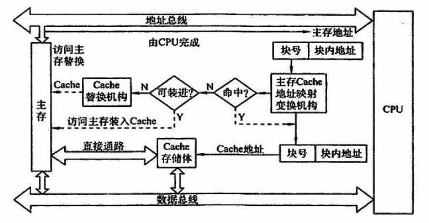

### Cache的映射方式

地址映射的方法有以下三种：

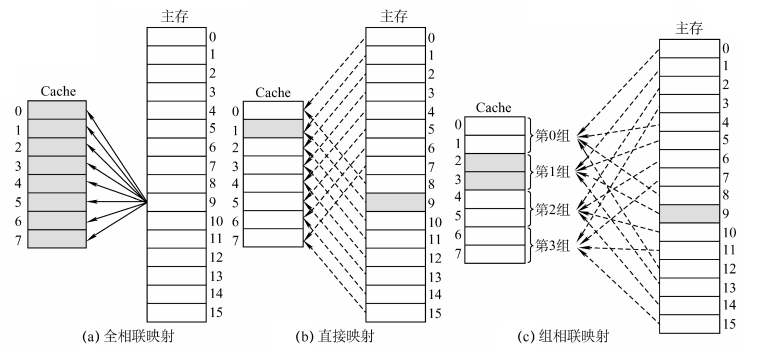

#### a) 全相联映射

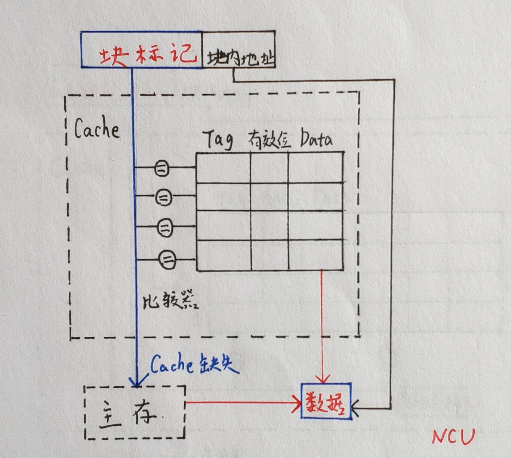

**例子：**

假设计算机的主存地址空间为256MB，按字节编址，其数据Cache有8行，行长为64B。

可以得出全相联映射的地址结构为：

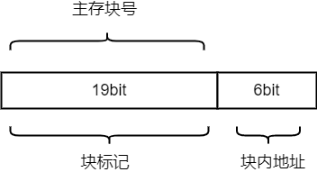

每当主存块调入了Cache中，则在块标记里记录原先的主存块号；之后在访问Cache的过程中，如果标记项匹配，说明获取到了目标的主存块。

#### b) 直接映射

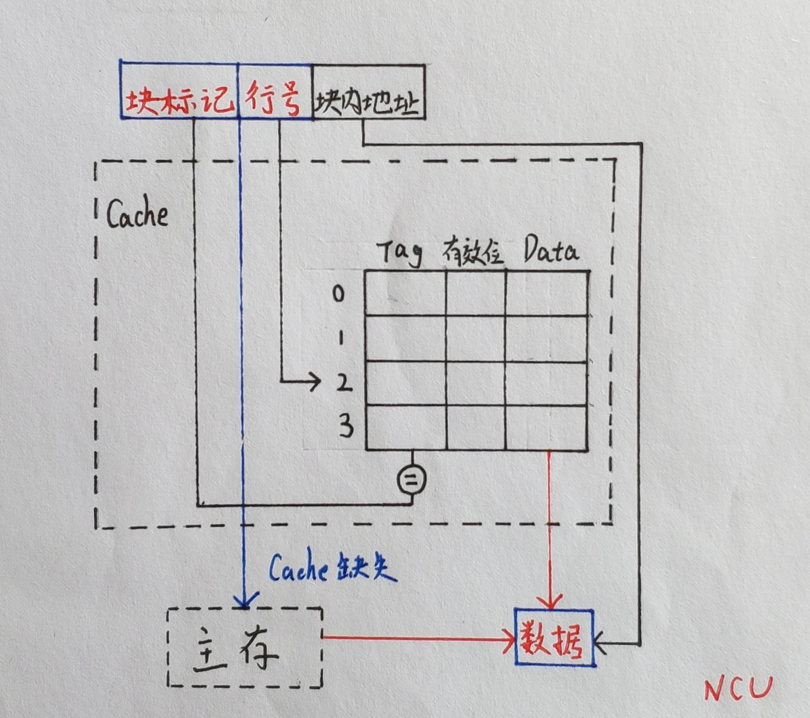

**例子：**

假设计算机的主存地址空间为256MB，按字节编址，其数据Cache有8行，行长为64B。

可以得出直接映射的地址结构为：

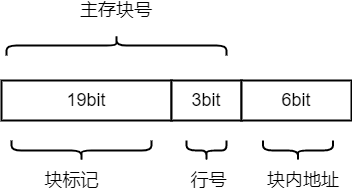

主存块在Cache中的位置 = 为主存块号 % Cache总块数

每当主存块调入了Cache中，其位置在Cache中是确定的，对应的块标记里记录的是原先的区域号；之后在访问Cache的过程中，在确定的位置上寻找Cache块，如果标记项匹配，说明获取到了目标的主存块。

#### c) 组相联映射

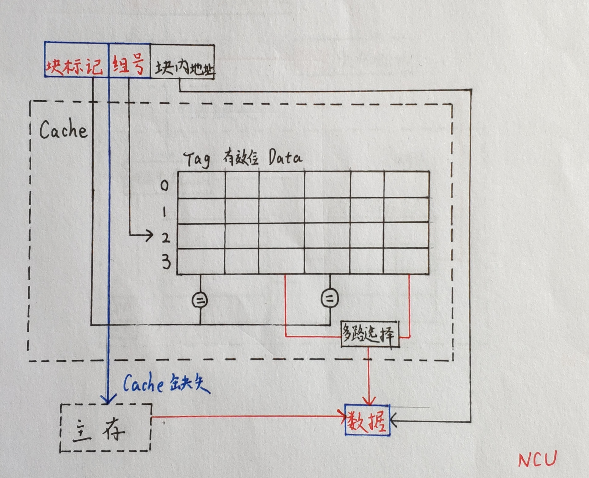

**例子：**

假设计算机的主存地址空间为256MB，按字节编址，其数据Cache有8行，行长为64B，每两行为一组，共4组。

可以得出组相联的地址结构为：

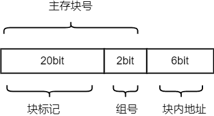

所属分组 = 主存块号 % 分组数

每当主存块调入了Cache中，其分组在Cache中是确定的，对应的块标记里记录的是原先的区域号；之后在访问Cache的过程中，在确定的分组里寻找Cache块，如果标记项匹配，说明获取到了目标的主存块。

### Cache的替换算法

全相联映射：Cache完全满了才需要进行替换，需要在全局中选择替换哪一块

直接映射：如果对应的位置非空，则毫无选择地直接替换

组相联映射：分组内满了才需要进行替换，需要在分组内选择替换哪一块

#### 1. 随机算法(RAND)

若Cache已满，则随机选择一块替换

未考虑局部性原理

**例子：**

设总共有 4 个Cache块，初始整个Cache为空。采用全相联映射，依次访问主存块 {1, 2, 3, 4, 1, 2, 5, 1, 2, 3, 4, 5}  

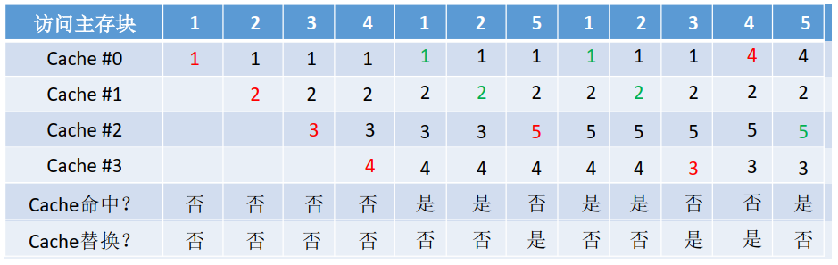

#### 2. 先进先出算法(FIFO)

若Cache已满，则替换最先被调入的Cache块

未考虑局部性原理，存在抖动现象

**例子：**

设总共有 4 个Cache块，初始整个Cache为空。采用全相联映射，依次访问主存块 {1, 2, 3, 4, 1, 2, 5, 1, 2, 3, 4, 5}  

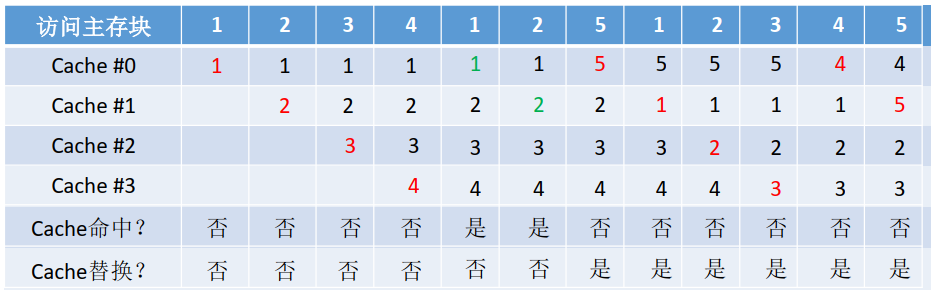

#### 3. 近期最少使用算法(LRU)

为每一个Cache块设置一个“计数器”，用于记录每个Cache块已经有多久没被访问了。当Cache满后替换“计数器”最大的  

基于局部性原理，若频繁访问的主存块数量>Cache行的数量，则存在抖动现象

**例子：**

设总共有 4 个Cache块，初始整个Cache为空。采用全相联映射，依次访问主存块 {1, 2, 3, 4, 1, 2, 5, 1, 2, 3, 4, 5}  

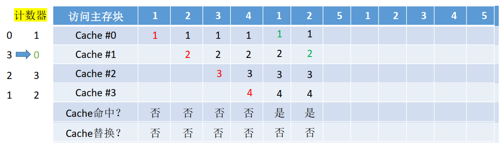

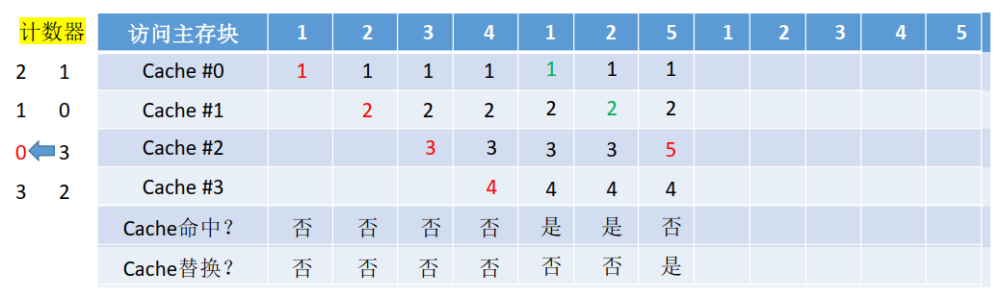

#### 4. 最近不经常使用算法(LFU)

为每一个Cache块设置一个“计数器”，用于记录每个Cache块被访问过几次。当Cache满后替换“计数器”最小的  

**例子：**

设总共有 4 个Cache块，初始整个Cache为空。采用全相联映射，依次访问主存块 {1, 2, 3, 4, 1, 2, 5, 1, 2, 3, 4, 5}  

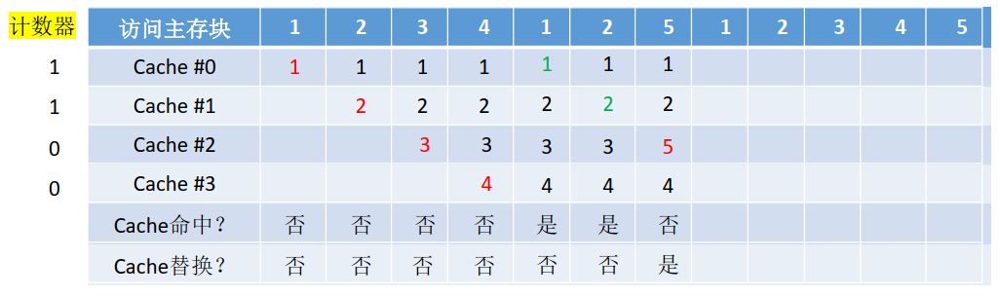

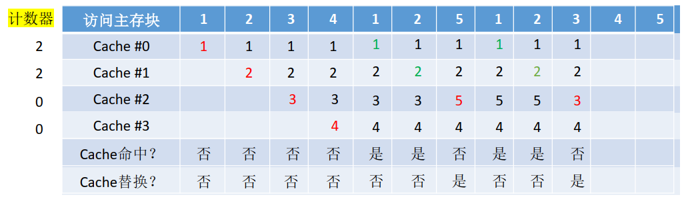

### Cache的写策略

主要解决写操作导致的Cache和主存数据不一致的问题

Cache 写命中

* 全写法：同时写入Cache和主存
* 写回法：写入Cache，在标记项中记录脏位，换出时写入主存

Cache 写不命中

* 写分配法：加载主存块到Cache中，之后走 Cache 写回法的策略
* 非写分配法：只写入主存

多级Cache的写策略：

* 各级Cache之常采用“全写法+非写分配法”
* Cache-主存之间常采用“写回法+写分配法”

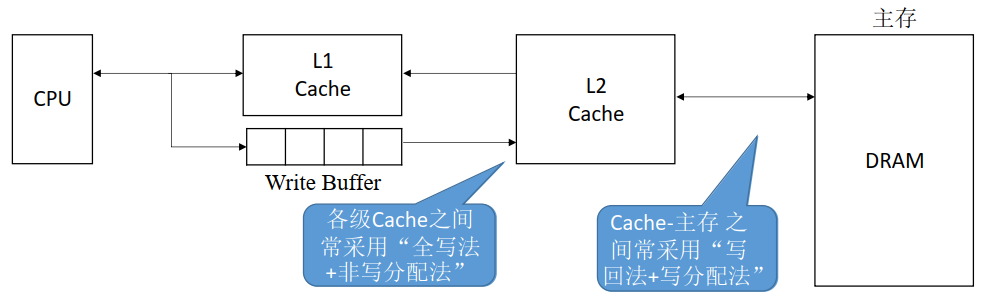
