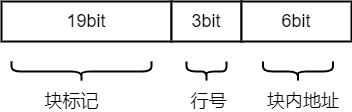

### 3.3 高速缓冲存储器

### 目录

1. 局部性原理
2. Cache的工作原理
3. Cache的映射方式
4. Cache的替换算法
5. Cache的写策略

### 局部性原理

程序访问的局部性原理包括，时间局部性和空间局部性

* 时间局部性：在最近的未来要用到的指令和数据，很可能是现在正在使用的信息
* 空间局部性：在最近的未来要用到的指令和数据，很可能与现在正在使用的信息在储存空间上是邻近的

### Cache的工作原理

当CPU需要访问主存时，会直接访问Cache，如果块标记命中

cache的访问方式和 cache 的映射方式是相反的，这里需要注意

//  todo 工作过程

### Cache的映射方式

由于主存的块数比Cache的块数多得多，也就是说主存中只有一部分的内容可以放在Cache中，因此在地址映射的过程中，主存地址的低位，可以作为Cache中的块地址；主存地址的高位，可以作为cache中的块标记，存放在Cache的标记阵列中，用于判定Cache块是否为目标的主存块。

地址映射的方法有以下三种：

**a) 全相联映射**

**例子：**

**b) 直接映射**

**例子：**

假设计算的主存地址空间为256MB，按字节编址，其数据Cache有8行，行长为64B。

可以得出直接映射的地址结构为：

其中主存块在Cache中的位置=主存块号 % Cache总块数

**c) 组相联映射**

**例子：**

### Cache的替换算法

### Cache的写策略

