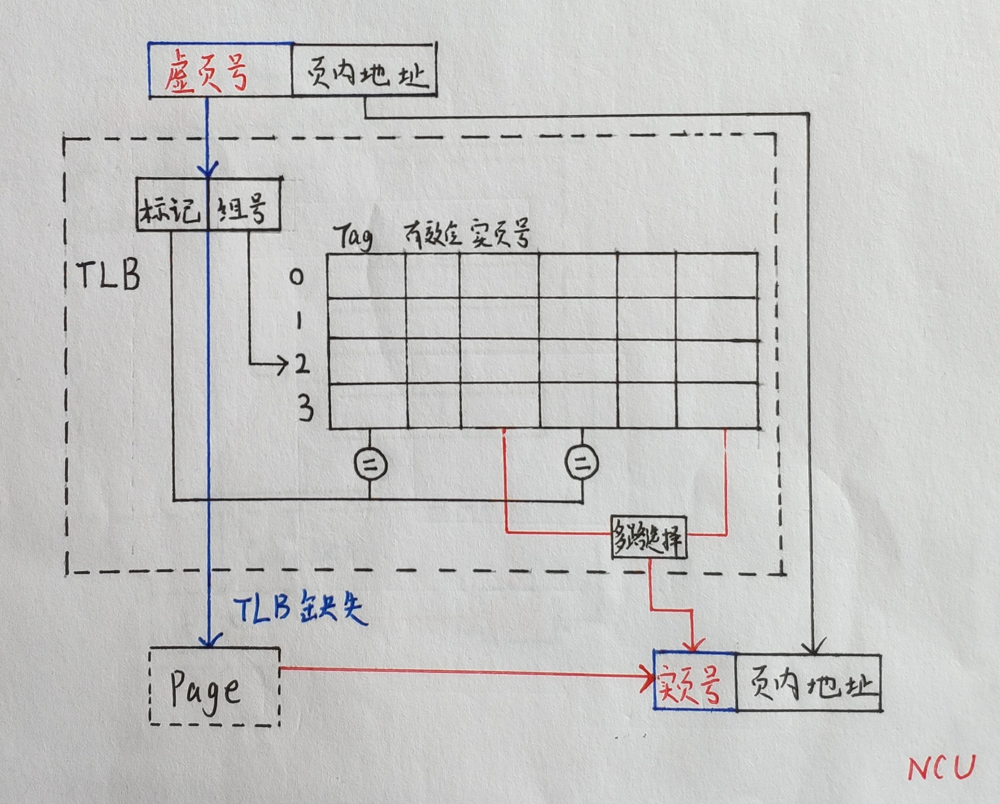
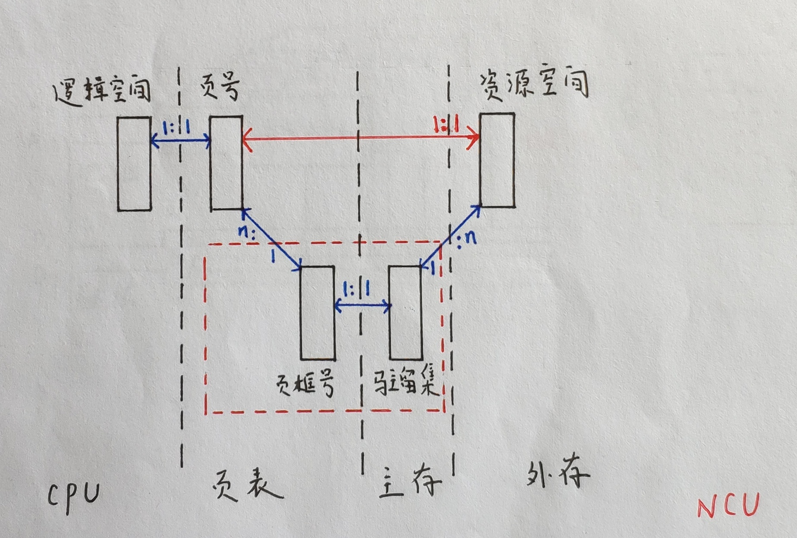

## 3.4 虚拟存储器

### 目录

1. 虚存的工作过程
2. TLB的访问过程
3. Page的访问过程
4. 页面的分配和置换

### 虚存的工作过程

由于CPU和IO的速度不匹配，计算机约定不直接从外存中，而是间接从内存中拿数据。因此，在访问存储系统的过程中，计算机需要将外存中的数据映射到相应的内存地址上，供CPU快速访问。

其中，页表起到了记录映射的作用，可以判定外存中的数据是否映射到了相应的内存地址上。若页表未命中，说明所需页面未调入主存，需要执行调页策略；若页表命中，说明所需页面已经映射到了相应的内存地址上，接下来进行地址的变换，访问主存并获取数据。

虚存的工作过程主要分3部分：①TLB的访问过程，②Page的访问过程，③页面的分配和置换，

### TLB的访问过程

在存储系统中若要从主存取得数据，必须先访问页表；为了实现对页表的快速访问，需要增设快表。TLB与page之间存在全相联映射、直接映射、组想联映射三种地址映射方式，因此TLB的访问分别存在以下三种情况。

* 全相联映射

* 直接映射

* 组相联映射

### Page的访问过程

如果TLB的访问未命中，则需要访问主存中的页表。为了避免连续的页表本身占用大量主存空间，存储系统通常采用分级页表，这里以二级页表的访问过程举例。

### 页面分配和置换

若page未命中，说明所需页面未调入主存，需要执行调页策略。对于页面的分配和置换，现代存储系统通常采用三种策略：固定分配局部置换，可变分配全局置换，可变分配局部置换。主存与外存之间的协作关系可以反映在分配策略上。

