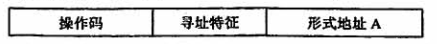
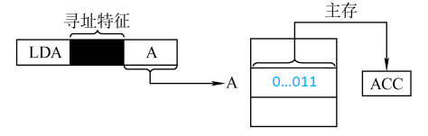
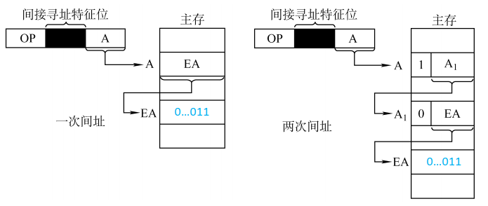
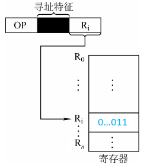
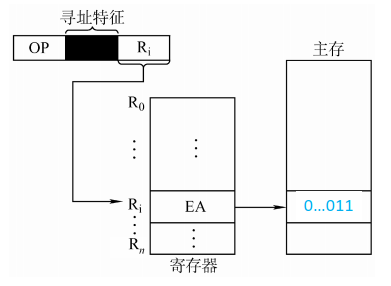
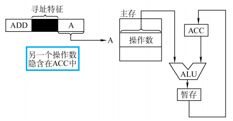
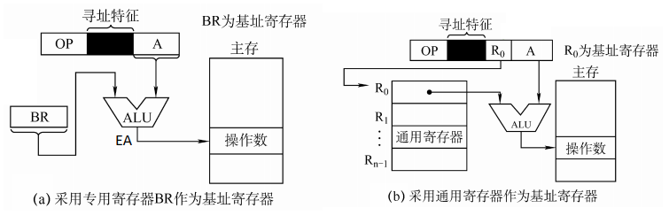
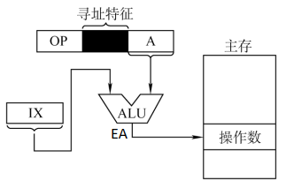
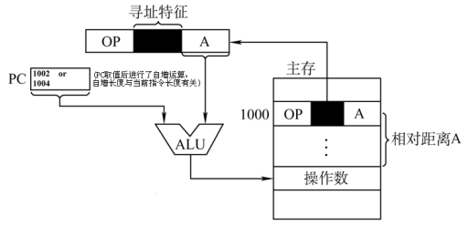

## 4.2 指令寻址方式

### 目录

1. 指令寻址
2. 数据寻址
3. 偏移寻址

### 指令寻址

寻找下一条将要执行的指令地址称为指令寻址，指令寻址方式有两种

* 顺序寻址：每次取指令结束后，PC自动加1
* 跳跃寻址：执行转移类指令导致PC值改变

### 数据寻址

寻找操作数的地址称为数据寻址，为了区别不同的数据寻址方式，通常在地址码字段中增设寻址特征字段

以一地址指令为例，求出操作数的真实地址EA：

#### a) 直接寻址

$EA = A$

* 优点：1次访存
* 缺点：寻址范围小

​	

#### b) 间接寻址

$EA = (A)$

* 优点：寻址范围大
* 缺点：多次访存

#### c) 寄存器寻址

$EA = R_i$

* 优点：不访问主存
* 缺点：寄存器贵

#### d) 寄存器间接寻址

$EA = (R_i)$

#### e) 隐含寻址

有效地址EA由程序指定

#### f) 立即寻址

形式地址A就是操作数本身

### 偏移寻址

偏移寻址是数据寻址的一种，偏移寻址以某个地址作为起点，将形式地址视为偏移量。根据偏移起点的不同，偏移寻址可以分为以下几类。

#### a) 基址寻址

$EA = (BR) + A$

基址寄存器内容由操作系统决定。在程序执行的过程中，基址寄存器的内容不变，形式地址可变。基址寻址适用于实现程序浮动。

#### b) 变址寻址

$EA = (IX) + A$

变址寄存器内容由用户决定。在程序执行的过程中，变址寄存器的内容可变，形式地址不可变。变址寻址适用于实现数组遍历。

#### c) 相对寻址

$EA = (PC) + A$

相对寻址是相对于下一条指令的偏移，相对寻址广泛应用于转移指令。

