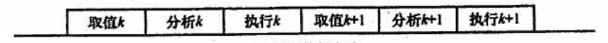
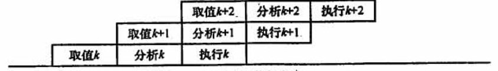
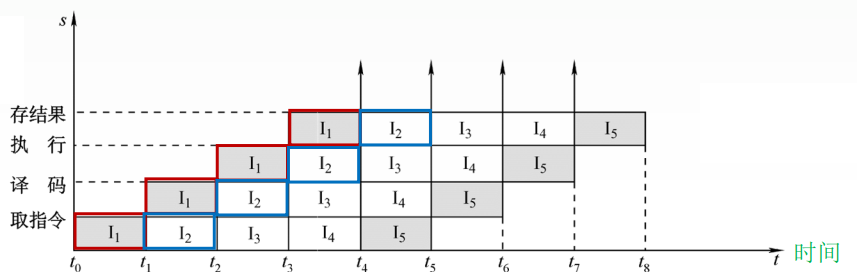

## 4.5 指令流水线

### 目录

1. 流水线的概念
2. 流水线的性能指标
3. 流水线的分类
4. 超标量指令流水线

### 一、流水线的概念

通常把一条指令的执行过程划分为取指、分析、执行3个阶段，假设每个阶段的时间都相等，当多条指令在处理器中执行时，可以采用以下两种方式

* 顺序执行方式

* 流水线执行方式

即指令流水线把一个重复的过程分为若干子过程，每个子过程与其他子过程并行执行。

为了进一步获得更高的执行速度，还可以将流水段进一步细分为4级流水，取指令(IF)、指令译码(ID)、执行(EX)、写回(WB)

注意：指令执行过程图和流水线时空图的区别

### 二、流水线的性能指标

**a) 吞吐率**

吞吐率是指，在单位时间内流水线所完成的任务数量，即$TP = n / T_k$

当流水线段数为k，时钟周期为t时，$T_k = (k + n - 1) * t$

**b) 加速比**

加速比是指，顺序执行与流水线执行的时间比率，即$S = T_0 / T_k$

**c) 效率**

效率是指，流水线的设备利用率

