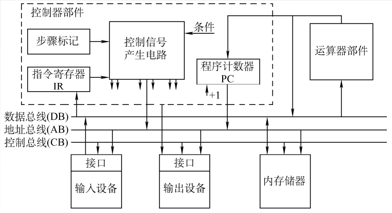
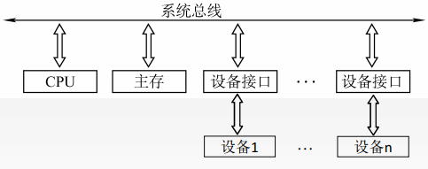
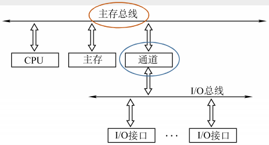
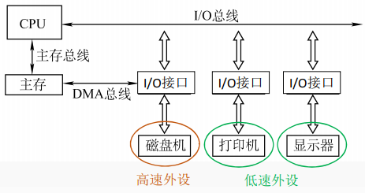

## 5.1 总线概述

### 目录

1. 总线的基本概念
2. 系统总线
3. 总线的性能指标

### 总线的基本概念

为了更好的解决I/O设备和主机之间连接的灵活性问题，计算机的结构从分散连接发展为总线连接。

总线是一组能被多个部件分时共享的公共信息传送线路。在某一时刻，只允许有一个部件向总线发送信息，但多个部件可以同时从总线上接收相同的信息

按照总线的功能划分，总线可以分为，片内总线、系统总线、通信总线

* 片内总线：CPU芯片内部的总线，连接寄存器与寄存器、寄存区与ALU
* 系统总线：计算机系统内部的总线，连接各功能部件如CPU、主存、I/O接口
* 通信总线：计算机系统外部的总线，连接计算机系统与其他系统

### 系统总线

按系统总线传输信息内容的不同，可以分为数据总线、地址总线、控制总线；按系统总线结构的不同，可以分为单总线结构，双总线结构，三总线结构。

**a) 单总线结构**

允许I/O设备之间、I/O设备和CPU之间、I/O设备和主存之间直接交换信息

**b) 双总线结构**

有两条总线，一条是主存总线，用于CPU、主存和通道之间的数据传送；另一条是I/O总线，用于多个外部设备与通道之间进行数据传送

通道是具有特殊功能的处理器，能对I/O设备进行统一管理。

**c) 三总线结构**

有三条总线，主存总线用于CPU和内存之间传送地址、数据和控制信息；I/O总线用于CPU和各类外设之间通信；DMA总线用于内存和高速外设之间直接传送数据

### 总线的性能指标

| 指标名称       | 单位     | 说明                                     |
| -------------- | -------- | ---------------------------------------- |
| 总线的传输周期 | [s/次]   | 一次总线操作所需要的时间，也称为总线周期 |
| 总线的时钟周期 | [s/拍]   | 即机器的时钟周期                         |
| 总线的工作频率 | [次/s]   | 一秒传送几次数据，即总线周期的倒数       |
| 总线的时钟频率 | [拍/s]   | 即机器的时钟频率                         |
| 总线宽度       | [bit/次] | 总线上同时能够传输的数据位数             |
| 总线带宽       | [bit/s]  | 单位时间内总线上能够传输的数据位数       |

