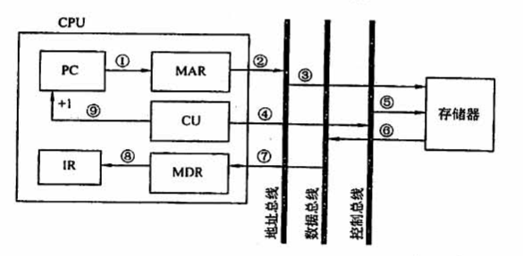
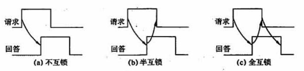

## 5.2 总线操作和定时

### 目录

1. 总线传输的阶段
2. 同步定时方式
3. 异步定时方式

### 总线传输的阶段

* 申请分配阶段：由总线仲裁机构将下一传输周期的总线使用权分配给某一申请者
* 寻址阶段：获得总线使用权的主设备，发出从设备的地址以及有关命令
* 传输阶段：主设备和从设备进行数据交换
* 结束阶段：主设备让出总线使用权

### 同步定时方式

在一个总线周期中，发送方和接收方可以完成一次数据传送，该过程由统一的时钟信号控制。

以取指周期为例，根据PC中的内容，从主存中取出指令代码并存放在IR中。

* T1时钟：CPU给出地址信息，存储器接收地址信息

* T2时钟：CPU给出读命令，存储器接收读命令

* T3时钟：存储器给出数据，CPU接收数据
* T4时钟：CPU让出总线使用权

### 异步定时方式

在一个总线周期中，发送方和接收方可以完成一次数据传送，该过程采用应答方式，可以进行有效性检验。

* 不互锁方式：主设备发出请求信号，自动撤销；从设备接收到请求信号后，发出回答信号，自动撤销
* 半互锁方式：主设备发出请求信号，收到回答才撤销；从设备接收到请求信号后，发出回答信号，自动撤销
* 全互锁方式：主设备发出请求信号，收到回答才撤销；从设备接收到请求信号后，发出回答信号，收到回答才撤销

