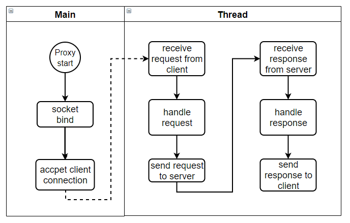
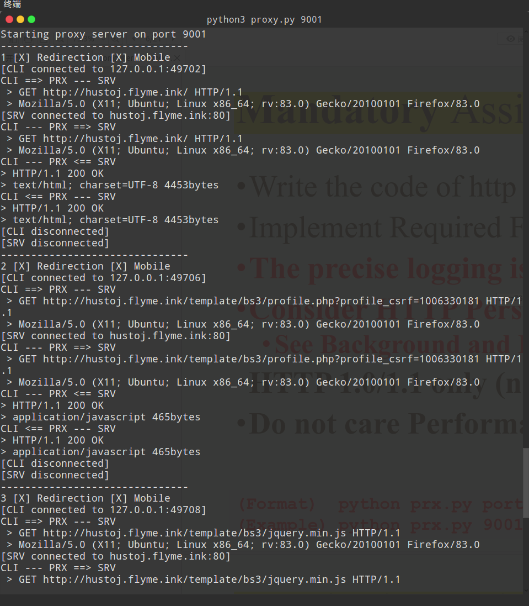

# Simple Proxy Server


## Introduction

OS：Ubuntu 16.04

Language: Python3.7

Reference:

[1] [Proxy server](https://en.wikipedia.org/wiki/Proxy_server)

[2] [HTTP Persistent Connection  ](https://www.oreilly.com/library/view/http-the-definitive/1565925092/ch04s05.html)


## Flow chart

In the `main()` method, we bind the proxy server's socket address to local 127.0.0.1:9001, and the proxy server monitors access to this port. If the client initiates access to the proxy port, the proxy service establishes a connection with the client and sets up a daemon thread to handle the specific proxy logic. During that time, the main thread continues to monitor the port for additional requests for access.

The `handleRequest()` function receive the request from the client and send the modified request to the target server. and our main work is to modify the HTTP header from "connection: keep-alive" to "connect: close", so that we can access a web server supporting the persistent connection.

The `handleResponse()` function mainly handle the response from the server. we need to split the head part of the response to avoid the challenge in the decoding process of the encrypted request body. after receiving the response from the server, the method forwards the response to the original client.




We try to visit the website `http://hustoj.flyme.ink`, and got the proxy server log as follow:




## Logical explanations

Here are the local python library the program needed to import. The next are several global parameter: the maximum length of the request header, the amount of data received at one time, and the maximum number of connections.

```python
import socket
import sys
import threading
import time

MAX_HEAD_SIZE = 4096
RECV_SIZE = 512
MAX_CONN = 5
```


In the `main()` method, we bind the proxy server's socket address to local 127.0.0.1:9001, and the proxy server monitors access to this port. If the client initiates access to the proxy port, the proxy service establishes a connection with the client and sets up a daemon thread to handle the specific proxy logic. During that time, the main thread continues to monitor the port for additional requests for access.

```python
def main():
    # param setting
    proxy_ip = "127.0.0.1"
    proxy_port = 9001
    if (2 == len(sys.argv)):
        proxy_port = int(sys.argv[1])

    s = socket.socket(socket.AF_INET, socket.SOCK_STREAM)
    s.setsockopt(socket.SOL_SOCKET, socket.SO_REUSEADDR, 1)
    s.bind((proxy_ip, proxy_port))
    s.listen(MAX_CONN)

    print("Starting proxy server on port %d" % (proxy_port))

    # accept request from client
    count = 0
    while True:
        try:
            conn, addr = s.accept()
            count += 1
            print("-------------------------------")
            print("%d [X] Redirection [X] Mobile" % (count))

            th = threading.Thread(target=handleRequest, args=(conn, addr))
            th.setDaemon(True)
            th.start()
            time.sleep(5)
        except KeyboardInterrupt:
            print("Shutting down proxy server on port %d" % (proxy_port))
            s.close()
            sys.exit(1)
```


The `handleRequest()` function receive the request from the client and send the modified request to the target server. and our main work is to modify the HTTP header from "connection: keep-alive" to "connect: close", so that we can access a web server supporting the persistent connection.

```python
def handleRequest(conn, addr):
    '''
    handle the request from client
    :param conn: the connection with client
    :param addr: the client address
    '''
    try:
        head, data = recvData(conn)
        headers = head.decode()
        agent = getHeader(headers, "User-Agent")
        host = getHeader(headers, "Host")

        print("[CLI connected to %s:%s]" % (addr[0], addr[1]))
        print("CLI ==> PRX --- SRV")
        print(" > %s" % (headers.split("\r\n")[0]))
        print(" > %s" % (agent.split("\r\n")[0]))

        keep = getHeader(headers, "Connection")
        if not keep == "None":
            data = setHeader(data, keep, "close")

        s = socket.socket(socket.AF_INET, socket.SOCK_STREAM)
        s.connect(splitHost(host))
        s.sendall(data)

        print("[SRV connected to %s:%s]" % splitHost(host))
        print("CLI --- PRX ==> SRV")
        print(" > %s" % (headers.split("\r\n")[0]))
        print(" > %s" % (agent.split("\r\n")[0]))

        handleResponse(s, conn)

    except Exception as e:
        print(e)
        print("[CLI disconnected]")
        print("[SRV disconnected]")
        conn.close()
        s.close()

```


The `handleResponse()` function mainly handle the response from the server. we need to split the head part of the response to avoid the challenge in the decoding process of the encrypted request body. after receiving the response from the server, the method forwards the response to the original client.

```python
def handleResponse(s, conn):
    '''
    handle the response from server
    :param s: the connection with server
    :param conn: the connection with client
    :return:
    '''
    try:
        print("CLI --- PRX <== SRV")
        head, data = recvData(s)
        headers = head.decode()
        type = getHeader(headers, "Content-Type")
        print("> %s" % (headers.split("\r\n")[0]))
        print("> %s %sbytes" % (type.split("\r\n")[0], len(data)))

        print("CLI <== PRX --- SRV")
        print("> %s" % (headers.split("\r\n")[0]))
        print("> %s %sbytes" % (type.split("\r\n")[0], len(data)))

        conn.send(data)
        s.close()
        conn.close()
        print("[CLI disconnected]")
        print("[SRV disconnected]")

    except Exception as e:
        print(e)
        print("[CLI disconnected]")
        print("[SRV disconnected]")
        conn.close()
        s.close()
```


The `recvData()` function mainly receive data from the connection. with the unknown length of the receiving data, we need to receive the data part by part according to the `RECV_SIZE`. The are two type of the received data, the data with head and the data with body ,so we need to handle the different type of data with different method.

```python
def recvData(conn):
    '''
    receive data from the connection
    :param conn: connection to receive data
    :return: the head and body of data
    '''
    sp_head = "\r\n\r\n".encode()
    sp_body = "\r\n0\r\n\r\n".encode()

    max_head = conn.recv(MAX_HEAD_SIZE)
    pos_head = max_head.find(sp_head)
    data = max_head
    head = max_head

    if not pos_head == -1:
        head = max_head[:pos_head]

    if pos_head < len(max_head) - 4:
        # body should be handle
        while data.find(sp_body) == -1:
            res = conn.recv(RECV_SIZE)
            data += res

    return (head, data)
```


The `getHeader()` function mainly get the special header from headers. If there are the equal key in the headers, the function will return the value of the special header, on the contrary, the function will return `None`.

```python
def getHeader(headers, key):
    '''
    get the header from headers with special key
    :param headers: the head part of the request
    :param key: the key of the target header
    :return: the value of the target header
    '''

    key = key.upper()
    base, i, l = 0, 0, len(headers)

    while i < l:
        while i < l and headers[i] != ":": i += 1
        if i < l and headers[base:i].strip().upper() == key:
            base = i + 1
            while i < l and not (headers[i] == "\n" and headers[i - 1] == "\r"): i += 1
            return headers[base:i - 1].strip()
        else:
            while i < l and not (headers[i] == "\n" and headers[i - 1] == "\r"): i += 1
            base, i = i + 1, i + 1
    return "None"
```


The last two methods are `setHeader()` and `splitHost()`, they are used as follows：

```python
def setHeader(data, old, new):
    '''
    replace the old part of raw data
    :param data: the raw data
    :param old: the old String
    :param new: the new String
    :return: the new data
    '''
    return data.replace(old.encode(), new.encode())


def splitHost(rhost):
    '''
    split the raw host to get host and port
    :param rhost: the raw host
    :return: host and port
    '''
    pos = rhost.find(":")
    if pos == -1:
        return (rhost, 80)
    else:
        return (rhost[:pos], int(rhost[pos + 1:]))
```

