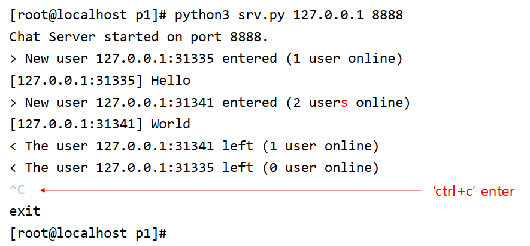
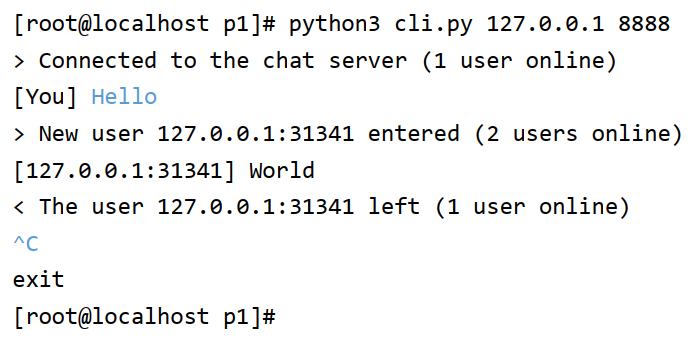
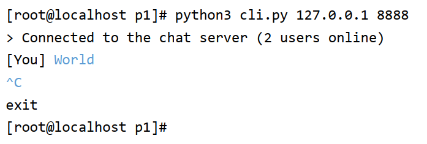

## Simple Multi-user TCP Chat

### Goal

1. Learn a basic socket programming
2. understand the "Client-Server" architecture
3. **write a simple TCP-based multi-user char application**

### Step

1. **follow up the Client code we provide**
2. Understand what select() does exactly
3. write your own codes for multi-user chatting application running in real-time

### Objectives

### Guidelines-Server

### Guidelines-Client1

### Guidelines-Client2

### Report

Introduction/Reference(3)

Flow chart or Diagram(10)

At least 3 snapshots(5)

Logical explanations block by block in detail

All explanations of the 7 functions in "What are these function? "slide.

### Deliverable

