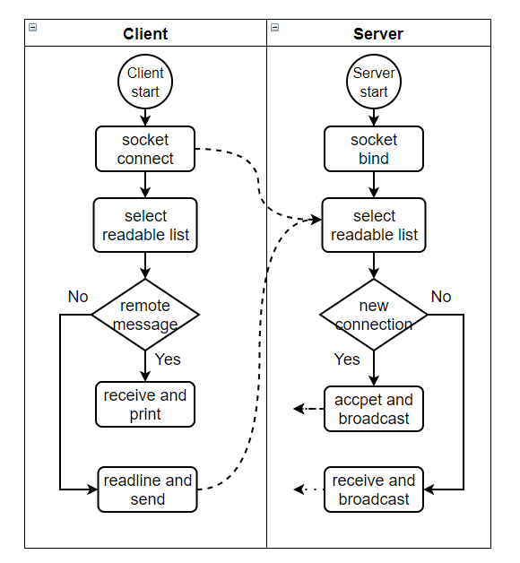
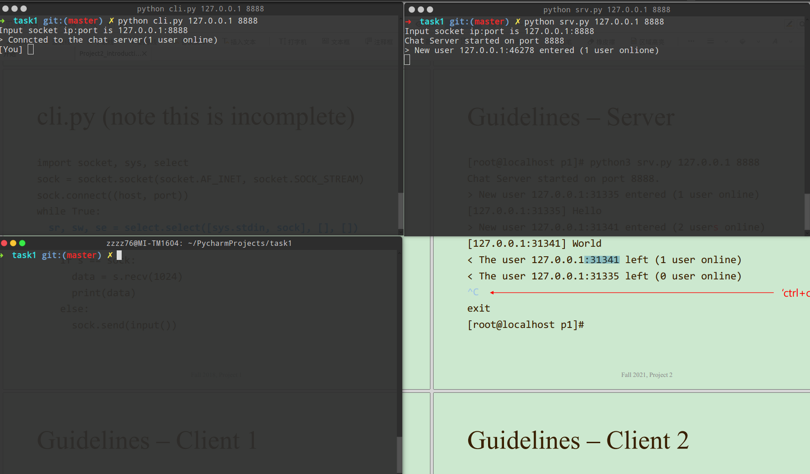
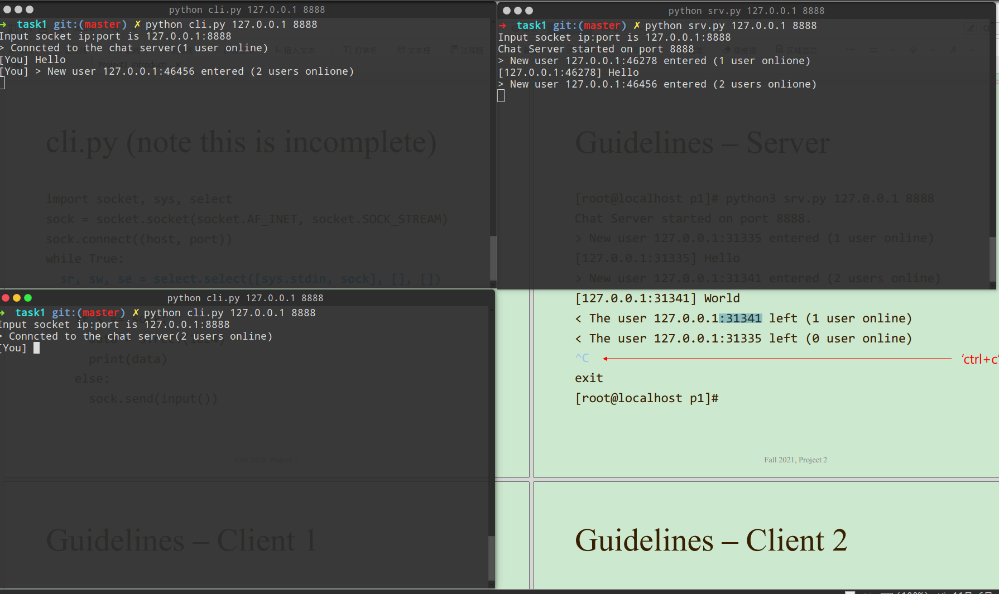
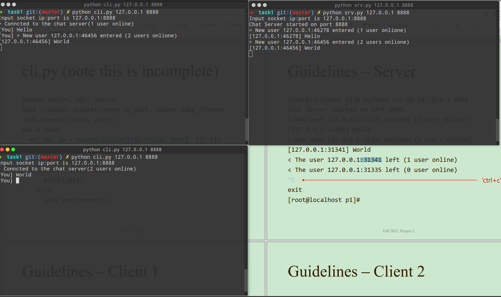
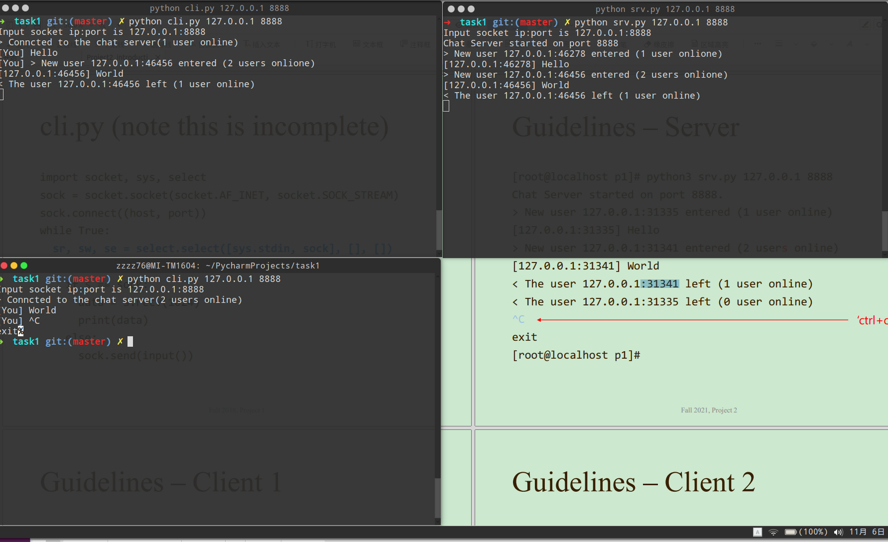
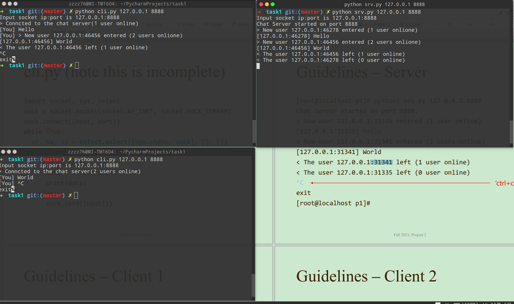
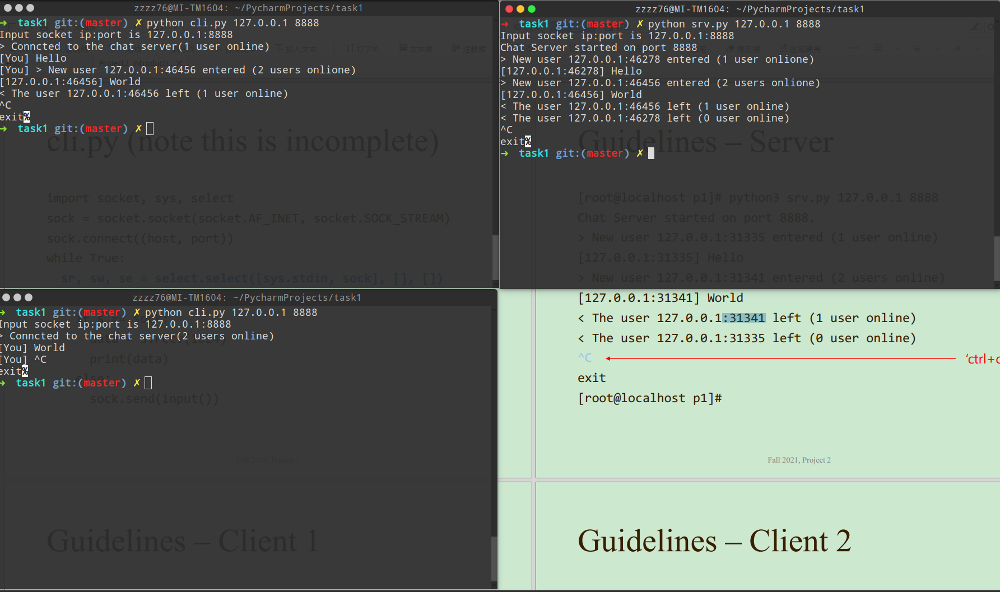
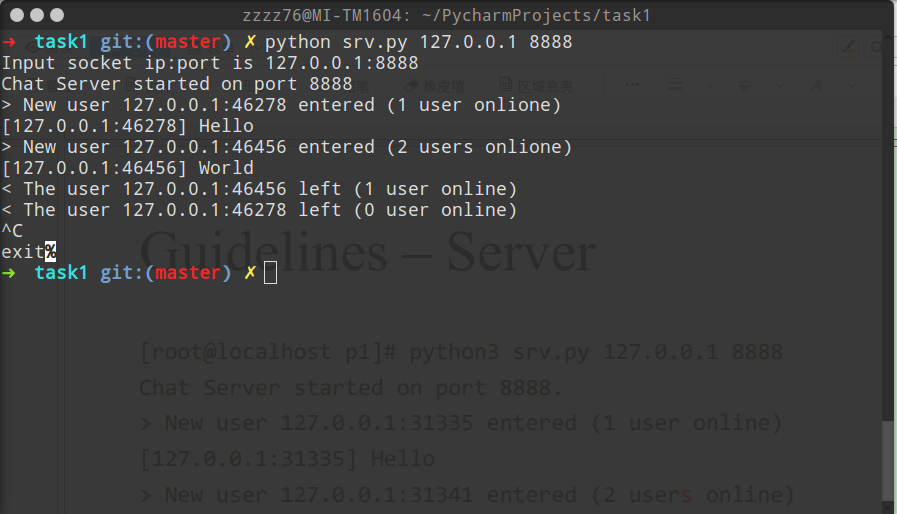
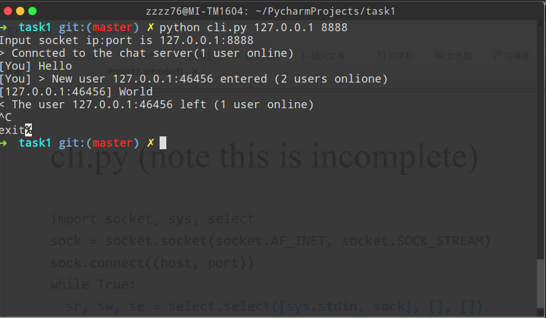
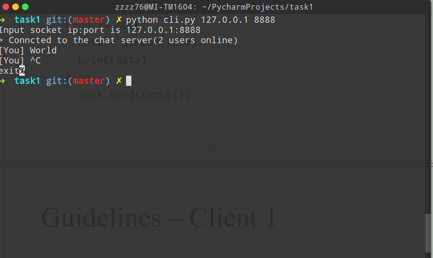

# Simple Multi-user TCP Chat


## Introduction

OS：Ubuntu 16.04

Language: Python3.5

Reference:

[1] [Sockets programming in Python](https://developer.ibm.com/tutorials/l-pysocks/)

[2] [Python socket – chat server and client with code example](https://www.binarytides.com/code-chat-application-server-client-sockets-python/)


## Flow chart

The chatroom server does two main things:

1. Receive new connections from multiple clients
2. Read messages from each client to broadcast to other connected clients


The chatroom client does two main things:

1. Listen for incoming messages from remote server
2. Check the user's input. If a user enters a message, it needs to be sent to the server


The flow chart of the above process is shown below：




## Snapshots

First we start chat server and bind the server socket to 127.0.01:8888, then we start chat client and connect the client1 socket to the defined host and port, The server will accept the new connection and broadcast the message to all of the socket except for itself




Next, we try to send a message from client 1 ，we entered “Hello” for test


 we start chat client2 and connect the client socket to the defined host and port, The server will accept the new connection and broadcast the message to all of the socket except for itself




This time, we try to send a message from client2 rather than client1，we entered “World” for test, Then the server will receive the message to broadcast to other connected clients




We try to terminate the client2 by keyboard interrupt Ctrl + C, The process termination message is sent to the server and broadcast




Now The client1 is left too 




Finally we terminal the chat server and close all of the socket list




Here is the finally result with big picture

The server：



The client1



The client2：



## Logical explanations

### a) The Server logical

The chatroom server does two main things:

* Receive new connections from multiple clients

* Read messages from each client to broadcast to other connected clients


First we need to process the input IP address and port. If the input is not recognized, 127.0.0.1:8888 is used as the binding address by default. Then comes the process of server socket creation and configuration. The server socket needs to be bound to the address we set for continuous monitoring.

```python
# check args
if (3 != len(sys.argv)):
    server_ip = "127.0.0.1"
    port = 8888
    print("Defult socket ip:port is %s:%d" % (server_ip, port))
else:
    server_ip = sys.argv[1]
    port = int(sys.argv[2])
    print("Input socket ip:port is %s:%d" % (server_ip, port))

    server_socket = socket.socket(socket.AF_INET, socket.SOCK_STREAM)
    server_socket.setsockopt(socket.SOL_SOCKET, socket.SO_REUSEADDR, 1)
    server_socket.bind((server_ip, port))
    server_socket.listen(5)
    # Add server socket to the list of readable connections
	inputs.append(server_socket)
```


We define a list variable connection list to represent a readable event that listens for multiple socket events. The code for multiplexing I/O using select is as follows

```python
# Get the list sockets which are ready to be read through select
sr, sw, se = select.select(inputs, outputs, [])
```


When select returns, read sockets have readable data on them. There are two cases:

1. If the main socket is readable, that is the socket created by the server and always in the listening state, it indicates that a new connection request can be received. In this case, you need to call the `accept()` function to receive the new client connection and broadcast the connection information to other clients.
2. If other sockets are available, the client sends a message to the server, reads the message using `recv()`, and forwards the message to all other connected clients.

```python
while True:
    sr, sw, se = select.select(inputs, outputs, [])
     # Get the list sockets which are ready to be read through select
    for sock in sr:
        #New connection
        if sock == server_socket:
            online_num += 1
            # Handle the case in which there is a new connection recieved through server_socket
            trans_sock, address = server_socket.accept()
            # login success
            if online_num > 1:
                login_msg = "> Conncted to the chat server(%d users online)\n[You] " % (online_num)
                log_msg = "> New user %s:%s entered (%d users onlione)\n" % (address[0], address[1], online_num)
            else:
                login_msg = "> Conncted to the chat server(%d user online)\n[You] " % (online_num)
                log_msg = "> New user %s:%s entered (%d user onlione)\n" % (address[0], address[1], online_num)

            sys.stdout.write(log_msg)
            sys.stdout.flush()

            trans_sock.send(login_msg.encode())
            inputs.append(trans_sock)
            broadcast(trans_sock, log_msg)

        #Some incoming message from a client
        else:
                host, port = sock.getpeername()
                data = sock.recv(1024).decode()
                if data == "-1":
                # ...

                elif data:
                    log_msg = "[%s:%s] " % (host, port) + data
                    sys.stdout.write(log_msg)
                    sys.stdout.flush()
                    broadcast(sock, log_msg)

```


The above two cases involve the process of broadcasting messages, which means sending messages received from a socket through each socket of the inputs one by one, except for itself and the main socket:

```python
#Function to broadcast chat messages to all connected clients
def broadcast(trans_sock, msg):
    #Do not send the message to master socket and the client who has send us the message
    for socket in inputs:
        if socket != server_socket and socket != trans_sock:
            try:
                socket.send(msg.encode())
            except:
                # broken socket connection may be, chat client pressed ctrl+c for example
                socket.close()
                inputs.remove(socket)
```


If the client disconnects by CTRL + C, the client should send “-1” to the server before disconnecting, and the server needs to close the socket and remove the client socket from the connection list.

```python
data = sock.recv(1024).decode()
    if data == "-1":
        online_num -= 1
        if online_num > 1:
            log_msg = "< The user %s:%s left (%d users online)\n" % (host, port, online_num)
        else:
            log_msg = "< The user %s:%s left (%d user online)\n" % (host, port, online_num)

        sys.stdout.write(log_msg)
        sys.stdout.flush()

        broadcast(sock, log_msg)
        sock.close()
        inputs.remove(sock)

    elif data:
        log_msg = "[%s:%s] " % (host, port) + data
        sys.stdout.write(log_msg)
        sys.stdout.flush()
        broadcast(sock, log_msg)
```


### b) The Client logical

The chatroom client does two main things:

* Listen for incoming messages from remote server

* Check the user's input. If a user enters a message, it needs to be sent to the server


There are two I/O events to listen for: the socket connecting to the server and standard input, which we can also do using SELECT:

```python
# Get the list sockets which are readable
sr, sw, se = select.select([sys.stdin, sock], [], [])
```


If sys.stdin has data to read, the user enters data from the console and presses Enter. Then the data is read from standard input and sent to the server. If the socket connected to the server has data readable, the server sends a message to the client and receives data from the socket. The complete client code with some hints and exception handling is as follows:

```python
import socket, sys, select

if __name__ == "__main__":
    # check args
    if (3 != len(sys.argv)):
        host_ip = "127.0.0.1"
        port = 8888
        print("Defult socket ip:port is %s:%d" % (host_ip, port))
    else:
        host_ip = sys.argv[1]
        port = int(sys.argv[2])
        print("Input socket ip:port is %s:%d" % (host_ip, port))

    sock = socket.socket(socket.AF_INET, socket.SOCK_STREAM)
    try:
        sock.connect((host_ip, port))
    except:
        print("connect fail")
        sys.exit(1)

    try:
        while True:
            # Get the list sockets which are readable
            sr, sw, se = select.select([sys.stdin, sock], [], [])
            for s in sr:
                if s == sock:
                    data = s.recv(1024)
                    if data:
                        sys.stdout.write(data.decode())
                        sys.stdout.flush()
                    else:
                        sys.exit()  # maybeserver down
                else:
                    message = sys.stdin.readline()
                    sock.send(message.encode())
                    sys.stdout.write("[You] ")
                    sys.stdout.flush()

    except KeyboardInterrupt:
        sys.stdout.write("\nexit")
        sys.stdout.flush()
        sock.send("-1".encode())
```


## Explanations of functions

```python
# Create and return a new socket object
socket(socket.AF_INET, socket.SOCK_STREAM)
# Set the value for the specified socket option
setsockopt(socket.SOL_SOCKET, socket.SO_REUSEADDR, 1)
# Bind the socket to the address and port
bind(("0.0.0.0", 7777))
# Place the socket into the listening state, able to pend backlog outstanding connection requests
listen(5)
# Connect the socket to the defined host and port
connect((host, port))
# Return a client socket with peer address information
accept()
# Close the socket 
close()
```

