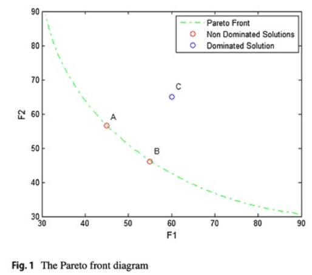
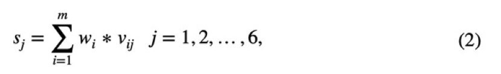
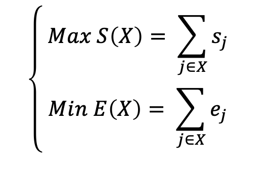
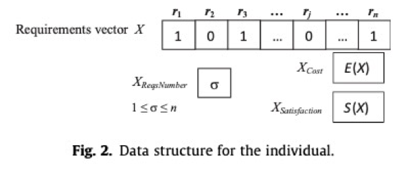
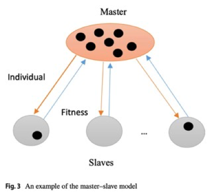
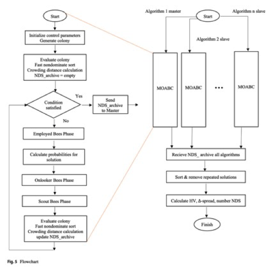
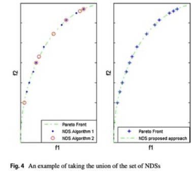

【白话论文】Parallel multi-objective artificial bee colony algorithm for software requirement optimization


#### Abstract

在软件产品的增量迭代过程中，产品的每一个版本都对应着一组新的需求。由于各种各样的现实问题，比如资金上的缺乏，时间上的缺乏，各种不同需求之间产生的相互依赖，导致所有的需求无法被同时满足。

总而言之，要选择一个最优的需求组合，是非常困难的问题，其中存在着两个相互冲突的目标，如何在提高用户满意度的同时又能够降低开发所产生的成本。论文将这个问题归纳为next release problem，属于Np-hard问题的一种。

与上述的NRP问题的标准版本不同，本文将这个问题建模为一个有限的多目标优化问题，并提出了一种基于主从模型的并行算法。

之后文章进行了实验评估，结果表明，所提出的方法将提高解决问题的质量和执行时间。


#### Introduction

文章的组织结构如下，在第二节进行了文献回顾并作动机分析，在第三节讨论并建模了软件需求的多目标优化问题，在第四节介绍了主从式并行处理的模型，提出了基于模型的改进算法，在第五节进行了实验评估，在第六节进行本研究的总结。


#### Literature reivew

文章进行了文献调研后发现，近期解决next release problem的方法大多是以元启发式的优化算法形式，但是目前为止，元启发式算法均串行算法，还没有文章引入并行算发来解决NPR问题。

Chaves-González等人在Software requirement optimization using a multiobjective swarm intelligence evolutionary algorithm中应用了MOABC算法来选择最优的需求集，这个算法得到了高质量的结果，本文打算通过并行方式和主从模式改进此方法。


#### The problem of selecting the optimal subset of multi-objective requirements

在单目标问题中，通常可以得到一个唯一的解决方案。而在多目标问题中，无法通过分配权重进行目标合并，通常得到的解决方案并不唯一


#### The Pareto front diagram

在一组解决方案中，如果不存在任何一个方案严格的优于其他某个方案，则称这一组解决方案为非支配性解决方案，Parejo JA等人在Multi-objective test case prioritization in highly configurable systems: a case study 中对多目标问题中的非支配性解决方案进行描述，称其为pareto Front

如图显示了三个解决方案，其中解决方案A严格的优于解决方案C，因为对于所有的目标F1和F2，解决方案A均占优；而方案A和方案B互不支配，因为两个方案中都存在目标比另一个方案更有优势，此处方案A和方案B构成的解集即为 Pareto Front



总结一下，在多目标问题中的一组解决方案，要构成 Pareto Front 需要满足两个条件。其一，该集合中的每两个解决方案都是非支配性的解决方案；其二，任何其他找到的解决方案都被 Pareto Front 集合中的至少一个解决方案所支配。

由于 Pareto Front 曲线可以由非支配解决方案拟合而成，使得开发团队可以动态的分析成本和满意度（例如要求客户满意度提高15%，需要额外花费20%）。出于这个原因，为特定问题找到非支配性解决方案的数量是很重要的，而且他们需要沿着 Paret Front 均匀分布，否者他们对决策者就没作用


#### Multi-objective NRP formulation

本节将需求工程问题转化为多目标NRP问题，并对其进行数学建模，这里的目标函数分别为开发成本和整体满意度，其解决方案的整体质量也是通过这两个目标函数评估的。下面将分别对两种数学模型的构建进行解释。

1. 整体满意度建模：

假设在多目标NRP中，存在n个需求被提议在下一个版本中进行开发，需求集合为R = P{r1, r2, ..., rn}，存在m个客户 C = {c1, c2, ..., cm}，每个客户对应的话语权级别为 W = {w1, w2, ..., wm}。

其中每个需求对不同的用户均有不同的价值，所以这里客户、需求、以及需求对于客户的价值将会构成m*n的价值矩阵，通过该矩阵可以计算任意给定需求rj的客户总体满意度，总满足度的集合可以表示为 S = {s1, s2, ..., sn}.



2. 开发成本建模：

假设以上每个需求对应的开发成本为E= {e1, e2, ..., en}，则总成本为选定需求对应的开发成本之和。


因此，需求工程的多目标NRP问题表示如下：




这里的 X 作为上述两个目标函数的输入参数，其含义为被选中用于下一个版本的需求向量。在多目标NRP问题中，对应一个解决方案，我们的目标是寻找在满意度和成本目标方面均相对最优的解决方案，即满足 Pareto Front 的集合。



#### The multi-objective ABC algorithm and its applications

在解决多目标NRP问题时，人工蜂群算法比其他算法的质量更高，本节打算对人工蜂群算法和其在多目标NRP的应用进行描述，并在之后提出对此算法的优化方案。

人工蜂群算法背景：

```
人工蜂群算法（ABC算法），是由Karaboga于2005年提出的一种新颖的基于集群智能的全局优化算法，其直观背景来源于蜂群的采蜜行为。它的主要特点是不需要了解问题的特殊信息，只需要对问题的优劣进行比较，通过人工蜂个体的局部寻优行为，最终在群体中使全局最优值突显出来，有着较快的收敛速度。
```


算法的调用过程如下：

```shell
初始化所有蜜源
记录最优蜜源

while:
	雇佣蜂对所有蜜源进行邻域搜索（避免饥饿效应）
	计算轮盘度，判断蜜源质量

	观察蜂对优质蜜源进行邻域搜索（加速算法收敛）
	记录最优蜜源

	侦查蜂放弃枯竭蜜源进行全局搜索（跳出局部最优）
end
```


以上调用过程为基于蜜蜂采蜜行为进行的解释，下面将结合NRP问题的处理对其进行解释。

这里的蜜源相当于是NRP问题模型的解，蜜蜂希望能够得到最优的蜜源，我们也希望能够得到问题的最优解决方案。

Step1：初始化问题的解决方案，这里的解决方案是随机得出的，在之后的过程中被不断的优化。

Step2：对所有解决方案进行解的邻域搜索，若当前解决方案的附近含有更优解，这更新此次解决方案。

Step3：依据轮盘赌策略，对所有优质解决方案进行高频的邻域搜索，加快算法收敛速度。

Step4：若存在某个解决方案持续的未被更新，则对该解决方案进行随机初始化，跳出原来的局部最优解。


此处单目标问题和多目标问题的处理区别在于，对优质蜜源的判断策略不同。单目标问题的处理策略希望能够得到唯一的全局最优解，而多目标问题的处理思路希望能够得到相对最优解的Pareto Front 集合

#### The master–slave model

本节打算采用主从并行编程模型来改进 NRP 的解决方案，即引入并行多目标ABC算法，首先对主从模型进行描述。

在主从模式中，一个处理器或者一个核心被选为主控，其余的核心作为主控核心的从属。主核通常将艰苦的工作或者是繁重的计算任务委托给从核，并等待其工作结果。




近年来，以主从模式运行的元启发式算法出现了两种形式。

在第一种形式中，主核负责执行算法的主要部分，它将两个函数计算任务分配给从属核心，然后等待他们的响应，其中两个计算任务分别为计算解决方案的适用性和解决方案的更新。该形式的缺点在于计算函数的粒度太低，每个从核心的计算频率高，但是处理时间短，相比之下主核和从核之间的通信需要更多的时间。

在第二种形式的主从模式中，主核负责执行算法的迭代部分，它将每一个待处理的解决方案，分配给不同的从核进行并行处理，从核的执行结果会反馈给主核。本文认为，该方案对硬件能力的利用不够充分，从核需要等待主核分配任务，可以进一步优化。


#### The proposed method

本文提出了一种在共享内存结构中使用主从模型的新方法。选择这个方法的目的是为了利用所有的CPU硬件能力，产生更多的非支配性解决方案，以及更加均匀的Pareto Front 集合。

在提出的新方法中，不论是主核还是从核，均在同等条件下完整地运行多目标ABC算法。也就是说，在所有核心执行的过程中，算法的迭代次数、解决方案的初始化数量，以及其他的所有参数都是相同的，每个核心都在独立的执行算法



在主从并行ABC算法执行结束时，所有的从核都将他们的非支配解集发送到主核。主核对自己和从核上产生的非支配解集进行排列，删除重复的解决方案，以获得一个高质量的一般解决方案集。

在这个例子中目标f1被最小化，目标f2被最大化，从两个不同计算核心得到的NDS解决方案集，之后聚合成一个解集。




在传统方法中，从核在被分配执行目标算法之前是闲置的，而在提出的方法中，完整的算法执行被分配给从核。在这种情况下，硬件能力被充分的使用。

与传统方法相比，本文提出的方法，在主从指之间的通信次数非常少，从核仅仅在算法执行结束的时候向主核发送一次他们的非支配结果集。

由于在所有核心上执行的算法是完全相同的，只有主核有一个额外的任务，负责对传入的解决方案集进行排序并删除迭代，可以说并行模式下算法的执行时间与串行算法没有区别，但我们将获得更高质量的解集。

