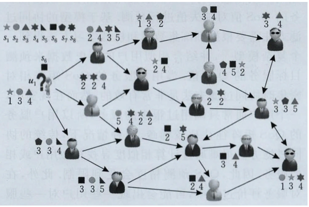
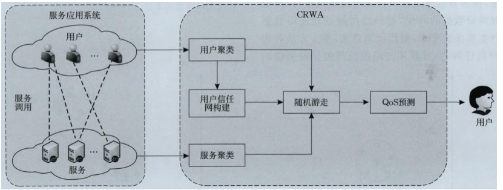
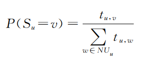
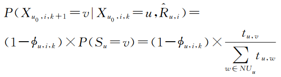
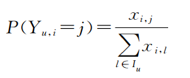
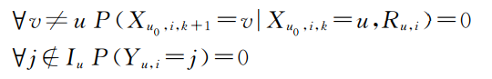
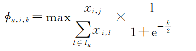

## 201812 张以文

### 研究背景

随着互联网上 Web 服务的日益增多，面对大量功能相同或相似的候选服务，用户希望能够选择质量最优的候选服务，然而，用户通常并不知道所有候选服务的服务质量。因此基于 Web 服务的历史记录预测 Qos 值得到了广泛关注。

### 主要问题

传统的**基于协同过滤的预测方法**可能会遭遇数据稀疏、用户信任等问题，导致该方法在预测精度方面表现一般。**基于信任的预测方法**可以在一定程度上缓解恶意评价问题，然而当数据十分稀疏时，该方法的预测性能有待进一步提高。

上图给出了一个Web服务场景中的用户信任网，假设推荐系统希望预测用户 $u_1$ 对服务 $s_6$ 的 Qos 评价，当数据十分稀疏时，系统发现用户 $u_1$ 的信任用户中没有用户评价过目标服务 $s_6$ ，这将导致预测失败。

如何在 Web 服务 Qos 信息十分稀疏的情况下同时考虑用户信任关系，从而提高 Qos 预测精度是本文的研究目的。

### 创新点

为了解决上述问题，本文提出了一种基于覆盖随机游走算法的服务质量预测方法

1. 本文将覆盖算法应用到 Web 服务 Qos 预测中，利用该算法计算用户信任度和服务关联度，与经典的聚类算法相比，改进过的用于聚类的覆盖算法不需要预先指定类的数量和初始质心，从而保证了预测的准确性
2. 本文在聚类结果的基础上，选取每个用户的Top-k个信任用户，构建用户信任网，进而结合随机游走算法提出了一种覆盖随机游走算法CRWA，该算法不仅考虑了用户之间的信任关系，对数据高度稀疏的应用场景同样具有很高的预测精度。

### 相关理论

CRWA 服务质量预测方法的总体框架

1. 用户信任网的构建
2. 随机游走
3. Qos预测

#### a) 改进的覆盖算法

首先，根据用户服务的历史Qos信息，构建如下矩阵，其中的每个元素 $q_{ui}$ 表示用户 $u$ 对 Web 服务 $i$ 的 Qos 体验，空元素表示未知的 Qos 值。

CNMF用数据点集合 $D = \{d_1, d_2, ..., d_g\}$ 表示 $U$ 中调用过服务 $i$ 的所有用户集合，其中  2<=g<=m，表示调用过服务 $i$ 的用户数量在 2~m 之间，$d_k$ 为一个 $p$ 维向量，表示调用过服务 $i$ 的第 $k$ 个用户的所有 Qos 值映射到了 $p$ 维空间中。本文使用覆盖算法将数据点集合 $D$ 划分成多个覆盖，每次迭代产生的新覆盖用 $C_{cr}$表示，覆盖半径用 $r_{cr}$ 表示，$D_{uc} \in D$ 表示未被覆盖的样本点集合，算法的主要步骤如下：

算法伪代码：

对于每个 Web 服务 $i \in I$，该算法在 $U(i)$ 上执行，即总共执行 $n$ 次，聚类的结果记录在用户相似度矩阵 $M_U$ 中，其中的每个元素 $x_{u,v}$ 表示在 $n$ 次执行聚类算法期间用户 $u$ 和 用户 $v$ 被分区到同一个类中的总次数。

如果两个用户被聚类到同一个覆盖中的次数越多，说明这两个用户的信任度越高，选取与每个用户覆盖次数的Top-k个用户为该用户的信任用户，通过连接每个用户与其信任用户构建用户信任网。

#### b) 改进的随机游走

假设从原用户 $u_0$ 开始随机游走，在随机游走的第 $k$ 步，到达某一用户 $u$ ，如果用户 $u$ 已经对目标服务 $i$ 做过评价，则停止随机游走并返回 $r_{u,i}$ 作为本次随机游走的结果；如果用户 $u$ 未对目标服务 $i$ 做过评价，则有以下两种选择：

1. 以概率 $\phi_{u,i,k}$ 停止随机游走，随机选择用户 $u$ 评价过的与目标服务 $i$ 相似的服务 $j$ ，并返回 $r_{u,j}$ 作为本次随机游走的结果
2. 以概率 $1 - \phi_{u,i,k}$ 继续随机游走到用户 $u$ 的某一信任用户 $v$

如果决定在用户 $u$ 继续进行随机游走，则不得不选择该用户的某一信任用户并走向他。PageRank算法认为访问每个出边节点的概率是相等的，但本文认为选择走向每个信任用户的概率有高低之分，并将在用户 $u$ 的信任用户集合中选择用户 $v$ 的概率定义为：

假设原用户 $u_0$ 在第 $k$ 步游走到达用户 $u$ ，那么原用户 $u_0$ 在第 $k + 1$ 步游走到达用户 $v$ 的概率为：

如果决定在用户 $u$ 停止随机游走，则需要选择用户 $u$ 已经评价过的与目标服务 $i$ 相似的服务 $j$ 。选择服务 $j$ 的概率计算如下：

### 评价

