## 201903 张以文

Covering-Based Web Service Quality Prediction via Neighborhood-Aware Matrix Factorization. Yiwen Zhang, Kaibin Wang


## 研究背景

互联网上的网络服务数量一直在快速增长。这使得用户越来越难以从大量的功能相当的候选服务中找到合适的服务。检查每个网络服务的质量值是不切实际的，因为它非常耗费资源。因此，在过去的几年里，网络服务的质量预测问题吸引了很多人的注意，重点是矩阵分解（MF）技术的应用。


## 主要问题

最近，研究人员已经开始采用用户相似性来改进基于MF的Web服务预测方法。然而，现有的方法都没有正确和系统地解决其中的两个主要问题。1）检索适当的邻域信息，即相似的用户和服务；2）利用完整的邻域信息，即用户和服务的邻域信息。


## 创新点

在本文中，我们提出了一种基于覆盖的服务质量预测方法CNMF，该方法是一种基于邻域感知矩阵分解的Web服务质量预测方法。CNMF的创新之处在于两个方面。首先，它采用了一种基于覆盖的聚类方法来寻找类似的用户和服务，这不需要预先指定聚类的数量和聚类中心。其次，它利用用户和服务的邻域信息来提高预测的准确性。

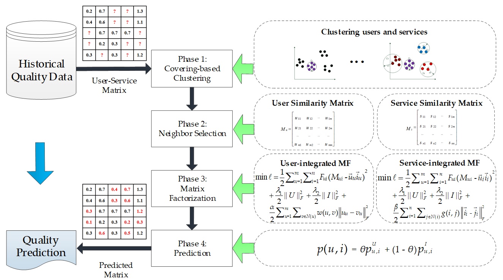


### a) 改进的覆盖算法

首先，根据用户服务的历史Qos信息，构建如下矩阵，其中的每个元素 $q_{ui}$ 表示用户 $u$ 对 Web 服务 $i$ 的 Qos 体验，空元素表示未知的 Qos 值。

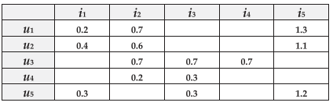


CNMF用数据点集合 $D = \{d_1, d_2, ..., d_g\}$ 表示 $U$ 中调用过服务 $i$ 的所有用户集合，其中  2<=g<=m，表示调用过服务 $i$ 的用户数量在 2~m 之间，$d_k$ 为一个 $p$ 维向量，表示调用过服务 $i$ 的第 $k$ 个用户的所有 Qos 值映射到了 $p$ 维空间中。本文使用覆盖算法将数据点集合 $D$ 划分成多个覆盖，每次迭代产生的新覆盖用 $C_{cr}$表示，覆盖半径用 $r_{cr}$ 表示，$D_{uc} \in D$ 表示未被覆盖的样本点集合，算法的主要步骤如下：

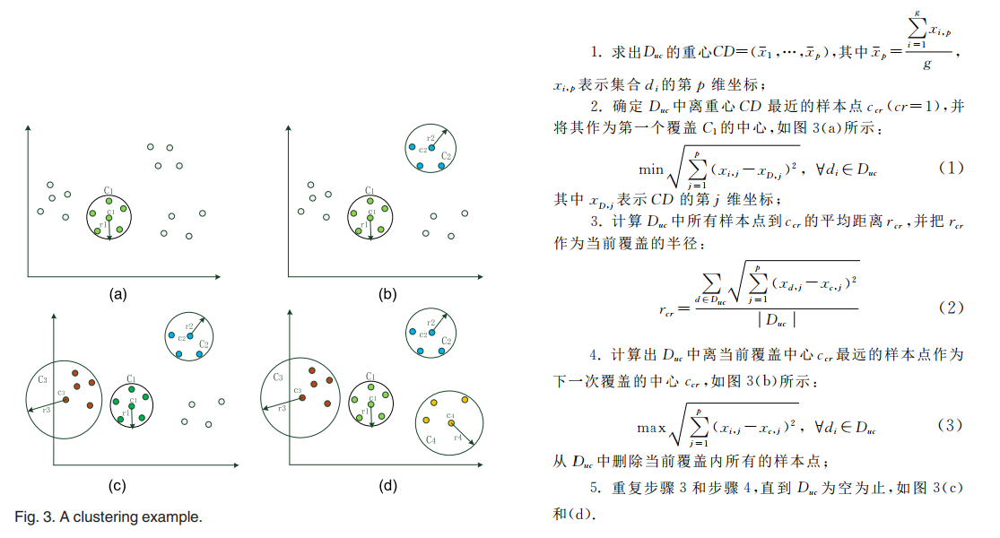


算法伪代码：


对于每个 Web 服务 $i \in I$，该算法在 $U(i)$ 上执行，即总共执行 $n$ 次，聚类的结果记录在用户相似度矩阵 $M_U$ 中，其中的每个元素 $x_{u,v}$ 表示在 $n$ 次执行聚类算法期间用户 $u$ 和 用户 $v$ 被分区到同一个类中的总次数。

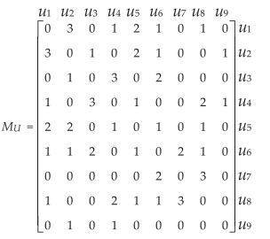


如果两个用户被聚类到同一个覆盖中的次数越多，说明这两个用户的信任度越高，选取与每个用户覆盖次数的Top-k个用户为该用户的信任用户。同样，采用类似的方法对服务相似性进行评价。


### b) 结合用户邻域的矩阵分解模型

给定 $N(u)$，CNMF 使用 MF 技术来获得基于用户的潜在用户特征矩阵 $U_U$ 和潜在服务特征矩阵 $I_U$。

1. 首先计算每个用户 $u$ 的邻居权重。其中 $x_{u,v}$ 表示在基于覆盖的聚类阶段，用户 $u$ 和 $v$ 被分配到同一个类的次数，$w(u,v)$ 的值越高，则用户 $u$ 和用户 $v$ 的相似度越高

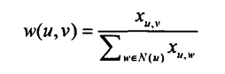


2. 将正则化项结合到基于 MF 的质量预测模型中。其中 $\overline{u_u}$ 和 $\overline{v_v}$ 表示 $U_u$ 中潜在用户特征向量，越相似的用户，特征隐向量的差距应该越小。


3. 结合用户的矩阵分解模型。其中 $\alpha > 0$ 是一个可调参数，用来控制正则项的所占比重。

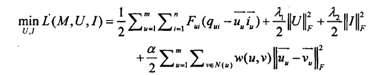


4. 采用梯度下降法重复更新 $U_U$ 和 $I_U$ 来找到近似最优解

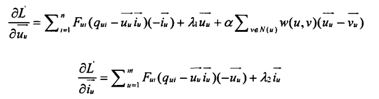


下图展示了经典的 MF，NIMF 和仅利用用户邻域的 CNMF-U 之间的差异。经典的 MF 不会在其模型中结合邻域信息，NIMF 通过计算 PCC 以找到 $N(u)$, 而 CNMF-U 采用基于覆盖的聚类方法找到 $N(u)$。现在来关注用户 $u_5$ 的预测，经典的 MF 利用所有其他用户的信息进行预测，因为他不考虑 $u_5$ 的邻域信息。NIMF 利用 $u_4$ 的信息进行预测，因为他计算 PCC 并发现 $N(u_5) = \{u_4\}$。CNMF-U 利用 $u_1$ 和 $u_2$ 的信息进行预测，因为他通过覆盖聚类找到 $N(u_4) = \{u_1, u_2\}$。接下来，观察相应的预测结果可以发现，在 $M_{NIMF}$ 中 $u_4$ 和 $u_5$ 的Qos 体验最相似，而在 $M_{CNMF-U}$ 中，$u_1, u_2$ 和 $u_5$ 的 Qos 体验最相似，有趣的是，在 $M_{CMF}$ 中，没有用户与 $u_5$ 特别相似。

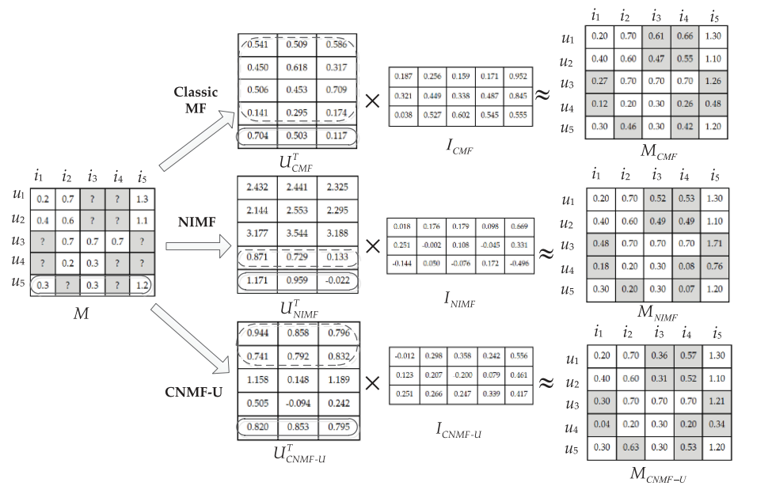

同理，CNMF 还可以进行结合服务的 MF，与结合用户的 MF 非常相似， 它将服务 $i$ 的邻域信息结合到预测模型中，而不是用户 $u$ 。为了充分利用 $u$ 和 $i$ 的邻域信息，CNMF 可以混合结合用户的 MF 和结合服务的 MF，以预测用户 $u$ 对 服务 $i$ 的Qos：

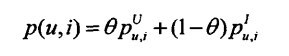


## 相关理论

协同过滤(CF)算法是推荐系统中最重要的方法，该算法可以分为两种：基于记忆的协同过滤算法和基于模型的协同过滤算法。

* 基于记忆的协同过滤算法可以进一步的划分为基于用户的协同过滤算法，和基于项目的协同过滤算法。基于用户的CF算法通过皮尔逊相关系数计算目标用户的相似邻居，然后利用邻居集合的评分信息进行预测评分。基于项目的CF算法和基于用户的CF算法采取同样的思路，通过目标项目的相似邻居进行预测评分。

* 基于模型的协同过滤算法的经典模型主要包括：贝叶斯模型、隐语义模型和矩阵分解模型，具体的模型需要根据训练数据和机器学习方法计算得到，之后结合用户的历史数据来预测缺失值。

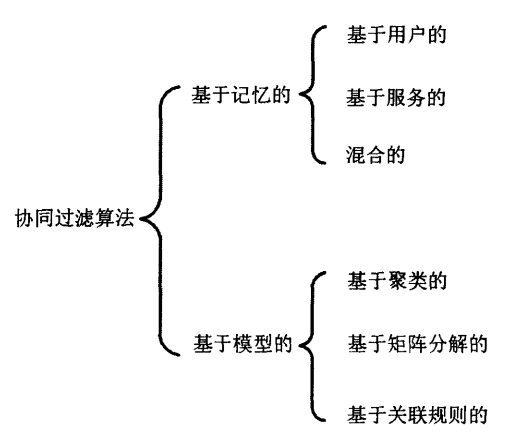

### a) 基于用户的协同过滤算法


**算法流程：**

```markdown
1. 收集用户服务的历史Qos数据，并建立用户-服务矩阵
2. 根据用户-服务矩阵就计算相似度寻找当前用户的相似邻居集
3. 根据相似邻居集的Qos信息对缺失值进行预测
```


**计算用户相似度：**

假设用户 $u$ 和用户 $v$ 是两个不同的用户，$R_{u, i}$ 表示用户 $u$ 对服务 $i$ 的Qos值，，$R_{v, i}$ 表示用户 $v$ 对服务 $i$ 的Qos值，$I_{u,v}$ 表示用户 $u$ 和用户 $v$ 一起调用过的服务集合，$\overline{R_u}$ 表示用户 $u$ 调用过的所有服务的平均Qos值，$\overline{R_v}$ 表示用户 $v$ 调用过的所有服务的平均Qos值。

* 皮尔逊相关系数（PCC）

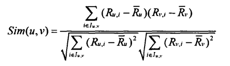

* 余弦相似度

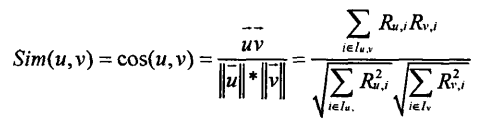


**预测Qos值：**

计算出每个用户间的相似度后，使用Top-k机制选择与目标用户最相似的Top-k个用户为相似用户集合。根据具相似用户集合的Qos信息对目标用户的Qos缺失值进行预测。

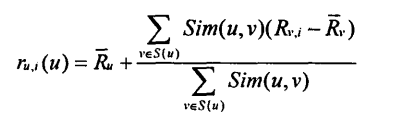


### b) 基于矩阵分解的协同过滤算法


**算法流程：**

```markdown
1. 收集用户服务的历史Qos数据，并建立用户-服务矩阵
2. 将高维的用户-服务矩阵分解成两个低维特征矩阵
3. 使用因子模型不断拟合用户特征矩阵和服务特征矩阵
4. 根据拟合的两个低维特征矩阵预测目标位置的缺失值
```


**矩阵分解：**

使用 $M$ 表示用户-服务矩阵， $U_{CMF} \in R_{d*m}$ 表示用户潜在特征矩阵， $I_{CMF} \in R_{d*n}$ 表示服务潜在特征矩阵。为了尝试接近 $M$，我们需要不断的拟合两个潜在特征矩阵。

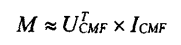


**拟合函数：**

向量 $\overline{u}$ 表示用户潜在特征想向量，向量 $\overline{i}$ 表示服务潜在特征向量，它们的维度为 $d$ 。利用如下目标函数使 $U$ 和 $I$ 对原始矩阵 $M$ 进行近似拟合

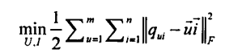


其中的 Frobenius 范数，用于计算 $M$ 中的实际值与预测值之间的差值，可以将其简化如下，$F_{ui}$ 是指示符函数，如果用户 $u$ 调用过服务 $i$ ，则返回1，否则返回0。

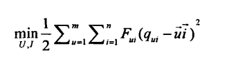


为了避免过度拟合得到最优的 $U$ 和 $I$ 逼近原始矩阵 $M$，需要加入两个与 $U$ 和 $I$ 相关的正则项

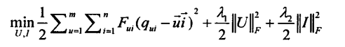


**求最优解：**

目标函数使用二次正则项来最小化平方误差和。因为它不是凸的，所以寻找全局最小是不现实的。可以采用随机梯度下降算法求解出近似最优的潜在特征向量，其中 $\gamma_1 > 0$，$\gamma_2 > 0$ 表示学习速率。

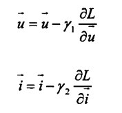


### c) 正则项与过拟合

在目标函数的拟合过程中，不仅需要保证loss值的不断下降，还需要加入正则项来防止函数过拟合。最终收敛的目标函数将是平滑而非崎岖的，不但能够符合训练集的要求，而且在测试集上也有良好的表现。


## 评价

优点

* CNMF 克服了基于 PCC 和 K-means 方法的用户相似度和服务相似度计算的局限性，无需预先指定聚类的数量和聚类中心，能够检索到合适的邻域信息。
* CNMF进一步集成了服务邻域信息，相比其他集成用户邻域信息的方法更加有效。


缺点

* CNMF所基于的矩阵分解算法，采用L2-norm来度量Qos观测值与预测值之间的差异，缺乏对异常值的鲁棒性。
* CNMF对冷启动问题缺乏考虑，比如当新用户或服务出现时如何进行预测和推荐。


思考

* 目前已知的聚类方法有，k-means聚类、高斯聚类、覆盖聚类，他们的优缺点是什么？是否有更加合适的聚类方法呢？
* 我们已经结合了用户邻域信息，对潜在用户特征矩阵进行限制，是否有从其他角度进行限制的可能性？
* 矩阵分解法可以基于大量的历史数据进行静态预测，但是对于新用户、新服务应该如何预测呢，或者说如何进行实时预测？
