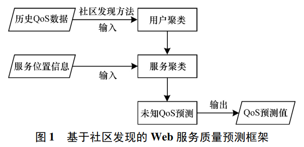
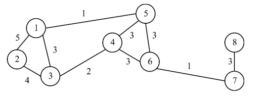
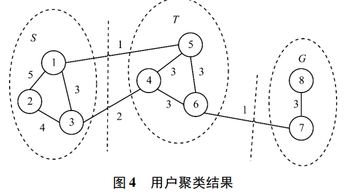
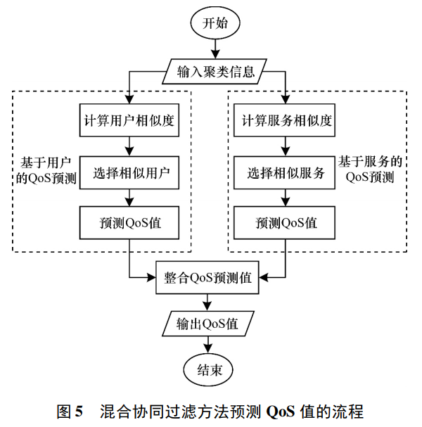
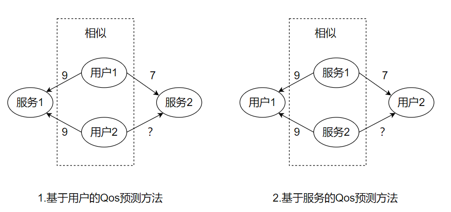

# 201903 陆贝妮

[基于社区发现的Web服务QoS预测](https://kns.cnki.net/kcms/detail/detail.aspx?filename=JSJC201903021&dbcode=CJFD&dbname=CJFD2019&v=0pB3H536puYvZMdLm-3ZQWgnDi2TbRai1R2_L3RyQTiLwwpoltbbkKNN5L67QzIH)[J]. 陆贝妮,杜育根.计算机工程 . 2019(03)

摘要：传统的协同过滤方法预测未知Qos值时面临数据稀疏、冷启动和噪声影响等问题。为此提出一种新的基于社区发现的Qos预测方法。通过谱聚类对用户进行社区划分，根据位置信息对Web服务聚类，利用改进的混合协同过滤方法预测Qos值。实验表明，该方法可以缓解新用户的冷启动问题，具有更高预测准确度。

## 研究背景

在Web服务推荐的场景中，Qos成为用户选择Web服务的重要因素，需要为目标用户预测未知Qos值。

## 主要问题

传统的Qos预测采用协同过滤方法，通过相似用户和相似项目来预测未知值，需要假设2个及2个以上的用户曾经调用过相同Web服务并得到过相似的Qos评价。然而真实环境中，被用户调用的Web服务数量过少，用户偏好无法准确学习。

## 创新点

相同社区网络中的用户更容易对Web服务做出相似的Qos评价，相同物理位置的Web服务更可能得到相似的Qos值。因此，本文利用社区发现算法中的谱聚类，将相似的用户聚类到同一个子社区中，利用服务位置信息对Web服务进行聚类，通过前后两次聚类将数据集从稀疏矩阵压缩成密集矩阵，根据协同过滤方法预测未知Qos值。

### a) 基于社区发现的用户聚类

1. 原始数据集为用户-服务Qos稀疏矩阵，构造用户-服务二部图

2. 将用户服务二部图，转化为关于用户的无向有权社区网络图，权重为相邻用户调用相同web服务的总个数

3. 结合谱聚类和KM对相似用户的聚类

### b) 基于服务位置信息的二次聚类

用户聚类将原本规模为N\*M的样本矩阵变成K\*M的矩阵。以此为基础，提出基于服务位置信息的二次聚类，使用K-means方法来识别一组在地理位置上类似的Web服务，M个Web服务被划分到Q个服务集合中，K\*M的矩阵被压缩成K\*Q的矩阵

### c) 基于混合协同过滤法预测Web服务的Qos值

为了获得用户对服务的Qos评价，首先到N\*M的用户服务矩阵中查找，没有则进行二次聚类后，到K\*Q的矩阵中查找，没有则使用混合协同过滤方法进行Qos值的预测。

混合协同过滤方法结合了基于用户的协同过滤和基于服务的协同过滤各自的优点

* 基于用户的Qos预测方法，为目标用户找到相似用户集合，利用相似用户观测到的Qos值为目标用户预测目标Web服务的未知Qos值
* 基于服务的Qos预测方法，为目标服务找到相似服务集合，利用相似服务的Qos值为目标用户预测Qos值

## 评价

优点：

* 相比其他协同过滤方法，在预测准确度和时间复杂度上有着更好的性能
* 将基于社区发现的用户聚类方法，运用于基于用户的协同过滤中，具备一定的创新性

缺点：

* 混合协同过滤在数据稀疏的情况下依然无法有很好的效率
* 协同过滤方法局限于空间上的预测，缺少时间上的预测

Future work

- 将时间信息加入到预测过程中来提高预测准确度
- 尝试将大数据技术加入到混合协同过滤方法中进行改进
