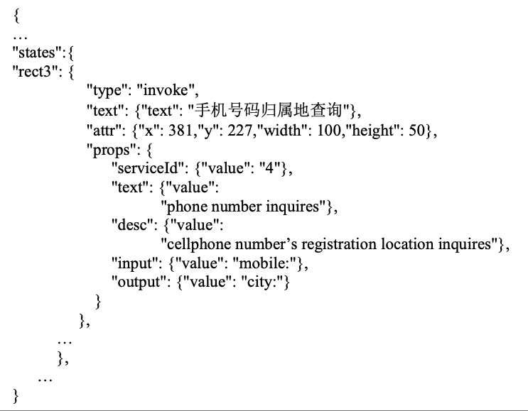

## 基于 JSON 的语义 Web 服务自动组合系统的设计与实现

### 摘要

### 目录

### 研究背景

两个问题：

* Q1：XML编程语言不够轻便
* Q2：当下Web服务组合工具不够方便

改进角度：

* 利用语义技术提升Web服务组合与匹配精度
* 设计出更便于描述的业务流程设计方式
* 使用B/S架构提升系统兼容性
* 设计存储格式对服务及服务组合进行存储和检索

主要工作：

* 对 Web 服务组合与匹配的当前现状和亟待解决的问题进行了论述
* 提出了利用 JSON 对业务流程和组合 Web服务进行描述的完整方法
* 利用Kuhn-Munkres 算法实现对自然语言的相似度计算
* 设计并实现了一个组合 Web 服务 Qos 的计算方法
* 实现了用户交互界面，对Web服务和业务流程进行管理

### 相关技术

|                   | 技术          | 描述                       |
| ----------------- | ------------- | -------------------------- |
| Web 服务引擎      | Apache Axis 2 | Web服务框架                |
|                   | Apache ODE    | 实现了BPEL流程的可视化开发 |
|                   | Oracle BPEL   | BPEL集成工具包             |
| 自然语言处理      | Apache Lucene | 全文检索工具包             |
|                   | WordNet       | 基于认知语言学的英语词典   |
|                   | JWI           | 对WordNet进行访问的API类库 |
| 本体与语义Web服务 | OWL           | Web本体语言                |
|                   | OWL-S         | Web服务本体语言            |

词汇表 -> 分类法 -> 本体

### 系统设计

系统需求：

* 使用可视化工具对Web服务进行组合，并将既定的组合转化为JSON代码编号存储，之后检索出需要的JSON代码，通过执行引擎构建组合服务。

| 角色       | 基础服务管理       | 业务流程管理                 |
| ---------- | ------------------ | ---------------------------- |
| 用户       | 服务查看           | 流程查看、组合服务执行       |
| 管理员     | 服务删除           | 流程删除                     |
| 服务提供者 | 服务添加、服务修改 | 流程添加、流程修改、流程匹配 |

系统总体框架

* Apache Server：为OWL-S文件、OWL本体文件以及WSDL文件提供了一个部署环境
* Web 服务数据库：存储基础服务管理、业务流程管理的相关信息
* 服务组合模块：根据服务描述生成服务组合图
* 服务匹配模块：根据业务流程，在服务组合图中寻找组合服务路径
* 业务流程转换模块：将服务组合路径用JSON进行描述，并存储到数据库中
* 服务执行模块：解析服务组合的JSON代码

基于 JSON 的业务流程描述

* 业务活动描述：根据input、output、description三个参数，去匹配数据库中存在的业务流程
* 业务流程描述

数据库设计：

* 服务表
* 参数表
* 流程表
* 组合服务表
* 用户表

模块设计：

* Apache Server：为OWL-S文件、OWL本体文件以及WSDL文件提供了一个部署环境
* Web 服务数据库：存储基础服务管理、业务流程管理的相关信息
* 服务组合模块：根据服务描述生成服务组合图
* 服务匹配模块：根据业务流程，在服务组合图中寻找组合服务路径
* 业务流程转换模块：将服务组合路径用JSON进行描述，并存储到数据库中
* 服务执行模块：解析服务组合的JSON代码

### Web 服务组合与匹配方法

### 系统实现

### 结论与展望

