## 基于 JSON 的语义 Web 服务自动组合系统的设计与实现

### 目录

1. 研究背景
2. 系统设计
3. 服务组合与匹配
4. 结论与展望

### 一、研究背景

两个问题：

* Q1：XML编程语言不够轻便
* Q2：当下Web服务组合工具不够方便

改进角度：

* 利用语义技术提升Web服务组合与匹配精度
* 设计出更便于描述的业务流程设计方式
* 使用B/S架构提升系统兼容性
* 设计存储格式对服务及服务组合进行存储和检索

主要工作：

* 对 Web 服务组合与匹配的当前现状和亟待解决的问题进行了论述
* 提出了利用 JSON 对业务流程和组合 Web服务进行描述的完整方法
* 利用Kuhn-Munkres 算法实现对自然语言的相似度计算
* 设计并实现了一个组合 Web 服务 Qos 的计算方法
* 实现了用户交互界面，对Web服务和业务流程进行管理

相关技术：

|                   | 技术          | 描述                       |
| ----------------- | ------------- | -------------------------- |
| Web 服务引擎      | Apache Axis 2 | Web服务框架                |
|                   | Apache ODE    | 实现了BPEL流程的可视化开发 |
|                   | Oracle BPEL   | BPEL集成工具包             |
| 自然语言处理      | Apache Lucene | 全文检索工具包             |
|                   | WordNet       | 基于认知语言学的英语词典   |
|                   | JWI           | 对WordNet进行访问的API类库 |
| 本体与语义Web服务 | OWL           | Web本体语言                |
|                   | OWL-S         | Web服务本体语言            |

词汇表 -> 分类法 -> 本体

### 二、系统设计

模块设计：

* Apache Server：为OWL-S文件、OWL本体文件以及WSDL文件提供了一个部署环境
* Web 服务数据库：存储基础服务管理、业务流程管理的相关信息
* 服务组合模块：根据服务描述生成服务组合图
* 服务匹配模块：根据业务流程，在服务组合图中寻找组合服务路径
* 业务流程转换模块：将服务组合路径用JSON进行描述，并存储到数据库中
* 服务执行模块：解析服务组合的JSON代码，对组合服务进行调用

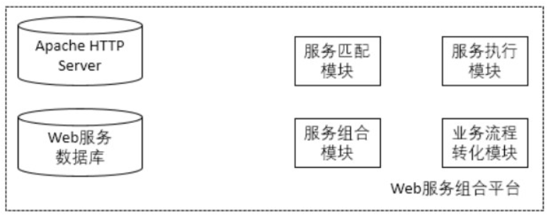

### 三、服务组合与匹配

本节详细介绍了应用于系统的Web服务组合与匹配方法。首先，介绍了Web服务参数的提取方法，和Web服务组合路径图的相关概念及建立算法；其次，对web服务匹配的各种概念进行了介绍，然后阐述了基于KM算法的Web服务匹配方法；最后，对基于Qos组合的Web服务筛选方法进行了介绍。

#### 1. 参数提取

从OWL-S文件中提取出输入输出参数，并存储到数据库中

#### 2. 服务组合算法

服务组合算法是指，通过将所有的Web服务作为顶点，若某顶点A的输出参数集与顶点B的输入参数集相同或相似，则添加一条从顶点A指向顶点B的边，由此建立一个有向无环图，图中的任何一条路径都可以看做是一个组合服务。

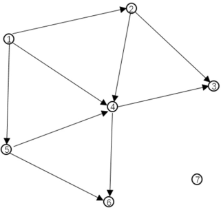

算法步骤：

1. 添加有向边

2. 建立服务组合图

**Q1：**

如何在顶点之间添加有向边？

**A1：**

通过比较顶点的某个输出参数，与其他顶点的某个输入参数，是否相同或相似，即计算是否存在两个参数之间相同或相似。

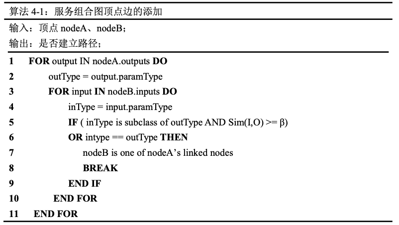

**Q2：**

如何判断相似度？

**A2：**

借助OWL本体文件和参数类型判断相似度，图中类2与类1、类3与类1相似，类2与类3之间通过最短路径距离计算语义相似度，类4与类123不相似。

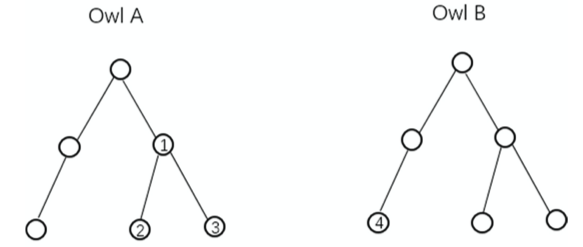

**Q3：**

如何计算语义相似度？

**A3：**

通过结点在OWL树上的路径距离计算相似度，

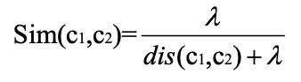

**Q4：**

如何建立服务组合图

**A4：**

逐个顶点遍历，对顶点的所有邻接结点，执行有向边添加算法

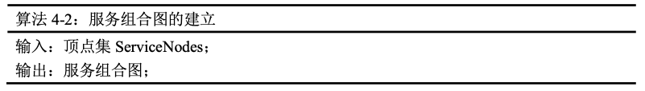

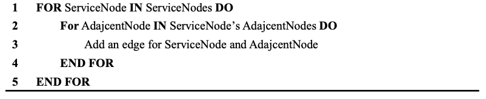

#### 3. 服务匹配算法

服务匹配算法是指，通过用户提供的输入输出参数集，可以在服务组合图中匹配多个顶点作为组合服务路径的开始顶点和结束顶点，从而得到不定数量的连通路径，再通过组合服务的文本描述与用户提供的服务需求进行语义相似度的匹配，从中选择与业务需求最符合的组合服务。

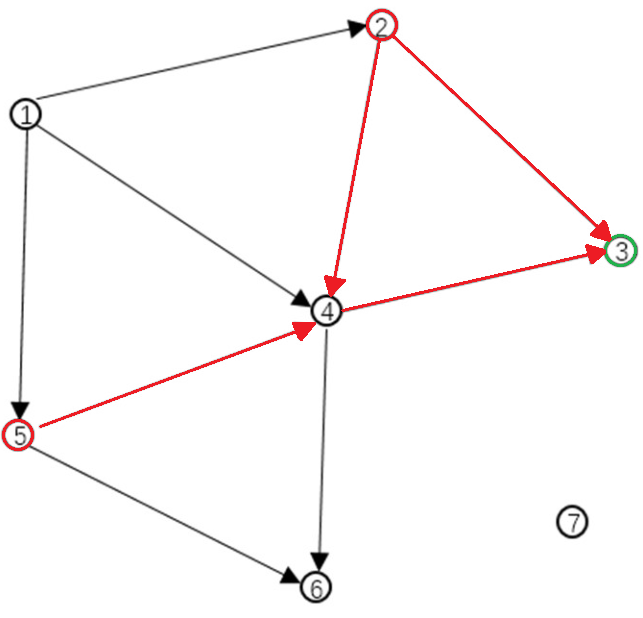

算法步骤：

1. 计算参数集相似度
2. 获取组合服务
3. 计算服务描述相似度
4. 基于语义相似度筛选服务组合

**Q1：**

如何计算单词相似度？

**A1：**

通过WordNet获取词语所在的同义词集合，然后针对两个同义词集合的关系和语义距离计算相似度。

比如：同义词集合$Set_1 = \{c_{11}, c_{12} ... c_{1m}\}$，与$Set_2 = \{c_{21}, c_{22} ... c_{2n}\}$ 的相似度，即可当做$word_1$与$word_2$的相似度

**Q2：**

如何计算同义词集合的相似度？

**A2：**

文章综合了2种经典算法

* 基于词条所属同义词集合的最小共同祖先结点，和同义词集合出现的频率计算相似度
* 基于路径长度计算相似度

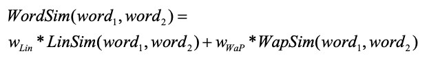

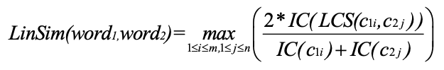

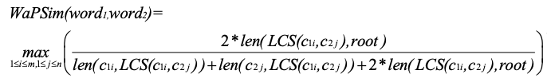

**Q3：**

如何计算参数相似度？

**A3：**

参数通常为单词组，通过Apache Lucene进行分词处理后，两个参数的相似度可以等同于两个单词组的相似度。

比如：两个参数$param_{action}, param_{service}$的单词组分别为 $words_{action} = \{aw_1, aw_2 ... aw_m\}, words_{service} = \{sw_1, sw_2 ... sw_n\}$

首先计算两个单词组中每个单词的相似度，获取相似度矩阵$WordsSim$

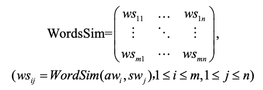

接着为矩阵添加虚拟结点，并应用二分图匹配算法，得到参数相似度计算公式

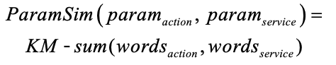

**Q4：**

如何计算参数集的相似度

**A4：**

计算参数集的相似度和计算单词组相似度的方法基本一致。

假设用户提供的参数集为$ActionParams = \{aparam_1, aparam_2, ... aparam_m\}$，OWL-S 文件提供的参数集为$ServiceParams = \{sparam_1, sparam_2,... sparam_n\}$

首先计算两个参数集中每个参数的相似度，获取相似度矩阵$ParamsSim$

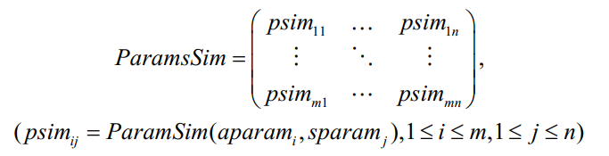

接着为矩阵添加虚拟结点，并应用二分图匹配算法，得到参数集相似度计算公式

**Q5：**

如何获取组合服务？

**A5：**

根据用户的输入参数集和输出参数集，对服务组合图中的所有服务进行匹配，得到开始顶点集和结束顶点集

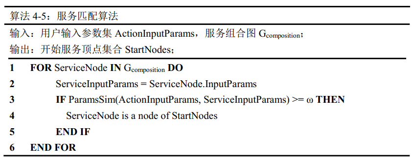

接着在组合服务图中搜索连接两个顶点的有向连通路径，找出其中的最短路径

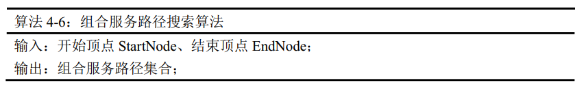

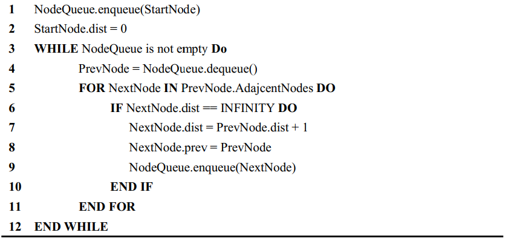

随后对开始顶点集和结束顶点集中的任意顶点应用以上算法，获得组合服务路径的集合 $ComPaths = \{cpath_1, cpath_2, ... cpath_n\}$

**Q6：**

如何计算服务描述相似度

**A6：**

本文仅关注用户的服务需求描述与组合Web服务中首尾位置的服务描述的相似度，相似度计算分为语义相似度计算和语法相似度计算。

服务描述的语义相似度计算方法和参数相似度计算方法类似，其计算公式如下

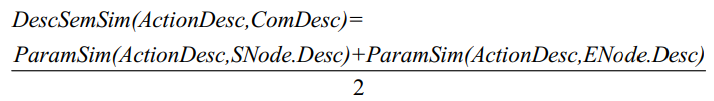

服务描述的语法相似度，采用余弦相似度计算方法，分别计算两个词组中每个词语的出现频次，得到词频向量$ActionDescVec = \{x_1, x_2, ... x_t\}$ 和 $ServiceDescVec = \{y_1, y_2, ... y_t\}$，最终服务描述的语法相似度计算公式如下

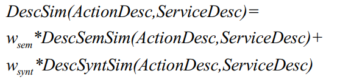

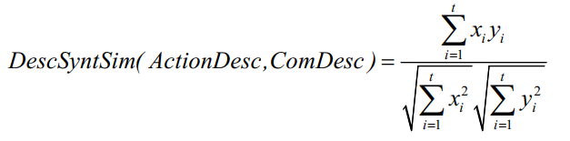

**Q7：**

如何筛选组合服务

**A7：**

在获取了组合服务路径的集合后，计算每路径对业务需求的匹配程度，其中匹配程度基于三部分

* 组合服务中第一个服务的输入参数集与用户的输入参数集的相似度
* 组合服务中最后一个服务的输出参数集与用户的输出参数集的相似度
* 组合服务中首尾位置服务的描述与用户的服务需求描述的相似度

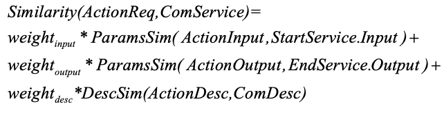

#### 4. 组合服务的筛选

通过对输入参数、输出参数和描述的相似度计算，筛选出了语义上可靠的组合Web服务集合，为了进一步对生成的组合Web服务进行筛选，还需要根据Qos对组合Web服务的服务质量进行评价，从中选择Qos最优的组合Web服务。

本文将Qos分为两类，一类为极小化Qos，如Time和Cost，另一类为极大化Qos，如Availability和Reliability

算法步骤：

1. 对Qos进行归一化处理
2. 计算综合Qos

**Q1：**

如何对Qos进行归一化处理？

**A1：**

通过以下公式的处理，将服务i的$Qos_i = \{time_i, cost_i, availability_i, reliability_i\}$ 转化为规范向量 $V_i = \{v_{i,1}, v_{i,2}, v_{i,3}, v_{i,4}\}$

* 对第一类Qos属性值的归一化方法

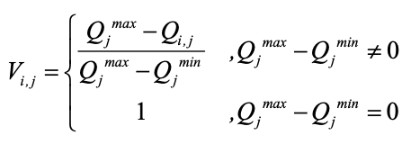

* 对第二类Qos属性值的归一化方法

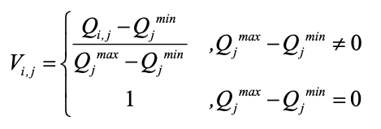

**Q2：**

如何计算综合Qos得分

**A2：**

顺序结构下综合Qos的计算方法如下

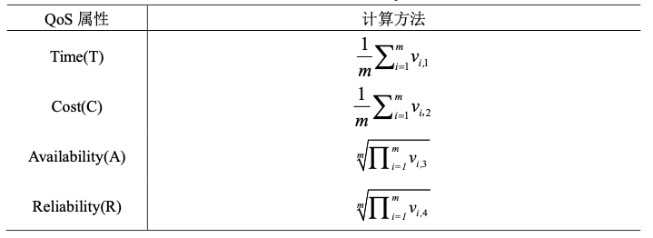

为每个属性分配权重之后，得到组合服务的最终Qos得分

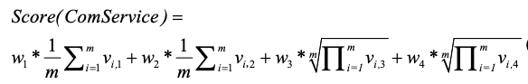

在获取了所有组合服务的Qos得分后，选择最高得分的组合服务，提供给业务活动

### 四、结论与展望

**论文总结：**

对于系统设计与实现，本文提出了通过JSON对业务流程和组合Web服务进行描述的方法，并设计了业务流程转化方法。

对于语义Web服务组合与匹配，本文利用 Kuhn-Munkres 算法实现了基于输入参数、输出参数、服务描述的相似度匹配方法，以及设计并实现了基于Qos的组合服务筛选方法。

**工作展望：**

对于Web服务组合和匹配的方法，可以引入机器学习、深度学习等方法，通过对大量文本的语义分析，获得更为准确的组合与匹配效果。现有的Word2Vec即是一种通过深度学习进行自然语言处理的工具

本文提出了JSON描述方式的初步设想和实现，对于组合Web服务中的结构控制，存在进一步优化的空间。

对于海量Web服务应用场景，可以进行基于特征的分类，同时加入Web服务组合演进机制，对Web服务组合不断的进行优化演进。

