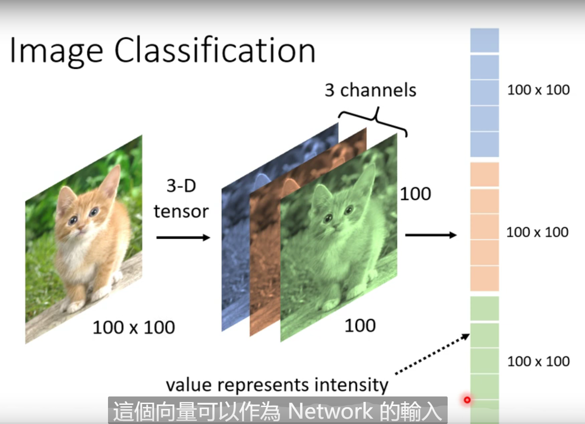
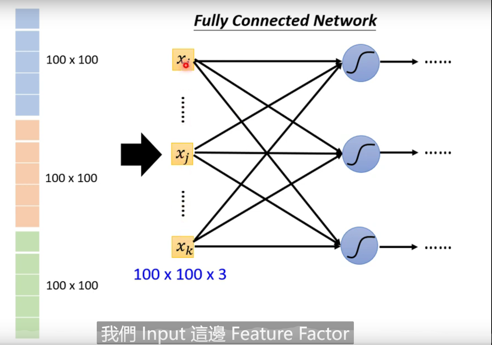
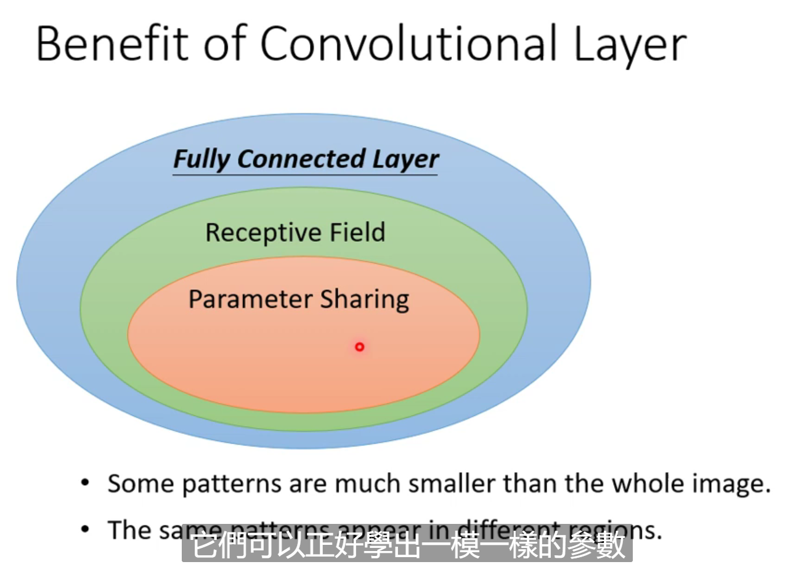
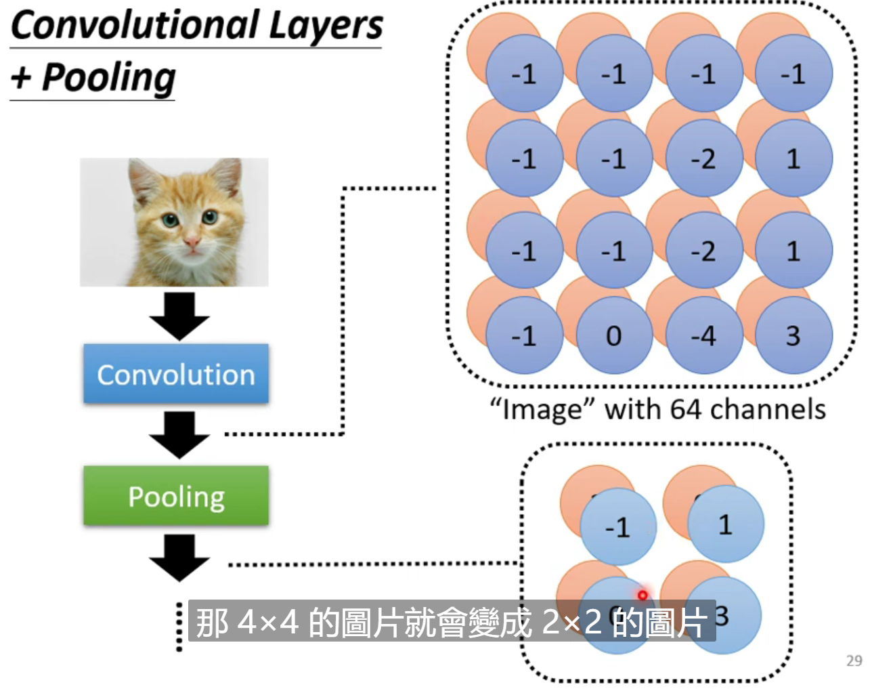
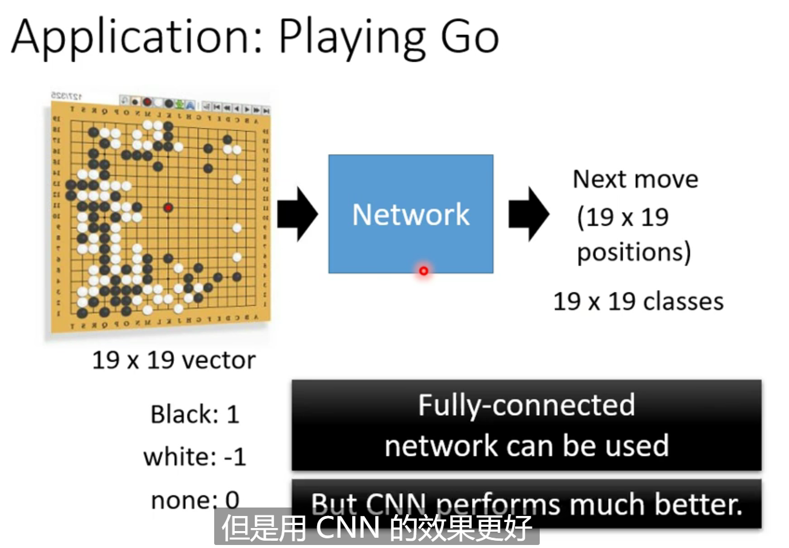

# 卷积神经网络

## Image Classification

将高维图片装换为单维向量

将单维向量作为神经网络的输入，大量的weight导致过拟合

并不需要把整张图片作为输入，只需要把图片的一小部分当做输入

在识别一个特征的时候，其输入虽然不同，但是参数可以共享

CNN是专门用在影像识别上的

## Pooling

pooling是为了减少计算量

 

## Application: Playing Go

围棋问题 = 输入图片进行分类的问题

CNN is not invariant to scaling and rotation , so we need data augmentation

